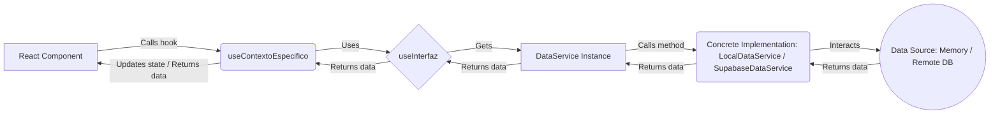

# TIM-CONTEXT: Guía para el Desarrollo de Componentes

## Descripción General de la Aplicación

Esta aplicación es un sistema de gestión para clínicas que permite administrar agendas, clientes, servicios, equipamiento y más. Está desarrollada con Next.js utilizando React y TypeScript.

## Arquitectura de Datos

La aplicación utiliza una arquitectura desacoplada para el manejo de datos, permitiendo cambiar entre diferentes fuentes de datos (local en memoria, base de datos remota, etc.) sin modificar los componentes de la interfaz de usuario ni la lógica de los contextos.

1.  **Capa de Presentación (Componentes)**: Componentes React (Server or Client Components) that render the UI.
2.  **Capa de Contexto (Contexts React)**: Providers of context (e.g., `ClinicProvider`, `TarifProvider`) that manage the state related to a specific entity and expose functions to interact with data.
3.  **Interfaz Contexto (`useInterfaz`)**: A central context that acts as a unified access point to the functions of the active data service.
4.  **Servicio Capa (`DataService` Interface)**: A TypeScript interface (`DataService`) that defines the contract (CRUD functions and others) that any data service must implement.
5.  **Data Implementation Capa**: Concrete classes that implement the `DataService` interface.
    *   **`LocalDataService`**: Implementation that operates **in memory**. Loads initial data (defined within the file itself, as `initialMockData`) when initialized and all operations (create, update, delete) modify these data **only in memory** (not persistent between application restarts). Ideal for quick development and testing.
    *   **`SupabaseDataService` (or others)**: Implementation(s) that interact with a remote database (e.g., Supabase). It will be selected in production or for tests with persistent data.
6.  **Data Service Selector (`getDataService`)**: A function (in `services/data/index.ts`) that decides which concrete implementation (`LocalDataService`, `SupabaseDataService`) to instantiate and return, based on configuration or environment variables.

### Typical Data Flow



**Important:** Components **NEVER** should interact directly with `LocalDataService` or `SupabaseDataService`. Always use the **contexts** (`useClinic`, `useTarif`, `useInterfaz`) to interact with the data. The contexts are the only ones that interact with the `DataService` instance provided by `getDataService`. `LocalDataService` currently uses data defined internally (`initialMockData`) to operate in memory.

## Uso de Contextos

Contexts are the **obligatory** way to access and modify data from components.

### Specific Contexts (Recommended)

Use the specific context for the entity you work with primarily.

```tsx
import { useClinic } from "@/contexts/clinic-context";
import { useTarif } from "@/contexts/tarif-context";
// ... other specific contexts

function MiComponenteClinica() {
  // Gets data and functions specific to clinics
  const { clinics, activeClinic, getClinicaById, updateClinica } = useClinic();

  // ... component logic using clinics, updateClinica, etc.
}
```

### General Context (`useInterfaz`)

Use it if you need to access functions of multiple different entities occasionally, although generally it's preferable to use the specific contexts.

```tsx
import { useInterfaz } from "@/contexts/interfaz-Context";

function ComponenteComplejo() {
  const interfaz = useInterfaz();

  const handleAction = async () => {
    const clinica = await interfaz.getClinicaById('clinic-1');
    const servicio = await interfaz.createServicio({ /* ... */ });
  }
  // ...
}
```

## Structure of a New Component

```tsx
"use client" // Or Server Component if no interactivity/state is needed

import { useState, useEffect, useCallback } from "react"
// Import necessary context hooks (preferably specific)
import { useClinic } from "@/contexts/clinic-context"
// Import necessary types (ideally from the service or interfaces)
import type { Clinica } from "@/services/data"
// Import UI components
import { Button } from "@/components/ui/button"
import { Input } from "@/components/ui/input"
import { toast } from "@/components/ui/use-toast"

interface MiComponenteProps {
  clinicId: string;
  // ... other props
}

export default function MiComponente({ clinicId }: MiComponenteProps) {
  // Get state and functions from the specific context
  const { getClinicaById, updateClinica } = useClinic();

  // Local state for UI and data of the form
  const [clinicaData, setClinicaData] = useState<Partial<Clinica>>({});
  const [isLoading, setIsLoading] = useState(true);
  const [error, setError] = useState<string | null>(null);

  // Load initial data
  const loadData = useCallback(async () => {
    setIsLoading(true);
    setError(null);
    try {
      const data = await getClinicaById(clinicId);
      if (data) {
        setClinicaData(data);
      } else {
        setError("Clinic not found");
      }
    } catch (err) {
      console.error("Error loading data:", err);
      setError("Error loading clinic.");
    } finally {
      setIsLoading(false);
    }
  }, [clinicId, getClinicaById]);

  useEffect(() => {
    loadData();
  }, [loadData]);

  // Handle changes in the form
  const handleChange = (e: React.ChangeEvent<HTMLInputElement | HTMLTextAreaElement>) => {
    const { name, value } = e.target;
    setClinicaData(prev => ({ ...prev, [name]: value }));
  };

  // Handle saving
  const handleSave = async () => {
    setIsLoading(true);
    setError(null);
    try {
      const success = await updateClinica(clinicId, clinicaData);
      if (success) {
        toast({ title: "Success", description: "Clinic updated." });
        // Optional: Reload data if needed (although the context should update)
        // loadData();
      } else {
        throw new Error("Update failed from service");
      }
    } catch (err) {
      console.error("Error saving data:", err);
      setError("Error saving changes.");
      toast({ title: "Error", description: "Could not save.", variant: "destructive" });
    } finally {
      setIsLoading(false);
    }
  };

  // Render component
  if (isLoading) return <div>Loading...</div>;
  if (error) return <div>Error: {error}</div>;
  if (!clinicaData) return <div>Clinic not available.</div>;

  return (
    <div>
      <h2>Edit Clinic: {clinicaData.name}</h2>
      <Input name="name" value={clinicaData.name || ''} onChange={handleChange} />
      {/* ... other fields ... */}
      <Button onClick={handleSave} disabled={isLoading}>
        {isLoading ? "Saving..." : "Save Changes"}
      </Button>
    </div>
  );
}
```

## Data Models (Types)

The primary types (like `Clinica`, `Tarifa`, `Servicio`, etc.) are defined in `services/data/models/interfaces.ts` and are re-exported by `services/data`. Import the types directly from `@/services/data`.

```typescript
import type { Clinica, Servicio } from "@/services/data";
```

## Key Summary

*   Always use **context hooks** (`useClinic`, `useTarif`, `useInterfaz`) to interact with data.
*   **NEVER** import or use `LocalDataService` or `SupabaseDataService` directly in components.
*   `LocalDataService` operates **in memory** using data defined internally (currently in `initialMockData` within the service file). Changes **are not persistent**.
*   The **`DataService` interface** is the contract that ensures that both implementations (local and remote) have the same functions.
*   The `getDataService` function in `services/data/index.ts` selects which implementation to use.

## Modelos de Datos Disponibles

La aplicación gestiona los siguientes modelos de datos principales:

### Entidades Principales

- **Clinica**: Representa una clínica física con sus configuraciones.
- **Client**: Información de clientes que reciben servicios.
- **Tarifa**: Tarifas que aplican a servicios.
- **FamiliaTarifa**: Agrupaciones de tarifas.
- **Servicio**: Servicios ofrecidos por las clínicas.
- **Equipo**: Equipamiento disponible en las clínicas.
- **Cabin**: Cabinas o habitaciones dentro de una clínica.
- **ScheduleBlock**: Bloques de horario en la agenda.
- **Producto**: Productos disponibles para venta o uso.
- **Consumo**: Registro de consumos de productos asociados a servicios.

### Tipos de Datos Comunes

```tsx
// Ejemplo de entidad con campos básicos
interface BaseEntity {
  id: string | number;
}

// Entidades que pueden activarse/desactivarse
interface Activable {
  isActive: boolean;
}

// Entidades que pueden deshabilitarse
interface Deshabilitada {
  deshabilitada: boolean;
}
```

## Funciones Disponibles en la Interfaz

El contexto principal `InterfazContext` proporciona las siguientes categorías de funciones:

### Funciones de Clínicas
- `getAllClinicas`: Obtiene todas las clínicas
- `getClinicaById`: Obtiene una clínica por su ID
- `createClinica`: Crea una nueva clínica
- `updateClinica`: Actualiza una clínica existente
- `deleteClinica`: Elimina una clínica
- `getActiveClinicas`: Obtiene solo las clínicas activas

### Funciones de Clientes
- `getAllClients`: Obtiene todos los clientes
- `getClientById`: Obtiene un cliente por su ID
- `createClient`: Crea un nuevo cliente
- `updateClient`: Actualiza un cliente existente
- `deleteClient`: Elimina un cliente
- `getClientsByClinicId`: Obtiene clientes de una clínica específica

### Funciones de Tarifas
- `getAllTarifas`: Obtiene todas las tarifas
- `getTarifaById`: Obtiene una tarifa por su ID
- `createTarifa`: Crea una nueva tarifa
- `updateTarifa`: Actualiza una tarifa existente
- `deleteTarifa`: Elimina una tarifa
- `getTarifasByClinicaId`: Obtiene tarifas asociadas a una clínica

### Funciones de Servicios
- `getAllServicios`: Obtiene todos los servicios
- `getServicioById`: Obtiene un servicio por su ID
- `createServicio`: Crea un nuevo servicio
- `updateServicio`: Actualiza un servicio existente
- `deleteServicio`: Elimina un servicio
- `getServiciosByTarifaId`: Obtiene servicios de una tarifa específica

### Funciones de Equipos
- `getAllEquipos`: Obtiene todos los equipos
- `getEquipoById`: Obtiene un equipo por su ID
- `createEquipo`: Crea un nuevo equipo
- `updateEquipo`: Actualiza un equipo existente
- `deleteEquipo`: Elimina un equipo
- `getEquiposByClinicaId`: Obtiene equipos de una clínica específica

### Funciones de Bloques de Agenda
- `getAllScheduleBlocks`: Obtiene todos los bloques de agenda
- `getScheduleBlockById`: Obtiene un bloque de agenda por su ID
- `createScheduleBlock`: Crea un nuevo bloque de agenda
- `updateScheduleBlock`: Actualiza un bloque de agenda existente
- `deleteScheduleBlock`: Elimina un bloque de agenda
- `getBlocksByDateRange`: Obtiene bloques en un rango de fechas para una clínica

### Funciones de Imágenes y Documentos
- `getEntityImages`: Obtiene imágenes asociadas a una entidad
- `saveEntityImages`: Guarda imágenes para una entidad
- `deleteEntityImages`: Elimina imágenes de una entidad
- `getEntityDocuments`: Obtiene documentos asociados a una entidad
- `saveEntityDocuments`: Guarda documentos para una entidad
- `deleteEntityDocuments`: Elimina documentos de una entidad

## Consideraciones de Desarrollo

### Compatibilidad con Datos Mock

Durante el desarrollo se utiliza `mockData.ts` como adaptador para mantener compatibilidad con código existente. Este archivo redirige las llamadas a los nuevos métodos en los contextos.

Si necesitas acceder a datos en componentes antiguos, puedes usar las funciones exportadas por `mockData.ts`:

```tsx
import { getClinics, getClinic, updateClinic } from "@/mockData";
```

Sin embargo, para nuevos componentes, es recomendable utilizar directamente los contextos:

```tsx
import { useInterfaz } from "@/contexts/interfaz-Context";
```

### Transición a Base de Datos

El sistema está diseñado para funcionar con datos locales durante el desarrollo y con Supabase en producción. Esta transición es manejada automáticamente por el servicio de datos.

## Ejemplo Completo: Desarrollo de un Nuevo Componente

Veamos paso a paso cómo desarrollar un nuevo componente que muestre servicios de una clínica específica:

```tsx
"use client"

import { useState, useEffect } from "react"
import { useInterfaz } from "@/contexts/interfaz-Context"
import { Servicio } from "@/services/data/models/interfaces"
import { Card, CardContent, CardHeader, CardTitle } from "@/components/ui/card"
import { Table, TableBody, TableCell, TableHead, TableHeader, TableRow } from "@/components/ui/table"
import { Button } from "@/components/ui/button"
import { Input } from "@/components/ui/input"

interface ServiciosClinicaProps {
  clinicaId: string;
}

export default function ServiciosClinica({ clinicaId }: ServiciosClinicaProps) {
  // Usar contexto para acceder a datos
  const { getClinicaById, getTarifasByClinicaId, getServiciosByTarifaId } = useInterfaz();
  
  // Estados locales
  const [clinica, setClinica] = useState<any>(null);
  const [tarifas, setTarifas] = useState<any[]>([]);
  const [servicios, setServicios] = useState<Servicio[]>([]);
  const [tarifaActiva, setTarifaActiva] = useState<string>("");
  const [cargando, setCargando] = useState(true);
  const [filtroNombre, setFiltroNombre] = useState("");
  
  // Cargar datos de la clínica
  useEffect(() => {
    const cargarClinica = async () => {
      try {
        const datosClinica = await getClinicaById(clinicaId);
        setClinica(datosClinica);
      } catch (error) {
        console.error("Error al cargar clínica:", error);
      }
    };
    
    cargarClinica();
  }, [clinicaId, getClinicaById]);
  
  // Cargar tarifas de la clínica
  useEffect(() => {
    const cargarTarifas = async () => {
      if (!clinicaId) return;
      
      try {
        const tarifasClinica = await getTarifasByClinicaId(clinicaId);
        setTarifas(tarifasClinica);
        
        // Seleccionar primera tarifa por defecto
        if (tarifasClinica.length > 0 && !tarifaActiva) {
          setTarifaActiva(tarifasClinica[0].id);
        }
      } catch (error) {
        console.error("Error al cargar tarifas:", error);
      }
    };
    
    cargarTarifas();
  }, [clinicaId, getTarifasByClinicaId, tarifaActiva]);
  
  // Cargar servicios de la tarifa seleccionada
  useEffect(() => {
    const cargarServicios = async () => {
      if (!tarifaActiva) {
        setServicios([]);
        setCargando(false);
        return;
      }
      
      try {
        setCargando(true);
        const serviciosTarifa = await getServiciosByTarifaId(tarifaActiva);
        setServicios(serviciosTarifa);
      } catch (error) {
        console.error("Error al cargar servicios:", error);
      } finally {
        setCargando(false);
      }
    };
    
    cargarServicios();
  }, [tarifaActiva, getServiciosByTarifaId]);
  
  // Escuchar cambios de datos
  useEffect(() => {
    const handleDataChange = (e: CustomEvent) => {
      const { entityType, entityId } = e.detail;
      
      if (entityType === "servicio" && servicios.some(s => s.id === entityId)) {
        // Recargar servicios si se modificó uno existente
        getServiciosByTarifaId(tarifaActiva)
          .then(serviciosTarifa => setServicios(serviciosTarifa))
          .catch(error => console.error("Error al recargar servicios:", error));
      }
    };
    
    window.addEventListener("data-change" as any, handleDataChange);
    return () => {
      window.removeEventListener("data-change" as any, handleDataChange);
    };
  }, [tarifaActiva, servicios, getServiciosByTarifaId]);
  
  // Filtrar servicios por nombre
  const serviciosFiltrados = servicios.filter(servicio => 
    servicio.nombre.toLowerCase().includes(filtroNombre.toLowerCase())
  );
  
  // Cambiar tarifa activa
  const cambiarTarifa = (tarifaId: string) => {
    setTarifaActiva(tarifaId);
  };
  
  return (
    <Card className="w-full">
      <CardHeader>
        <CardTitle>
          Servicios de {clinica?.name || "Clínica"}
        </CardTitle>
        <div className="flex space-x-2 mt-2">
          {tarifas.map(tarifa => (
            <Button 
              key={tarifa.id}
              variant={tarifaActiva === tarifa.id ? "default" : "outline"}
              onClick={() => cambiarTarifa(tarifa.id)}
            >
              {tarifa.nombre}
            </Button>
          ))}
        </div>
        <Input
          placeholder="Filtrar por nombre..."
          value={filtroNombre}
          onChange={(e) => setFiltroNombre(e.target.value)}
          className="mt-2"
        />
      </CardHeader>
      <CardContent>
        {cargando ? (
          <div className="text-center py-4">Cargando servicios...</div>
        ) : serviciosFiltrados.length === 0 ? (
          <div className="text-center py-4">No hay servicios disponibles</div>
        ) : (
          <Table>
            <TableHeader>
              <TableRow>
                <TableHead>Código</TableHead>
                <TableHead>Nombre</TableHead>
                <TableHead>Precio</TableHead>
                <TableHead>Duración</TableHead>
              </TableRow>
            </TableHeader>
            <TableBody>
              {serviciosFiltrados.map(servicio => (
                <TableRow key={servicio.id}>
                  <TableCell>{servicio.codigo}</TableCell>
                  <TableCell>{servicio.nombre}</TableCell>
                  <TableCell>{servicio.precioConIVA}</TableCell>
                  <TableCell>{servicio.duracion} min</TableCell>
                </TableRow>
              ))}
            </TableBody>
          </Table>
        )}
      </CardContent>
    </Card>
  );
}
```

Este ejemplo muestra:
1. Cómo importar y usar los contextos
2. Cómo cargar datos iniciales
3. Cómo manejar estados de carga y errores
4. Cómo escuchar cambios en los datos
5. Cómo aplicar filtros y transformaciones a los datos

## Mejores Prácticas

1. **Usa los contextos específicos** cuando trabajas principalmente con una entidad.
2. **Usa InterfazContext** cuando necesites acceder a múltiples tipos de entidades.
3. **Maneja estados de carga y error** para mejorar la experiencia del usuario.
4. **Utiliza eventos de cambio de datos** para mantener la sincronización entre componentes.
5. **Separa la lógica de negocio** de los componentes visuales cuando sea posible.
6. **Implementa validación de datos** antes de enviarlos al servicio.
7. **Usa tipos TypeScript** para mejorar la calidad del código y la experiencia de desarrollo.
8. **Documenta tus componentes** con comentarios y tipos claros.

## Resolución de Problemas

### Datos no Actualizados
Si los datos no se actualizan después de modificaciones:
1. Verifica que estás disparando el evento `data-change` correctamente.
2. Asegúrate de que los componentes que necesitan actualizar sus datos están escuchando el evento.
3. Verifica las dependencias de los `useEffect` para asegurarte de que se ejecutan cuando cambian los datos relevantes.

### Errores de Tipo
Si encuentras errores de tipo:
1. Verifica las interfaces en `services/data/models/interfaces.ts`.
2. Utiliza casting de tipos con precaución cuando sea necesario.
3. Actualiza las interfaces si necesitas extender funcionalidades.

### Rendimiento
Si experimentas problemas de rendimiento:
1. Implementa memoización con `useMemo` y `useCallback`.
2. Evita consultas innecesarias a los servicios de datos.
3. Optimiza las operaciones de filtrado y transformación de datos.

## Lista de Todos los Contextos Disponibles

Aquí tienes una lista de todos los contextos disponibles y su propósito:

1. **interfaz-Context**: Contexto principal que proporciona acceso a todas las entidades y operaciones.
2. **clinic-context**: Manejo de clínicas y sus configuraciones.
3. **client-context**: Gestión de clientes y sus datos.
4. **tarif-context**: Administración de tarifas.
5. **servicios-context**: Gestión de servicios ofrecidos.
6. **iva-context**: Manejo de tipos de IVA.
7. **equipment-context**: Administración de equipamiento.
8. **CabinContext**: Gestión de cabinas en clínicas.
9. **schedule-blocks-context**: Bloques de horario en agenda.
10. **schedule-templates-context**: Plantillas de horario.
11. **image-context**: Manejo de imágenes para entidades.
12. **file-context**: Gestión de archivos y documentos.
13. **storage-context**: Administración del almacenamiento.
14. **producto-contexto**: Gestión de productos.
15. **consumo-servicio-context**: Registro de consumos de servicios.
16. **family-context**: Gestión de familias (agrupaciones).
17. **document-context**: Administración de documentos.
18. **database-context**: Acceso a base de datos (uso interno).
19. **theme-context**: Configuración de temas de la aplicación.
20. **auth-context**: Autenticación de usuarios.

## Conclusión

Siguiendo esta guía, podrás desarrollar componentes que se integren perfectamente con la arquitectura de la aplicación, manteniendo una estructura coherente y facilitando el trabajo en equipo.

Recuerda que la clave para un desarrollo exitoso es comprender cómo fluyen los datos a través de la aplicación y utilizar las herramientas apropiadas para cada tarea.

Para cualquier duda o sugerencia sobre esta documentación, contacta al equipo de desarrollo. 

## Nota Importante para el Equipo de Desarrollo

**Este documento debe ser actualizado obligatoriamente cada vez que un miembro del equipo desarrolle una nueva interfaz o añada nuevas funciones a los contextos existentes**. 

El objetivo es mantener un catálogo completo, actualizado y accesible de todas las funciones disponibles en el sistema para que cualquier desarrollador, ya sea del equipo o una inteligencia artificial, pueda conocer rápidamente las capacidades del sistema y cómo integrar correctamente nuevos componentes.

La documentación completa y actualizada es fundamental para:
1. Facilitar la incorporación de nuevos miembros al equipo
2. Reducir errores de integración entre componentes
3. Mantener la coherencia en el diseño y arquitectura
4. Proporcionar un punto de referencia único para todo el equipo

Al añadir una nueva funcionalidad, asegúrate de:
- Documentar las nuevas funciones con sus parámetros y valores de retorno
- Actualizar la lista de contextos si has creado uno nuevo
- Incluir ejemplos de uso si la funcionalidad es compleja
- Informar al resto del equipo sobre las actualizaciones realizadas 