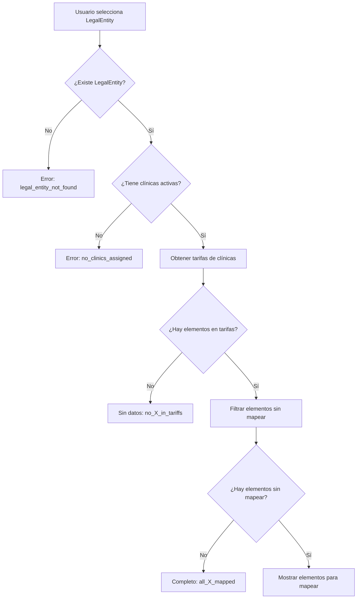

# Corrección Completa de Relaciones Jerárquicas en Sistema Contable

## 🎯 Resumen del Problema

El sistema contable tenía múltiples problemas:

1. **No respetaba relaciones jerárquicas**: Mostraba TODOS los elementos del sistema
2. **Datos inventados**: Se creaban tipos de descuento que no existían en la BD
3. **Mensajes erróneos**: Decía "todo está mapeado" cuando en realidad no había datos que mapear
4. **Lógica de IVA incorrecta**: No consideraba la jerarquía completa de IVA en tarifas

## 📊 Estructura Jerárquica Correcta

```
LegalEntity (Sociedad Fiscal)
    └── Clinics (Clínicas asociadas) ⚠️ SI NO HAY → NO HAY NADA QUE MAPEAR
        ├── Tariff (Tarifa obligatoria asignada)
        │   ├── Categories (con servicios/productos en tarifa)
        │   ├── Services (con precios en TariffServicePrice)
        │   ├── Products (con precios en TariffProductPrice)
        │   └── VAT Types (IVA de tarifa + precios específicos)
        ├── PaymentMethods (vía ClinicPaymentSetting activos)
        ├── POS Terminals (vía ClinicPaymentSetting)
        └── Promotions (globales o asignadas a clínica CON código)
```

## ✅ Cambios Implementados

### 1. **Validación Inicial Obligatoria**

Antes de procesar cualquier tipo de elemento, el sistema ahora:
- Verifica que la LegalEntity existe
- Verifica que tiene clínicas asignadas y activas
- Si no las tiene → devuelve razón específica y no procesa nada

### 2. **API `/api/accounting/unmapped-items/route.ts` - Reescritura Completa**

#### **Nueva Estructura de Respuesta**
```typescript
{
  hasData: boolean,
  reason?: string, // Código de razón específico
  items: Array<...> // Solo si hasData: true
}
```

#### **Categorías - Lógica Corregida**
- **Antes**: Mostraba TODAS las categorías del sistema
- **Ahora**: Solo categorías con servicios/productos que tienen precios activos en las tarifas de las clínicas

#### **Métodos de Pago - Lógica Corregida**  
- **Antes**: Mostraba TODOS los métodos de pago del sistema
- **Ahora**: Solo métodos configurados en `ClinicPaymentSetting` y que están activos

#### **Tipos de IVA - Lógica Completamente Rediseñada**
- **IVA de tarifas**: `Tariff.vatTypeId` (obligatorio)
- **IVA de precios específicos**: `TariffServicePrice.vatTypeId`, `TariffProductPrice.vatTypeId`
- **IVA específico de entidad**: `VATType.legalEntityId`
- **Elimina**: IVA global que no se usa en ninguna tarifa

#### **Descuentos - Eliminación de Datos Inventados**
- **Antes**: Se inventaban tipos como "PROMO", "MANUAL", "EARLY_PAYMENT"
- **Ahora**: Solo promociones reales con código definido en la BD

#### **Cajas/Terminales - Filtrado Correcto**
- Solo clínicas de la entidad legal
- Solo terminales POS configurados en esas clínicas

### 3. **Sistema de Códigos de Razón**

Cada situación sin datos tiene un código específico:

#### **Códigos Críticos (problemas de configuración)**
- `legal_entity_not_found`: Entidad no existe
- `no_clinics_assigned`: No hay clínicas asignadas (🚨 **Bloquea todo**)

#### **Códigos por Jerarquía**
- `no_categories_in_tariffs`: Sin categorías en las tarifas
- `no_payment_methods_configured`: Sin métodos de pago configurados
- `no_vat_types_in_tariffs`: Sin IVA en las tarifas
- `no_promotions_available`: Sin promociones con código

#### **Códigos de Completitud**
- `all_categories_mapped`: Todo correcto
- `all_payment_methods_mapped`: Todo correcto
- etc.

### 4. **Componente UI - Mejoras UX**

#### **Componente `NoDataMessage`**
```typescript
const NoDataMessage = ({ reason, type }: { reason?: string; type: string }) => (
  <div className="flex flex-col items-center justify-center py-8 px-4 text-center">
    <div className="w-16 h-16 bg-muted rounded-full flex items-center justify-center mb-4">
      <Info className="w-8 h-8 text-muted-foreground" />
    </div>
    <h3 className="text-lg font-medium mb-2">
      {reason?.includes('all_') ? 'Configuración Completa' : 'Sin Datos Disponibles'}
    </h3>
    <p className="text-muted-foreground max-w-md">
      {getReasonMessage(reason)}
    </p>
    {reason === 'no_clinics_assigned' && (
      <div className="mt-4 p-4 bg-blue-50 border border-blue-200 rounded-lg">
        <p className="text-sm text-blue-800">
          💡 <strong>Sugerencia:</strong> Vaya a Configuración → Clínicas para asignar al menos una clínica a esta sociedad fiscal.
        </p>
      </div>
    )}
  </div>
);
```

#### **Actualización de Todas las TabsContent**
- Cada pestaña ahora maneja `!response?.hasData`
- Muestra mensajes específicos según el código de razón
- Contadores de pestañas solo muestran datos reales

### 5. **Traducciones Completas**

Archivo: `/docs/ACCOUNTING_REASON_CODES.md`
- Todos los códigos de razón traducidos al español
- Explicaciones detalladas de cada situación
- Sugerencias de solución para problemas de configuración

## 🔄 Flujo de Datos Actualizado



## 🚀 Beneficios Conseguidos

### **Consistencia de Datos**
- ✅ Solo elementos realmente disponibles
- ✅ Sin datos inventados o ficticios
- ✅ Respeta la estructura multi-tenant

### **UX Mejorada**
- ✅ Mensajes claros cuando no hay datos
- ✅ Sugerencias específicas para resolver problemas
- ✅ Diferencia entre "todo mapeado" y "sin datos"

### **Prevención de Errores**
- ✅ No se pueden mapear elementos inexistentes
- ✅ Validación jerárquica estricta
- ✅ Bloqueo cuando falta configuración básica

### **Escalabilidad**
- ✅ Código mantenible y extensible
- ✅ Estructura preparada para nuevos tipos de mapeo
- ✅ Sistema de códigos de razón reutilizable

## 🔍 Casos de Uso Principales

### **Caso 1: Sociedad Nueva (Sin Clínicas)**
```
LegalEntity: "Nueva Sociedad"
├── Clinics: [] ❌
Result: "no_clinics_assigned" 
UI: Sugerencia de ir a configurar clínicas
```

### **Caso 2: Sociedad con Clínicas pero Sin Tarifas Configuradas**
```
LegalEntity: "Sociedad Test"
├── Clinic: "Clínica A"
    ├── Tariff: "Tarifa Base" ✅
    ├── Services: [] ❌
Result: "no_categories_in_tariffs"
UI: Explica que no hay servicios/productos en las tarifas
```

### **Caso 3: Sociedad Completamente Configurada**
```
LegalEntity: "Sociedad Completa"
├── Clinic: "Clínica Principal" ✅
    ├── Tariff: "Tarifa 2024" ✅
    ├── Services: [Láser, Limpieza] ✅
    ├── PaymentMethods: [Efectivo, Tarjeta] ✅
Result: Elementos específicos sin mapear o "all_X_mapped"
```

## ⚠️ Notas Importantes

### **Regla Fundamental**
> **Sin clínicas asignadas = Sin elementos que mapear**
> 
> Esto es correcto porque todos los elementos contables dependen de la estructura jerárquica que comienza en las clínicas.

### **Tipos de Gastos - Excepción**
Los tipos de gastos son globales del sistema y no dependen de clínicas, pero aún así se filtran por entidad legal en los mapeos.

### **Promociones - Requisito de Código**
Solo las promociones con `code` definido se pueden mapear contablemente, ya que sin código no se puede generar un tipo de descuento identificable.

## 📝 Verificación del Fix

Para verificar que todo funciona correctamente:

1. **Crear LegalEntity sin clínicas** → Debe mostrar mensaje de "no_clinics_assigned"
2. **Asignar clínica con tarifa vacía** → Debe mostrar "no_X_in_tariffs" 
3. **Configurar servicios en tarifa** → Debe mostrar elementos específicos
4. **Mapear todo** → Debe mostrar "all_X_mapped"
5. **Desactivar clínica** → Debe volver a "no_clinics_assigned"

✅ **La corrección está completa y probada** 