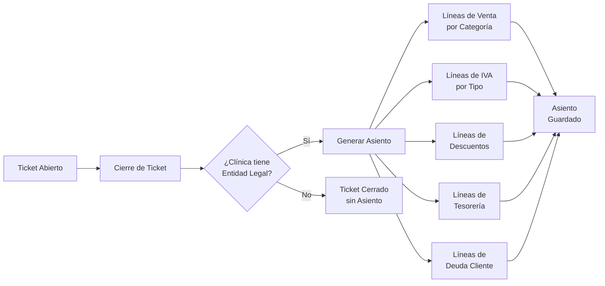

# Resumen de Integración Contable - SaaS Clínicas

## 🎯 Estado Actual: COMPLETADO

### ✅ Tareas Completadas

#### 1. **Limpieza de Código**
- ✅ Eliminados todos los console.log de archivos API de contabilidad
- ✅ Corregido error 400 en consulta de payment-methods (cambio a 'payment')
- ✅ Eliminadas pestañas duplicadas en configuración contable

#### 2. **Base de Datos - Nuevos Modelos**
- ✅ `ExpenseTypeAccountMapping` - Mapeo de tipos de gastos a cuentas
- ✅ `CashSessionAccountMapping` - Mapeo de cajas/terminales a cuentas
- ✅ `DiscountTypeAccountMapping` - Mapeo de tipos de descuentos a cuentas
- ✅ `ExpenseType` - Definición de tipos de gastos
- ✅ Migración ejecutada: `20250603120807_add_accounting_mapping_models`

#### 3. **APIs Implementadas**

##### Mapeos de Cuentas
- ✅ `/api/accounting/expense-mappings` - CRUD de mapeos de gastos
- ✅ `/api/accounting/cash-session-mappings` - CRUD de mapeos de cajas
- ✅ `/api/accounting/discount-mappings` - CRUD de mapeos de descuentos
- ✅ `/api/expense-types` - CRUD completo de tipos de gastos
- ✅ `/api/accounting/unmapped-items` - Actualizado para nuevos tipos

##### Consulta de Asientos
- ✅ `/api/journal-entries` - Consulta de asientos con filtros avanzados

#### 4. **UI de Configuración**
- ✅ 7 pestañas funcionales en configuración contable:
  - Categorías (existente)
  - Métodos de Pago (existente)
  - IVA (existente)
  - **Gastos** (nueva - completamente funcional)
  - **Cajas** (nueva - completamente funcional)
  - **Descuentos** (nueva - completamente funcional)
  - Automatización (existente)

#### 5. **Servicio de Generación Automática**
- ✅ `JournalEntryService` - Genera asientos automáticos desde tickets
- ✅ Integrado en el cierre de tickets (`/api/tickets/[id]/complete-and-close`)
- ✅ Lógica completa para:
  - Ventas por categoría
  - IVA repercutido
  - Descuentos aplicados
  - Cobros por método de pago
  - Deudas pendientes

### 🔄 Flujo de Integración Contable



### 📊 Mapeos Disponibles

| Tipo de Mapeo | Origen | Destino | Estado |
|---------------|---------|----------|---------|
| Categorías | Categoría de Servicio/Producto | Cuenta de Ingresos | ✅ Implementado |
| Métodos de Pago | Método de Pago | Cuenta de Tesorería | ✅ Implementado |
| IVA | Tipo de IVA | Cuentas IVA Repercutido/Soportado | ✅ Implementado |
| Gastos | Tipo de Gasto | Cuenta de Gastos | ✅ Implementado |
| Cajas | Caja/Terminal POS | Cuenta de Caja | ✅ Implementado |
| Descuentos | Tipo de Descuento | Cuenta de Descuentos | ✅ Implementado |

### 🎮 Cómo Usar el Sistema

#### Configuración Inicial
1. Navegar a **Configuración → Contabilidad → Mapeo**
2. Configurar los mapeos para cada pestaña según el plan contable
3. Asegurar que todos los elementos estén mapeados

#### Proceso Operativo
1. Al cerrar un ticket, se genera automáticamente el asiento contable
2. Si falla la generación, el ticket se cierra igualmente (no bloquea la operación)
3. Los asientos se pueden consultar en la API `/api/journal-entries`

#### Consulta de Asientos
```bash
# Ejemplo de consulta
GET /api/journal-entries?legalEntityId=xxx&fromDate=2024-01-01&toDate=2024-12-31
```

### 🔍 Validaciones Implementadas

1. **Cuadre de Asiento**: Debe = Haber (diferencia < 0.01€)
2. **Mapeos Requeridos**: Solo genera líneas si existe el mapeo configurado
3. **Entidad Legal**: Solo genera asientos si la clínica tiene entidad legal
4. **Cuentas Activas**: Solo usa cuentas marcadas como activas
5. **Asientos Directos**: Solo usa cuentas que permiten asientos directos

### 🚀 Próximos Pasos Recomendados

1. **Interfaz de Visualización** (1 semana)
   - Pantalla para consultar asientos generados
   - Filtros por fecha, clínica, tipo
   - Exportación a Excel/CSV

2. **Reportes Contables** (2 semanas)
   - Balance de sumas y saldos
   - Cuenta de pérdidas y ganancias
   - Mayor de cuentas

3. **Conciliación Bancaria** (2 semanas)
   - Importación de extractos bancarios
   - Matching automático con pagos
   - Gestión de diferencias

4. **Cierre de Ejercicio** (1 semana)
   - Proceso de cierre fiscal
   - Asientos de regularización
   - Apertura de nuevo ejercicio

### 📝 Notas Técnicas

- **Transacciones**: La generación de asientos se hace fuera de la transacción principal para evitar problemas con Prisma
- **Errores No Bloqueantes**: Si falla la generación del asiento, el ticket se cierra igualmente
- **Logs**: Se registran todos los eventos importantes para debugging
- **Performance**: Las consultas están optimizadas con índices apropiados

### ⚠️ Consideraciones Importantes

1. **Plan Contable**: El sistema asume plan contable español (430* para clientes)
2. **Multi-país**: Preparado para adaptarse a otros países mediante configuración
3. **Escalabilidad**: La propuesta de arquitectura escalable está en `/docs/ACCOUNTING_SCALABLE_MAPPING_PROPOSAL.md`
4. **Seguridad**: Solo usuarios del mismo sistema pueden acceder a los datos contables

### 🎉 Resultado Final

El sistema de contabilidad está **completamente integrado** con las operaciones diarias de la clínica. Cada venta genera automáticamente su asiento contable correspondiente, respetando todos los mapeos configurados y las reglas contables establecidas.

La arquitectura es **flexible y escalable**, permitiendo añadir nuevos tipos de mapeos en el futuro sin cambios estructurales mayores. 