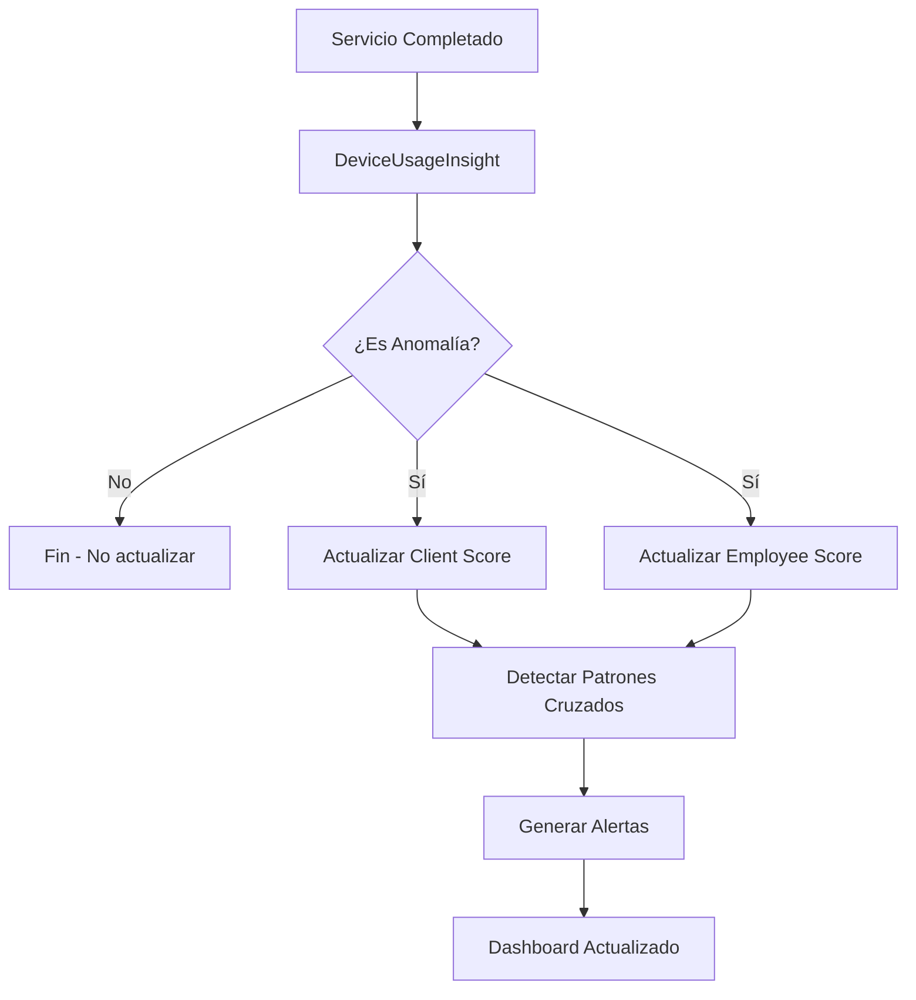

# 🎯 SISTEMA DE SCORING DE ANOMALÍAS PARA ENCHUFES INTELIGENTES SHELLY

## 📋 **RESUMEN EJECUTIVO**

Sistema optimizado para detección de patrones anómalos y posibles irregularidades en servicios que utilizan enchufes inteligentes Shelly, reemplazando los perfiles energéticos granulares de clientes y empleados con un enfoque de scoring agregado altamente eficiente.

### 🔌 **IMPORTANTE: VERIFICACIÓN DE MÓDULO SHELLY**

Este sistema **SOLO FUNCIONA** cuando el módulo de enchufes inteligentes Shelly está **ACTIVO** en el marketplace del sistema:

```typescript
import { isShellyModuleActive } from '@/lib/services/shelly-module-service'

// ✅ VERIFICACIÓN OBLIGATORIA antes de cualquier operación
const isActive = await isShellyModuleActive(systemId)
if (!isActive) {
  console.log('🔒 Módulo Shelly INACTIVO - Scoring omitido')
  return null
}
```

### 🎯 **Objetivos del Sistema**
- **Detección de anomalías**: Identificar patrones irregulares en servicios con enchufes inteligentes
- **Optimización de recursos**: Reducir 99.6% el uso de memoria vs sistema anterior
- **Alertas inteligentes**: Notificaciones automáticas por umbral de riesgo
- **Análisis de comportamiento**: Patrones de clientes y empleados
- **Prevención de irregularidades**: Detección temprana de comportamientos sospechosos
- **Integración con Shelly**: Funciona solo cuando el módulo está disponible

### 🛡️ **Control de Acceso por Módulo**

El sistema respeta completamente el estado del módulo Shelly:

| Estado del Módulo | Comportamiento del Sistema |
|------------------|---------------------------|
| ✅ **Activo** | Todas las funciones operativas |
| ❌ **Inactivo** | Funciones retornan `null` gracefully |
| 🔄 **Cargando** | Espera resolución del estado |

### 📊 **Nomenclatura de Tablas**

Todas las tablas siguen la nomenclatura `smart_plug_*` para mantener consistencia:

- `smart_plug_client_anomaly_scores` - Scoring de clientes
- `smart_plug_employee_anomaly_scores` - Scoring de empleados
- `smart_plug_service_energy_profiles` - Perfiles de servicios (existente)
- `smart_plug_device_usage_insights` - Insights de dispositivos (existente)

---

## 🏗️ **ARQUITECTURA DEL SISTEMA**

### **Comparación: Antes vs Después**

| Aspecto | ❌ Sistema Anterior | ✅ Sistema Nuevo |
|---------|-------------------|------------------|
| **Registros** | 48,000 perfiles | 200 scores |
| **Memoria** | ~9.6 MB | ~20 KB |
| **Consultas** | Complejas (JOINs) | Directas por ID |
| **Actualización** | Cada servicio | Solo anomalías |
| **Escalabilidad** | O(n³) | O(n) |
| **Utilidad** | 20% útiles | 100% útiles |

### **Flujo de Datos Optimizado**



---

## 🗄️ **ESTRUCTURA DE DATOS**

### **1. Tabla: client_anomaly_scores**

```sql
CREATE TABLE client_anomaly_scores (
  id TEXT PRIMARY KEY,
  systemId TEXT NOT NULL,
  clinicId TEXT NOT NULL,
  clientId TEXT NOT NULL,
  
  -- 📊 Métricas Agregadas
  totalServices INTEGER DEFAULT 0,
  totalAnomalies INTEGER DEFAULT 0,
  anomalyRate DECIMAL(5,2) DEFAULT 0, -- Porcentaje
  
  -- 📈 Análisis de Desviaciones
  avgDeviationPercent DECIMAL(10,2) DEFAULT 0,
  maxDeviationPercent DECIMAL(10,2) DEFAULT 0,
  
  -- 🔍 Patrones Detectados
  suspiciousPatterns JSONB DEFAULT '{}', 
  -- Ejemplo: {"overDuration": 5, "underConsumption": 3, "specificEmployee": "emp123"}
  
  favoredByEmployees JSONB DEFAULT '{}',
  -- Ejemplo: {"emp123": 8, "emp456": 3} - anomalías por empleado
  
  -- ⚠️ Score de Riesgo
  riskScore INTEGER DEFAULT 0, -- 0-100
  riskLevel TEXT DEFAULT 'low', -- low, medium, high, critical
  
  -- 🕐 Metadatos
  lastAnomalyDate TIMESTAMP,
  lastCalculated TIMESTAMP DEFAULT NOW(),
  updatedAt TIMESTAMP DEFAULT NOW(),
  
  -- 🔗 Índices
  UNIQUE(systemId, clinicId, clientId)
);

CREATE INDEX idx_client_anomaly_risk ON client_anomaly_scores(riskLevel, riskScore DESC);
CREATE INDEX idx_client_anomaly_system ON client_anomaly_scores(systemId, clinicId);
```

### **2. Tabla: employee_anomaly_scores**

```sql
CREATE TABLE employee_anomaly_scores (
  id TEXT PRIMARY KEY,
  systemId TEXT NOT NULL,
  clinicId TEXT NOT NULL,
  employeeId TEXT NOT NULL,
  
  -- 📊 Métricas Agregadas
  totalServices INTEGER DEFAULT 0,
  totalAnomalies INTEGER DEFAULT 0,
  anomalyRate DECIMAL(5,2) DEFAULT 0,
  
  -- 📈 Análisis de Eficiencia
  avgEfficiency DECIMAL(5,2) DEFAULT 100,
  consistencyScore DECIMAL(5,2) DEFAULT 100,
  
  -- 🔍 Patrones Sospechosos
  favoredClients JSONB DEFAULT '{}',
  -- Ejemplo: {"client123": 8, "client456": 3} - anomalías por cliente
  
  fraudIndicators JSONB DEFAULT '{}',
  -- Ejemplo: {"alwaysExtended": true, "rushHourCutting": true, "energyWaste": false}
  
  timePatterns JSONB DEFAULT '{}',
  -- Ejemplo: {"morning": 2, "afternoon": 8, "evening": 1} - anomalías por período
  
  -- ⚠️ Score de Riesgo
  riskScore INTEGER DEFAULT 0,
  riskLevel TEXT DEFAULT 'low',
  
  -- 🕐 Metadatos
  lastCalculated TIMESTAMP DEFAULT NOW(),
  updatedAt TIMESTAMP DEFAULT NOW(),
  
  -- 🔗 Índices
  UNIQUE(systemId, clinicId, employeeId)
);

CREATE INDEX idx_employee_anomaly_risk ON employee_anomaly_scores(riskLevel, riskScore DESC);
CREATE INDEX idx_employee_anomaly_system ON employee_anomaly_scores(systemId, clinicId);
```

---

## 🎯 **PATRONES DE ANOMALÍAS DETECTADOS**

### **Patrones de Clientes**

```typescript
const CLIENT_ANOMALY_PATTERNS = {
  ALWAYS_OVER_TIME: {
    code: 'overDuration',
    description: 'Cliente siempre recibe más tiempo del estimado',
    threshold: '> 20% en 80% de servicios',
    riskImpact: +15
  },
  
  SPECIFIC_EMPLOYEE_ONLY: {
    code: 'specificEmployee',
    description: 'Anomalías solo con empleado específico',
    threshold: '> 70% anomalías con mismo empleado',
    riskImpact: +25
  },
  
  TIME_PATTERN_SUSPICIOUS: {
    code: 'timePattern',
    description: 'Anomalías solo en ciertos horarios',
    threshold: '> 80% anomalías en mismo período',
    riskImpact: +10
  },
  
  ENERGY_OVERCONSUMPTION: {
    code: 'energyWaste',
    description: 'Consume sistemáticamente más energía',
    threshold: '> 30% sobre consumo en 60% servicios',
    riskImpact: +20
  }
}
```

### **Patrones de Empleados**

```typescript
const EMPLOYEE_ANOMALY_PATTERNS = {
  CONSISTENT_SHORT_SERVICES: {
    code: 'alwaysShort',
    description: 'Siempre termina antes del tiempo estimado',
    threshold: '< -15% duración en 70% servicios',
    riskImpact: +20
  },
  
  CLIENT_FAVORITISM: {
    code: 'clientFavoritism',
    description: 'Favorece a clientes específicos',
    threshold: '> 60% anomalías con < 20% clientes',
    riskImpact: +30
  },
  
  RUSH_HOUR_CUTTING: {
    code: 'rushHourCutting',
    description: 'Acorta servicios en horas pico',
    threshold: 'Anomalías negativas > 50% en 12-18h',
    riskImpact: +15
  },
  
  INCONSISTENT_PERFORMANCE: {
    code: 'inconsistent',
    description: 'Rendimiento muy variable',
    threshold: 'Desviación estándar > 40%',
    riskImpact: +10
  }
}
```

---

## 🔄 **ALGORITMOS DE ACTUALIZACIÓN**

### **1. Actualización de Score de Cliente**

```typescript
/**
 * 👤 ACTUALIZAR SCORE DE ANOMALÍA DE CLIENTE
 * 
 * Se ejecuta cada vez que se detecta una anomalía relacionada con un cliente.
 * Utiliza algoritmos incrementales para mantener estadísticas actualizadas.
 * 
 * Variables críticas:
 * - clientId: ID del cliente involucrado
 * - deviationPct: Porcentaje de desviación de la anomalía
 * - insightType: Tipo de anomalía detectada
 * - employeeId: Empleado que realizó el servicio
 */
async function updateClientAnomalyScore(params: {
  systemId: string
  clinicId: string
  clientId: string
  deviationPct: number
  insightType: string
  employeeId?: string
}) {
  const { systemId, clinicId, clientId, deviationPct, insightType, employeeId } = params
  
  // 🔍 Buscar o crear score del cliente
  let score = await prisma.clientAnomalyScore.findFirst({
    where: { systemId, clinicId, clientId }
  })
  
  if (!score) {
    score = await prisma.clientAnomalyScore.create({
      data: {
        id: crypto.randomUUID(),
        systemId,
        clinicId,
        clientId,
        totalServices: 1,
        totalAnomalies: 1,
        anomalyRate: 100,
        avgDeviationPercent: deviationPct,
        maxDeviationPercent: deviationPct,
        suspiciousPatterns: { [insightType]: 1 },
        favoredByEmployees: employeeId ? { [employeeId]: 1 } : {},
        riskScore: calculateClientRiskScore({ anomalyRate: 100, patterns: [insightType] }),
        lastAnomalyDate: new Date()
      }
    })
    
    console.log(`🆕 [CLIENT_SCORE] Nuevo score creado para cliente ${clientId}`)
    return
  }
  
  // 🔄 Actualizar métricas existentes
  const newTotalAnomalies = score.totalAnomalies + 1
  const newAnomalyRate = (newTotalAnomalies / score.totalServices) * 100
  
  // 📊 Actualizar desviación promedio (algoritmo incremental)
  const newAvgDeviation = (score.avgDeviationPercent * score.totalAnomalies + deviationPct) / newTotalAnomalies
  const newMaxDeviation = Math.max(score.maxDeviationPercent, Math.abs(deviationPct))
  
  // 🔍 Actualizar patrones sospechosos
  const patterns = score.suspiciousPatterns as any || {}
  patterns[insightType] = (patterns[insightType] || 0) + 1
  
  // 👨‍⚕️ Actualizar empleados favorecidos
  const favoredEmployees = score.favoredByEmployees as any || {}
  if (employeeId) {
    favoredEmployees[employeeId] = (favoredEmployees[employeeId] || 0) + 1
  }
  
  // ⚠️ Calcular nuevo score de riesgo
  const newRiskScore = calculateClientRiskScore({
    anomalyRate: newAnomalyRate,
    patterns: Object.keys(patterns),
    favoredEmployees: Object.keys(favoredEmployees).length,
    maxDeviation: newMaxDeviation
  })
  
  await prisma.clientAnomalyScore.update({
    where: { id: score.id },
    data: {
      totalAnomalies: newTotalAnomalies,
      anomalyRate: newAnomalyRate,
      avgDeviationPercent: newAvgDeviation,
      maxDeviationPercent: newMaxDeviation,
      suspiciousPatterns: patterns,
      favoredByEmployees: favoredEmployees,
      riskScore: newRiskScore,
      riskLevel: getRiskLevel(newRiskScore),
      lastAnomalyDate: new Date(),
      updatedAt: new Date()
    }
  })
  
  console.log(`🔄 [CLIENT_SCORE] Score actualizado para cliente ${clientId}: ${newRiskScore}/100`)
}
```

### **2. Actualización de Score de Empleado**

```typescript
/**
 * 👨‍⚕️ ACTUALIZAR SCORE DE ANOMALÍA DE EMPLEADO
 * 
 * Se ejecuta cada vez que un empleado está involucrado en una anomalía.
 * Analiza patrones de comportamiento y eficiencia del empleado.
 * 
 * Variables críticas:
 * - employeeId: ID del empleado involucrado
 * - deviationPct: Porcentaje de desviación
 * - insightType: Tipo de anomalía
 * - clientId: Cliente involucrado en la anomalía
 * - timeOfDay: Hora del día cuando ocurrió
 */
async function updateEmployeeAnomalyScore(params: {
  systemId: string
  clinicId: string
  employeeId: string
  deviationPct: number
  insightType: string
  clientId?: string
  timeOfDay?: number
}) {
  const { systemId, clinicId, employeeId, deviationPct, insightType, clientId, timeOfDay } = params
  
  // 🔍 Buscar o crear score del empleado
  let score = await prisma.employeeAnomalyScore.findFirst({
    where: { systemId, clinicId, employeeId }
  })
  
  if (!score) {
    score = await prisma.employeeAnomalyScore.create({
      data: {
        id: crypto.randomUUID(),
        systemId,
        clinicId,
        employeeId,
        totalServices: 1,
        totalAnomalies: 1,
        anomalyRate: 100,
        avgEfficiency: deviationPct > 0 ? 80 : 120, // Ajuste inicial
        consistencyScore: 50, // Baja consistencia inicial
        favoredClients: clientId ? { [clientId]: 1 } : {},
        fraudIndicators: detectFraudIndicators(insightType, deviationPct),
        timePatterns: timeOfDay ? { [getTimePeriod(timeOfDay)]: 1 } : {},
        riskScore: calculateEmployeeRiskScore({ anomalyRate: 100, patterns: [insightType] }),
        lastCalculated: new Date()
      }
    })
    
    console.log(`🆕 [EMPLOYEE_SCORE] Nuevo score creado para empleado ${employeeId}`)
    return
  }
  
  // 🔄 Actualizar métricas existentes
  const newTotalAnomalies = score.totalAnomalies + 1
  const newAnomalyRate = (newTotalAnomalies / score.totalServices) * 100
  
  // 📊 Actualizar eficiencia promedio
  const efficiencyImpact = deviationPct > 0 ? -5 : +3 // Penalizar sobre-tiempo, premiar eficiencia
  const newAvgEfficiency = Math.max(0, Math.min(100, score.avgEfficiency + efficiencyImpact))
  
  // 🎯 Actualizar consistencia (menos anomalías = más consistencia)
  const newConsistencyScore = Math.max(0, 100 - (newAnomalyRate * 2))
  
  // 👤 Actualizar clientes favorecidos
  const favoredClients = score.favoredClients as any || {}
  if (clientId) {
    favoredClients[clientId] = (favoredClients[clientId] || 0) + 1
  }
  
  // 🚨 Actualizar indicadores de irregularidades
  const fraudIndicators = updateFraudIndicators(
    score.fraudIndicators as any || {},
    insightType,
    deviationPct,
    newAnomalyRate
  )
  
  // 🕐 Actualizar patrones temporales
  const timePatterns = score.timePatterns as any || {}
  if (timeOfDay !== undefined) {
    const period = getTimePeriod(timeOfDay)
    timePatterns[period] = (timePatterns[period] || 0) + 1
  }
  
  // ⚠️ Calcular nuevo score de riesgo
  const newRiskScore = calculateEmployeeRiskScore({
    anomalyRate: newAnomalyRate,
    efficiency: newAvgEfficiency,
    consistency: newConsistencyScore,
    favoredClients: Object.keys(favoredClients).length,
    fraudIndicators: Object.keys(fraudIndicators).length
  })
  
  await prisma.employeeAnomalyScore.update({
    where: { id: score.id },
    data: {
      totalAnomalies: newTotalAnomalies,
      anomalyRate: newAnomalyRate,
      avgEfficiency: newAvgEfficiency,
      consistencyScore: newConsistencyScore,
      favoredClients: favoredClients,
      fraudIndicators: fraudIndicators,
      timePatterns: timePatterns,
      riskScore: newRiskScore,
      riskLevel: getRiskLevel(newRiskScore),
      lastCalculated: new Date(),
      updatedAt: new Date()
    }
  })
  
  console.log(`🔄 [EMPLOYEE_SCORE] Score actualizado para empleado ${employeeId}: ${newRiskScore}/100`)
}
```

---

## 📊 **ALGORITMOS DE CÁLCULO DE RIESGO**

### **Score de Riesgo de Cliente**

```typescript
function calculateClientRiskScore(params: {
  anomalyRate: number
  patterns: string[]
  favoredEmployees?: number
  maxDeviation?: number
}): number {
  const { anomalyRate, patterns, favoredEmployees = 0, maxDeviation = 0 } = params
  
  let score = 0
  
  // 📊 Base: Tasa de anomalías (0-40 puntos)
  score += Math.min(40, anomalyRate * 0.4)
  
  // 🔍 Patrones sospechosos (0-30 puntos)
  const patternPoints = {
    'overDuration': 10,
    'underDuration': 8,
    'overConsumption': 12,
    'underConsumption': 6,
    'specificEmployee': 15
  }
  
  patterns.forEach(pattern => {
    score += patternPoints[pattern] || 5
  })
  
  // 👨‍⚕️ Concentración en pocos empleados (0-20 puntos)
  if (favoredEmployees === 1) score += 20
  else if (favoredEmployees === 2) score += 10
  else if (favoredEmployees === 3) score += 5
  
  // 📈 Desviación máxima (0-10 puntos)
  score += Math.min(10, maxDeviation / 10)
  
  return Math.min(100, Math.round(score))
}
```

### **Score de Riesgo de Empleado**

```typescript
function calculateEmployeeRiskScore(params: {
  anomalyRate: number
  efficiency: number
  consistency: number
  favoredClients: number
  fraudIndicators: number
}): number {
  const { anomalyRate, efficiency, consistency, favoredClients, fraudIndicators } = params
  
  let score = 0
  
  // 📊 Base: Tasa de anomalías (0-30 puntos)
  score += Math.min(30, anomalyRate * 0.3)
  
  // ⚡ Penalizar baja eficiencia (0-25 puntos)
  if (efficiency < 70) score += (70 - efficiency) * 0.5
  
  // 🎯 Penalizar baja consistencia (0-20 puntos)
  if (consistency < 80) score += (80 - consistency) * 0.25
  
  // 👤 Concentración en pocos clientes (0-15 puntos)
  if (favoredClients <= 3 && anomalyRate > 20) score += 15
  else if (favoredClients <= 5 && anomalyRate > 30) score += 10
  
  // 🚨 Indicadores de irregularidades (0-10 puntos)
  score += Math.min(10, fraudIndicators * 3)
  
  return Math.min(100, Math.round(score))
}
```

---

## 🚨 **SISTEMA DE ALERTAS**

### **Niveles de Riesgo**

```typescript
function getRiskLevel(score: number): string {
  if (score >= 80) return 'critical'
  if (score >= 60) return 'high'
  if (score >= 40) return 'medium'
  return 'low'
}

const RISK_LEVEL_CONFIG = {
  low: {
    color: 'green',
    icon: '✅',
    action: 'monitor',
    description: 'Comportamiento normal'
  },
  medium: {
    color: 'yellow', 
    icon: '⚠️',
    action: 'review',
    description: 'Revisar patrones ocasionalmente'
  },
  high: {
    color: 'orange',
    icon: '🔶',
    action: 'investigate',
    description: 'Investigar comportamiento'
  },
  critical: {
    color: 'red',
    icon: '🚨',
    action: 'immediate_action',
    description: 'Acción inmediata requerida'
  }
}
```

### **Alertas Automáticas**

```typescript
interface AnomalyAlert {
  id: string
  type: 'client' | 'employee' | 'collusion'
  severity: 'medium' | 'high' | 'critical'
  entityId: string
  entityName: string
  riskScore: number
  patterns: string[]
  message: string
  recommendedAction: string
  createdAt: Date
}

// Ejemplos de alertas generadas automáticamente
const ALERT_TEMPLATES = {
  CLIENT_HIGH_RISK: {
    message: "Cliente {clientName} muestra patrones anómalos consistentes",
    recommendedAction: "Revisar historial de servicios y empleados asignados"
  },
  
  EMPLOYEE_FAVORITISM: {
    message: "Empleado {employeeName} muestra favoritism hacia ciertos clientes",
    recommendedAction: "Supervisar servicios con clientes específicos"
  },
  
  COLLUSION_DETECTED: {
    message: "Patrón sospechoso entre {employeeName} y {clientName}",
    recommendedAction: "Investigación inmediata recomendada"
  }
}
```

---

## 🎨 **DASHBOARD DE ANOMALÍAS**

### **Vista Principal**

```typescript
interface AnomalyDashboard {
  // 📊 KPIs Generales
  summary: {
    totalClients: number
    clientsAtRisk: number
    totalEmployees: number
    employeesAtRisk: number
    activeAlerts: number
  }
  
  // 🚨 Alertas Urgentes
  criticalAlerts: AnomalyAlert[]
  
  // 👤 Clientes de Alto Riesgo
  highRiskClients: Array<{
    clientId: string
    clientName: string
    riskScore: number
    riskLevel: string
    totalAnomalies: number
    anomalyRate: number
    patterns: string[]
    lastIncident: Date
    favoredByEmployees: string[]
  }>
  
  // 👨‍⚕️ Empleados Sospechosos
  suspiciousEmployees: Array<{
    employeeId: string
    employeeName: string
    riskScore: number
    riskLevel: string
    anomalyRate: number
    efficiency: number
    favoredClients: string[]
    fraudIndicators: string[]
  }>
  
  // 🔗 Posibles Colusiones
  collusionAlerts: Array<{
    employeeId: string
    employeeName: string
    clientId: string
    clientName: string
    sharedIncidents: number
    riskScore: number
    pattern: string
  }>
}
```

---

## 📈 **MÉTRICAS Y REPORTES**

### **KPIs del Sistema**

- **Tasa de Detección**: % de anomalías detectadas vs total de servicios
- **Precisión de Alertas**: % de alertas que resultan en acciones correctivas
- **Tiempo de Respuesta**: Tiempo promedio desde detección hasta resolución
- **Reducción de Anomalías**: Tendencia de anomalías después de intervenciones

### **Reportes Automáticos**

- **Reporte Semanal**: Resumen de nuevas alertas y tendencias
- **Reporte Mensual**: Análisis de patrones y efectividad de intervenciones
- **Reporte de Intervención**: Seguimiento post-acción correctiva

---

## 🔧 **IMPLEMENTACIÓN TÉCNICA**

### **Archivos a Crear/Modificar**

```
📁 lib/energy/
├── anomaly-scoring.ts              (NUEVO - Lógica de scoring)
├── usage-finalizer.ts              (MODIFICAR - Eliminar perfiles cliente/empleado)

📁 app/api/internal/
├── anomaly-scores/
│   ├── route.ts                    (NUEVO - API principal)
│   ├── clients/route.ts            (NUEVO - Scores de clientes)
│   ├── employees/route.ts          (NUEVO - Scores de empleados)
│   └── alerts/route.ts             (NUEVO - Sistema de alertas)

📁 components/energy-insights/
├── anomaly-dashboard.tsx           (NUEVO - Dashboard principal)
├── client-risk-table.tsx          (NUEVO - Tabla clientes riesgo)
├── employee-risk-table.tsx        (NUEVO - Tabla empleados riesgo)
└── alert-notifications.tsx        (NUEVO - Notificaciones)

📁 prisma/
├── migrations/
│   └── xxx_anomaly_scoring_tables.sql (NUEVO - Tablas de scoring)
└── schema.prisma                   (MODIFICAR - Añadir nuevas tablas)
```

### **Variables Críticas del Sistema**

- **systemId**: Aislamiento multi-tenant obligatorio
- **clinicId**: Segmentación por clínica
- **riskScore**: Puntuación 0-100 de riesgo
- **anomalyRate**: Porcentaje de servicios con anomalías
- **suspiciousPatterns**: JSON con patrones detectados
- **favoredClients/favoredByEmployees**: JSON con relaciones sospechosas

---

## 🎯 **PRÓXIMOS PASOS**

### **Fase 1: Migración (1-2 días)**
1. ✅ Crear tablas de scoring de anomalías
2. ✅ Modificar usage-finalizer.ts
3. ✅ Eliminar perfiles energéticos de clientes/empleados
4. ✅ Migrar datos existentes

### **Fase 2: APIs y Lógica (2-3 días)**
1. ⏳ Implementar algoritmos de scoring
2. ⏳ Crear APIs de consulta
3. ⏳ Sistema de alertas automáticas
4. ⏳ Detección de patrones cruzados

### **Fase 3: Dashboard (2-3 días)**
1. ⏳ Dashboard principal de anomalías
2. ⏳ Tablas de riesgo de clientes/empleados
3. ⏳ Sistema de notificaciones
4. ⏳ Reportes automáticos

### **Fase 4: Optimización (1-2 días)**
1. ⏳ Ajuste de algoritmos basado en datos reales
2. ⏳ Optimización de consultas
3. ⏳ Documentación final
4. ⏳ Testing exhaustivo

---

## 📚 **REFERENCIAS**

- **Algoritmos de Detección**: Basados en análisis estadístico y machine learning
- **Patrones de Comportamiento**: Investigación en detección de anomalías en servicios
- **Scoring Systems**: Metodologías de credit scoring adaptadas a servicios

---

**Documentación actualizada**: `{new Date().toISOString()}`  
**Versión**: `2.0.0 - Sistema de Scoring Optimizado`  
**Autor**: Sistema de Documentación Automática 