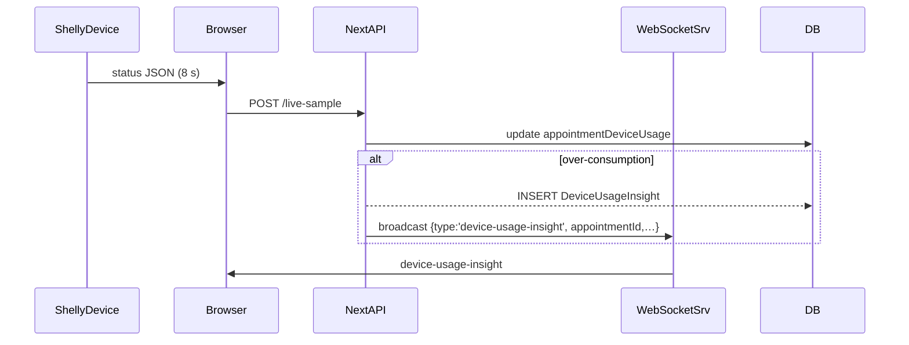

# Energy Insights Module

> **Contexto:** Este documento proporciona la referencia completa del _Energy Insights Module_, su modelo de datos, algoritmos y consideraciones de futuro para IA/Dev.
>
> **Última actualización:** {{DATE}}

---

## 1. Objetivo
Controlar y detectar desviaciones anómalas de consumo energético en equipamiento clínico conectado a enchufes inteligentes (Shelly). Cuando la energía real supera la prevista según el perfil de servicio/equipo se genera un _DeviceUsageInsight_ y se avisa en tiempo real.

## 2. Modelos Prisma

### `ServiceEnergyProfile`
| Campo | Tipo | Descripción |
|-------|------|-------------|
| `id` | `String @id` | PK UUID |
| `systemId` | `String` | Tenant multi-clinic |
| `equipmentId` | `String` | Equipo asociado |
| `serviceId` | `String` | Servicio asociado |
| `avgKwh` | `Float` | Media histórica kWh |
| `stdDevSum` | `Float` | Σ desviaciones estándar; base para umbrales dinámicos |
| `samples` | `Int` | Nº de muestras válidas |
| `createdAt` / `updatedAt` | `DateTime` | Timestamps |

### `DeviceUsageInsight`
| Campo | Tipo | Descripción |
|-------|------|-------------|
| `id` | `String @id` | PK UUID |
| `systemId` | `String` | Tenant |
| `appointmentId` | `String` | Cita afectada |
| `deviceUsageId` | `String` | Registro _appointmentDeviceUsage_ |
| `equipmentClinicAssignmentId` | `String?` | Asignación opcional |
| `insightType` | `Enum UsageInsightType` | `OVER_CONSUMPTION` (único por ahora) |
| `actualKwh` | `Float` | Energía medida |
| `expectedKwh` | `Float` | Energía esperada |
| `deviationPct` | `Float` | % desviación `((actual-expected)/expected)*100` |
| `resolved` | `Boolean @default(false)` | Estado |
| `detailJson` | `Json?` | Extra (stdDevSum, timestamp, etc.) |
| `detectedAt` | `DateTime @default(now())` | Fecha detección |

## 3. Algoritmo `calculateExpectedEnergy()`
1. Se recuperan los últimos consumos de la misma combinación `equipmentId+serviceId`.
2. Si existen ≥ 20 muestras válidas ⇒ media y Σ desviaciones estándar.
3. Fallback: media global del equipo.
4. Devuelve `{ expectedKwh, stdDevSum }`.

## 4. Umbral de Alarma
`exceeds = deviationPct > 25 % &&
           actualKwh > expectedKwh + max(stdDevSum*2, expectedKwh*0.25)`

Resultado: se crea `DeviceUsageInsight` y se emite un evento Socket.IO `device-usage-insight` al _room_ del sistema.

## 5. Flujo Tiempo Real

## 6. UI
- Pestaña “Anomalías” en _Enchufes Inteligentes_ lista los insights abiertos.
- Icono ⚠ en `AppointmentItem` cuando llega evento correspondiente.

## 7. Endpoints
| Método | Ruta | Descripción |
|--------|------|-------------|
| `GET` | `/api/internal/energy-insights` | Filtro por estado/fechas |
| `PATCH` | `/api/internal/energy-insights/{id}` | Resolución / notas |
| `POST` | `/api/internal/energy-insights/recalc` | Recalcular perfiles & reevaluar usos |

## 8. Futuro
- ML para auto-tuning dinámico de `powerThreshold`.
- Aprendizaje incremental de perfiles al cerrar el uso.
- Predicciones de sobre-consumo para prevención proactiva.

---

> Fin del documento 