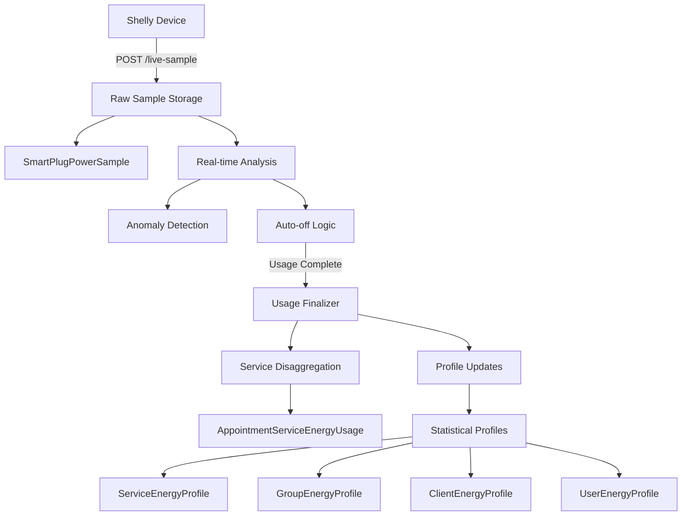

# 📊 Energy Insights - Sistema de Análisis Energético

## 🎯 Propósito

El sistema **Energy Insights** proporciona análisis avanzado del consumo energético de equipos IoT (enchufes inteligentes Shelly) para:

- **Detección de anomalías** en tiempo real
- **Optimización de tiempos** de tratamiento
- **Detección de fraudes** por cliente/empleado
- **Análisis de eficiencia** operacional
- **Predicción de costos** energéticos

## 🏗️ Arquitectura del Sistema

### 📋 Flujo de Datos



### 🗄️ Estructura de Datos

#### 1. Muestras Crudas (`SmartPlugPowerSample`)
```typescript
{
  id: string
  systemId: string      // Multi-tenant
  clinicId: string
  clientId?: string     // Cliente (Person)
  userId?: string       // Empleado
  deviceId: string      // Shelly device
  usageId: string       // AppointmentDeviceUsage
  timestamp: DateTime   // Cada ~8 segundos
  watts: number         // Potencia instantánea
  totalEnergy: number   // kWh acumulado
  relayOn: boolean      // Estado del relay
  servicesInfo?: Json   // Servicios y tiempos estimados
}
```

#### 2. Desagregación por Servicio (`AppointmentServiceEnergyUsage`)
```typescript
{
  id: string
  systemId: string
  clinicId: string
  clientId?: string
  userId: string
  usageId: string       // FK a AppointmentDeviceUsage
  serviceId: string     // FK a Service
  equipmentId: string
  estimatedMinutes: number
  realMinutes: number   // Proporcionalmente calculado
  allocatedKwh: number  // Energía asignada proporcionalmente
}
```

#### 3. Perfiles Estadísticos

**Por Servicio Individual (`ServiceEnergyProfile`)**
```typescript
{
  systemId: string
  equipmentId: string
  serviceId: string
  avgKwhPerMin: number      // Media de kWh/minuto
  stdDevKwhPerMin: number   // Desviación estándar (Welford)
  avgMinutes: number        // Duración media real
  stdDevMinutes: number     // Desviación estándar tiempo
  sampleCount: number       // Número de muestras
  m2KwhPerMin: number      // Suma de cuadrados (Welford)
  m2Minutes: number        // Suma de cuadrados tiempo
}
```

**Por Grupo de Servicios (`ServiceGroupEnergyProfile`)**
```typescript
{
  systemId: string
  equipmentId: string
  servicesHash: string      // MD5 de IDs ordenados
  services: Json           // Array de service IDs
  hourBucket: number       // Hora del día (0-23)
  meanKwh: number
  stdDevKwh: number
  meanMinutes: number
  stdDevMinutes: number
}
```

**Por Cliente (`ClientServiceEnergyProfile`)**
```typescript
{
  systemId: string
  clinicId: string
  clientId: string
  serviceId: string
  hourBucket: number
  // ... métricas estadísticas
}
```

**Por Empleado (`UserServiceEnergyProfile`)**
```typescript
{
  systemId: string
  clinicId: string
  userId: string
  serviceId: string
  hourBucket: number
  // ... métricas estadísticas
}
```

## 🔍 Algoritmos de Análisis

### 📊 Algoritmo de Welford (Desviación Estándar Incremental)

```typescript
// Actualización incremental de media y varianza
const delta = newValue - oldMean
const newMean = oldMean + delta / newSampleCount
const delta2 = newValue - newMean
const newM2 = oldM2 + delta * delta2
const newStdDev = Math.sqrt(newM2 / (newSampleCount - 1))
```

**Ventajas:**
- ✅ Actualización en tiempo real
- ✅ Numéricamente estable
- ✅ Eficiente en memoria
- ✅ No requiere almacenar todas las muestras

### 🚨 Detección de Anomalías

#### Energía (OVER_CONSUMPTION / UNDER_CONSUMPTION)
```typescript
const threshold = expectedKwh + (stdDevSum * sigmaMultiplier)
const deviationPct = (actualKwh - expectedKwh) / expectedKwh
const isAnomaly = deviationPct > deviationPct && actualKwh > threshold
```

#### Duración (OVER_DURATION / UNDER_DURATION)
```typescript
const timeDeviation = Math.abs(actualMinutes - estimatedMinutes) / estimatedMinutes
const isTimeAnomaly = timeDeviation > timeThreshold
```

#### Outliers (Método IQR)
```typescript
const iqr = q3 - q1
const lowerBound = q1 - (1.5 * iqr)
const upperBound = q3 + (1.5 * iqr)
const isOutlier = value < lowerBound || value > upperBound
```

### 🎯 Validación Estadística

#### Confianza del Perfil
```typescript
const confidence = sampleCount >= 20 ? 'high' 
  : sampleCount >= 10 ? 'medium' 
  : sampleCount >= 5 ? 'low' 
  : 'insufficient_data'
```

#### Fallback para σ = 0
```typescript
const effectiveStdDev = stdDev > 0 ? stdDev : mean * 0.1 // 10% fallback
```

## 🚀 APIs Implementadas

### 📡 Endpoints Principales

| Endpoint | Método | Propósito |
|----------|--------|-----------|
| `/api/internal/device-usage/live-sample` | POST | Recibir muestras crudas |
| `/api/internal/energy-insights/stats` | GET | KPIs del dashboard |
| `/api/internal/energy-insights/profiles/service` | GET | Perfiles por servicio |
| `/api/internal/energy-insights/profiles/group` | GET | Perfiles por grupo |
| `/api/internal/energy-insights/profiles/client` | GET | Perfiles por cliente |
| `/api/internal/energy-insights/profiles/user` | GET | Perfiles por empleado |
| `/api/internal/energy-insights/recalc` | POST | Recálculo batch |

### 📊 Dashboard Stats API

**GET** `/api/internal/energy-insights/stats`

**Query Parameters:**
- `clinicId?: string` - Filtrar por clínica
- `dateFrom?: string` - Fecha inicio (ISO)
- `dateTo?: string` - Fecha fin (ISO)

**Response:**
```typescript
{
  success: true,
  data: {
    insights: {
      total: number
      open: number
      resolved: number
      resolutionRate: number
    },
    anomaliesByType: Array<{type: string, count: number}>,
    topProblematicServices: Array<{serviceName, anomalyCount, avgDeviation}>,
    topProblematicClients: Array<{clientName, anomalyCount, avgDeviation}>,
    topProblematicEmployees: Array<{employeeName, anomalyCount, avgTimeDeviation}>,
    weeklyEvolution: Array<{week, anomalyCount, avgDeviation}>,
    equipmentVariability: Array<{equipmentName, variabilityPct, sampleCount}>,
    confidenceDistribution: Array<{confidence, count}>
  }
}
```

### 🔍 Perfiles por Cliente API

**GET** `/api/internal/energy-insights/profiles/client`

**Query Parameters:**
- `clinicId?: string`
- `clientId?: string`
- `serviceId?: string`
- `hourBucket?: number` (0-23)
- `minSamples?: number` (default: 3)
- `anomalyThreshold?: number` (default: 30%)

**Response:**
```typescript
{
  profiles: Array<{
    client: {name, email, phone},
    service: {name, estimatedDuration},
    energy: {meanKwh, stdDevKwh, variabilityPct, globalComparison},
    time: {meanMinutes, stdDevMinutes, variabilityPct, globalComparison},
    risk: {level, score, flags, isAnomalous}
  }>,
  metadata: {
    totalProfiles: number,
    anomalousProfiles: number,
    anomalyRate: number,
    topRiskClients: Array<{clientId, clientName, riskScore, riskFlags}>
  }
}
```

### 👥 Perfiles por Empleado API

**GET** `/api/internal/energy-insights/profiles/user`

**Query Parameters:**
- `clinicId?: string`
- `userId?: string`
- `serviceId?: string`
- `hourBucket?: number`
- `minSamples?: number` (default: 5)
- `performanceThreshold?: number` (default: 20%)

**Response:**
```typescript
{
  profiles: Array<{
    user: {name, email, isActive},
    service: {name, estimatedDuration},
    energy: {meanKwh, benchmarkComparison, quartilePosition},
    time: {meanMinutes, benchmarkComparison, quartilePosition},
    performance: {level, score, flags, needsTraining, isOutlier}
  }>,
  metadata: {
    performanceDistribution: {good, average, below_average, poor},
    topPerformers: Array<{userName, performanceScore, energyEfficiency}>,
    poorPerformersList: Array<{userName, performanceFlags, needsTraining}>
  }
}
```

## ⚙️ Configuración

### 🎛️ Archivo de Configuración

**`config/energy-insights.ts`**

```typescript
export const ENERGY_INSIGHT_CFG: EnergyInsightsConfig = {
  thresholds: {
    deviationPct: 0.25,           // 25% desviación
    sigmaMultiplier: 2.0,         // 2 sigmas
    minSamples: 5,                // Mínimo muestras válidas
    confidenceThreshold: 0.8      // 80% confianza mínima
  },
  retention: {
    rawSamplesDays: 90,           // 3 meses muestras crudas
    disaggregatedYears: 3,        // 3 años desagregados
    downsampleAfterDays: 30       // Down-sample a 30 días
  },
  statistics: {
    welfordMinSamples: 2,         // Mínimo para Welford
    outlierIqrMultiplier: 1.5,    // IQR estándar
    fallbackStdDevPct: 0.1,       // 10% fallback σ
    performanceThresholdPct: 20   // 20% umbral rendimiento
  },
  processing: {
    batchSize: 1000,              // Lotes de 1000
    maxProcessingTimeMs: 1800000, // 30 min máximo
    sampleIntervalSeconds: 8      // Muestras cada 8s
  }
}
```

### 🌍 Variables de Entorno

| Variable | Descripción | Default |
|----------|-------------|---------|
| `ENERGY_DEVIATION_PCT` | % desviación anomalía | 0.25 |
| `ENERGY_SIGMA_MULTIPLIER` | Multiplicador sigma | 2.0 |
| `ENERGY_MIN_SAMPLES` | Mínimo muestras | 5 |
| `RETENTION_RAW_DAYS` | Días retención raw | 90 |
| `RETENTION_DISAGGREGATED_YEARS` | Años retención | 3 |
| `ENERGY_BATCH_SIZE` | Tamaño lote | 1000 |

### 🔧 Configuraciones Predefinidas

```typescript
// Conservadora (más sensible)
ENERGY_CONFIGS.conservative: {
  deviationPct: 0.15,     // 15% más estricto
  sigmaMultiplier: 1.5,   // Más sensible
  minSamples: 10          // Más muestras
}

// Relajada (menos falsos positivos)
ENERGY_CONFIGS.relaxed: {
  deviationPct: 0.35,     // 35% más tolerante
  sigmaMultiplier: 2.5,   // Menos sensible
  minSamples: 3           // Menos muestras
}

// Desarrollo
ENERGY_CONFIGS.development: {
  rawSamplesDays: 7,      // 1 semana
  batchSize: 100,         // Lotes pequeños
  maxProcessingTimeMs: 300000 // 5 minutos
}
```

## 🔄 Gestión de Datos

### 📈 Down-sampling Automático

El script `scripts/energy-retention-cleanup.js` realiza:

1. **Down-sampling**: Muestras crudas → agregados por hora
2. **Purga**: Elimina muestras > 90 días
3. **Limpieza**: Elimina desagregados > 3 años

**Uso:**
```bash
# Ejecución normal
node scripts/energy-retention-cleanup.js --system=SYSTEM_ID

# Dry-run (sin cambios)
node scripts/energy-retention-cleanup.js --system=SYSTEM_ID --dry-run

# Verbose (más logs)
node scripts/energy-retention-cleanup.js --system=SYSTEM_ID --verbose
```

### 📊 Tabla de Agregados por Hora

```sql
CREATE TABLE "smart_plug_power_sample_hourly" (
  id VARCHAR(30) PRIMARY KEY,
  "systemId" VARCHAR(25) NOT NULL,
  "deviceId" VARCHAR(30) NOT NULL,
  "usageId" VARCHAR(30) NOT NULL,
  "hourTimestamp" TIMESTAMPTZ NOT NULL,
  "avgWatts" DECIMAL(8,2) NOT NULL,
  "maxWatts" DECIMAL(8,2) NOT NULL,
  "minWatts" DECIMAL(8,2) NOT NULL,
  "hourlyKwh" DECIMAL(10,3) NOT NULL,
  "sampleCount" INTEGER NOT NULL,
  "wasRelayOn" BOOLEAN NOT NULL
);
```

### 🎯 Escalabilidad

**Estimación de carga:**
- 100 clínicas × 5 enchufes × 10,800 muestras/día = **5.4M muestras/mes**
- Con down-sampling: **~90K agregados/mes** (60-70× reducción)
- Purga automática: Solo **~16M muestras activas** máximo

## 🎨 Interfaz de Usuario

### 📱 Dashboard Principal

**Ubicación:** `/configuracion/integraciones/EquiposIot/EnchufesInteligentes`  
**Pestaña:** "Control inteligente de servicios"

**Componentes:**
- 📊 KPIs principales (anomalías totales, tasa resolución)
- 🔍 Filtros por clínica, cliente, empleado, servicio
- 📈 Gráficos de evolución temporal
- 🏆 Rankings de top performers/problemáticos
- ⚠️ Alertas de anomalías en tiempo real

### 🎛️ Filtros Disponibles

```typescript
interface DashboardFilters {
  clinicId?: string        // Filtrar por clínica
  clientId?: string        // Filtrar por cliente
  userId?: string          // Filtrar por empleado
  serviceId?: string       // Filtrar por servicio
  groupHash?: string       // Filtrar por grupo servicios
  hourBucket?: number      // Filtrar por hora (0-23)
  dateFrom?: string        // Fecha inicio
  dateTo?: string          // Fecha fin
  minSamples?: number      // Mínimo muestras
  anomalyThreshold?: number // Umbral anomalías
}
```

## 🚨 Tipos de Insights

### ⚡ Energía

| Tipo | Descripción | Trigger |
|------|-------------|---------|
| `OVER_CONSUMPTION` | Consumo excesivo | `actualKwh > expected + (σ × 2)` |
| `UNDER_CONSUMPTION` | Consumo insuficiente | `actualKwh < expected - (σ × 2)` |
| `POWER_ANOMALY` | Picos de potencia | Detección en tiempo real |

### ⏱️ Duración

| Tipo | Descripción | Trigger |
|------|-------------|---------|
| `OVER_DURATION` | Duración excesiva | `actualMin > estimatedMin + tolerance` |
| `UNDER_DURATION` | Duración insuficiente | `actualMin < estimatedMin - tolerance` |

### 👤 Comportamiento

| Flag | Descripción | Aplicación |
|------|-------------|------------|
| `HIGH_ENERGY` | Alto consumo vs promedio | Cliente/Empleado |
| `LOW_ENERGY` | Bajo consumo vs promedio | Cliente/Empleado |
| `SLOW_SERVICE` | Servicio lento | Empleado |
| `FAST_SERVICE` | Servicio rápido | Empleado |
| `INCONSISTENT_ENERGY` | Variabilidad alta energía | Cliente/Empleado |
| `INCONSISTENT_TIME` | Variabilidad alta tiempo | Cliente/Empleado |
| `ENERGY_OUTLIER` | Outlier estadístico energía | Cliente/Empleado |
| `TIME_OUTLIER` | Outlier estadístico tiempo | Cliente/Empleado |

## 🔧 Mantenimiento

### 🔄 Tareas Automáticas

1. **Cada muestra (8s)**: Inserción en `SmartPlugPowerSample`
2. **Al cerrar uso**: Desagregación + actualización perfiles
3. **Diario (recomendado)**: Script de retención
4. **Semanal**: Recálculo completo de perfiles

### 📋 Monitoreo

**Métricas clave:**
- Tasa de inserción de muestras
- Tiempo de procesamiento de finalización
- Tamaño de tablas (crecimiento)
- Tasa de detección de anomalías
- Distribución de confianza estadística

**Alertas recomendadas:**
- ⚠️ Tabla `SmartPlugPowerSample` > 10M registros
- ⚠️ Tiempo de finalización > 30s
- ⚠️ Tasa de anomalías > 15%
- ⚠️ Perfiles con confianza 'insufficient_data' > 50%

## 🧪 Testing

### 🎯 Casos de Prueba Críticos

1. **Algoritmo de Welford**
   - Verificar cálculo incremental de σ
   - Validar estabilidad numérica
   - Comprobar convergencia con datos reales

2. **Detección de Anomalías**
   - Falsos positivos < 5%
   - Falsos negativos < 10%
   - Tiempo de detección < 1s

3. **Desagregación Proporcional**
   - Suma de partes = total
   - Proporción correcta por tiempo
   - Manejo de servicios con duración 0

4. **Escalabilidad**
   - 1M muestras/hora sin degradación
   - Down-sampling completo < 30min
   - Purga de 10M registros < 60min

### 🔬 Datos de Prueba

```typescript
// Escenario típico
const testScenario = {
  services: [
    {id: 'svc_1', estimatedMin: 20, realMin: 22},
    {id: 'svc_2', estimatedMin: 40, realMin: 38}
  ],
  totalEnergy: 1.25, // kWh
  samples: 450,      // 60min × 7.5 samples/min
  expectedInsights: ['OVER_DURATION'] // svc_1 se pasó
}
```

## 📚 Referencias

### 🔗 Enlaces Útiles

- [Algoritmo de Welford](https://en.wikipedia.org/wiki/Algorithms_for_calculating_variance#Welford's_online_algorithm)
- [Detección de Outliers IQR](https://en.wikipedia.org/wiki/Interquartile_range#Outliers)
- [Shelly API Documentation](https://shelly-api-docs.shelly.cloud/)

### 📖 Documentación Relacionada

- `docs/SMART_PLUGS_MODULE_ISOLATION.md` - Aislamiento del módulo
- `docs/PRISMA_CLIENT_STRATEGY.md` - Estrategia de cliente Prisma
- `docs/AUTHENTICATION_PATTERNS.md` - Patrones de autenticación

---

**Última actualización:** Julio 2024  
**Versión:** 2.0.0  
**Mantenedor:** Equipo de Desarrollo SaaS 