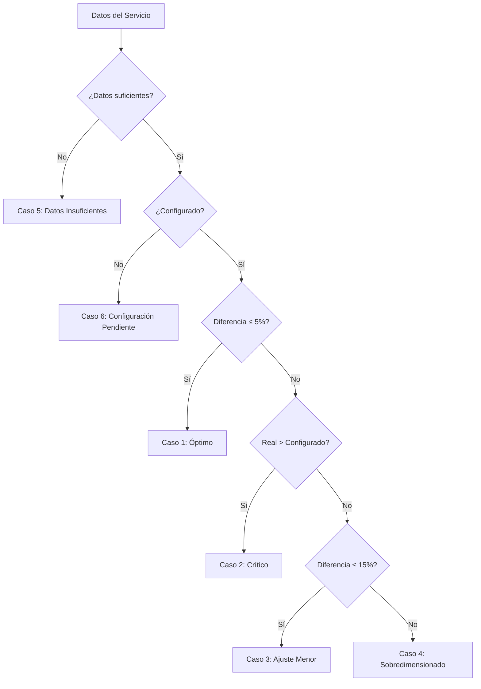

# 📋 ENERGY INSIGHTS - CASOS Y RECOMENDACIONES

## 📊 **Tabla de Casos Completa**

Esta documentación define todos los casos posibles en el sistema de Energy Insights y las recomendaciones específicas que se muestran tanto en el **Modal de Actualización** como en los **Tooltips de Servicio**.

---

## 🎯 **CASOS PRINCIPALES**

### **CASO 1: CONFIGURACIÓN ÓPTIMA** 🟢
- **Condición**: `|avgReal - configured| ≤ 5%`
- **Prioridad**: Baja
- **Estado**: Estable

| Componente | Mensaje/Recomendación |
|------------|----------------------|
| **Modal** | `La configuración actual es óptima (diferencia: X%). No se requieren cambios.` |
| **Tooltip** | `✅ Configuración Óptima - La duración configurada (X min) coincide con la realidad (Y min). Mantener la duración actual y continuar monitoreando.` |
| **Acción** | Mantener configuración |

---

### **CASO 2: SOBREPASO CRÍTICO** 🔴
- **Condición**: `avgReal > configured`
- **Prioridad**: Crítica
- **Estado**: Variable

| Componente | Mensaje/Recomendación |
|------------|----------------------|
| **Modal** | `⚠️ CRÍTICO: La duración real (X min) excede la configurada (Y min). Riesgo de retrasos. Se propone: Tratamiento X min + Z min de preparación.` |
| **Tooltip** | `🚨 Sobrepaso Crítico - El tiempo real supera la duración configurada. Esto causa retrasos en la agenda. Aumentar la duración del servicio para evitar retrasos.` |
| **Acción** | Actualizar duración urgente |
| **Propuesta** | `serviceDuration = avgReal + margen(10% o mín 2 min)` |

---

### **CASO 3: AJUSTE MENOR** 🟡
- **Condición**: `avgReal < configured AND diferencia 5-15%`
- **Prioridad**: Media
- **Estado**: Moderado

| Componente | Mensaje/Recomendación |
|------------|----------------------|
| **Modal** | `Optimización menor: Ajustar duración de tratamiento de X min a Y min (diferencia: Z%). Mantener duración de servicio para preservar margen de preparación.` |
| **Tooltip** | `🔧 Ajuste Recomendado - Pequeña diferencia entre configurado y real. Ajustar la duración de tratamiento para optimizar la precisión.` |
| **Acción** | Optimizar duración |
| **Propuesta** | `treatmentDuration = avgReal, mantener serviceDuration` |

---

### **CASO 4: SOBREDIMENSIONADO** 🟠
- **Condición**: `avgReal < configured AND diferencia > 15%`
- **Prioridad**: Media
- **Estado**: Variable

| Componente | Mensaje/Recomendación |
|------------|----------------------|
| **Modal** | `Servicio sobredimensionado: La duración real (X min) es Y% menor que la configurada (Z min). Se propone optimizar a W min (X min tratamiento + V min preparación).` |
| **Tooltip** | `📉 Servicio Sobredimensionado - La duración configurada es mayor que la realidad. Reducir la duración para optimizar la agenda sin comprometer la calidad.` |
| **Acción** | Optimizar duración |
| **Propuesta** | `serviceDuration = avgReal + margen(15% o mín 3 min)` |

---

### **CASO 5: DATOS INSUFICIENTES** ⚫
- **Condición**: `sampleCount < 3 OR avgReal ≤ 0`
- **Prioridad**: Baja
- **Estado**: Sin datos

| Componente | Mensaje/Recomendación |
|------------|----------------------|
| **Modal** | No se muestra (modal no se abre) |
| **Tooltip** | `📊 Datos Insuficientes - Solo X muestras disponibles. Se necesitan al menos 3 tratamientos para análisis confiable.` |
| **Acción** | Esperar más datos |

---

### **CASO 6: CONFIGURACIÓN PENDIENTE** 🔵
- **Condición**: `configuredDuration ≤ 0 OR null`
- **Prioridad**: Media
- **Estado**: Sin configurar

| Componente | Mensaje/Recomendación |
|------------|----------------------|
| **Modal** | No se muestra (modal no se abre) |
| **Tooltip** | `⚙️ Configuración Pendiente - El servicio no tiene duración configurada. Configurar duración inicial basándose en los datos reales disponibles.` |
| **Acción** | Configurar duración |

---

## 🎨 **CÓDIGOS DE COLOR**

### **Modal de Actualización**
- 🟢 **Verde**: Configuración óptima (no cambios)
- 🔴 **Rojo**: Sobrepaso crítico (urgente)
- 🟡 **Amarillo**: Ajuste menor (recomendado)
- 🟠 **Naranja**: Sobredimensionado (optimizar)

### **Tooltips de Servicio**
- `bg-green-100 text-green-700 border-green-300`: Óptimo
- `bg-red-100 text-red-700 border-red-300`: Crítico
- `bg-yellow-100 text-yellow-700 border-yellow-300`: Ajuste menor
- `bg-orange-100 text-orange-700 border-orange-300`: Sobredimensionado
- `bg-gray-100 text-gray-700 border-gray-300`: Datos insuficientes
- `bg-blue-100 text-blue-700 border-blue-300`: Configuración pendiente

---

## 📝 **FÓRMULAS DE CÁLCULO**

### **Diferencia Porcentual**
```javascript
const difference = Math.abs(avgReal - configured)
const diffPercentage = (difference / configured) * 100
```

### **Margen de Preparación**
- **Sobrepaso crítico**: `Math.max(2, Math.round(avgReal * 0.1))` (10% o mín 2 min)
- **Sobredimensionado**: `Math.max(3, Math.round(avgReal * 0.15))` (15% o mín 3 min)

### **Variabilidad Futura**
```javascript
if (avgReal > configured || deviationPct > 25) {
  status = 'Variable' // Rojo
} else if (deviationPct >= 10) {
  status = 'Moderado' // Amarillo  
} else {
  status = 'Estable' // Verde
}
```

---

## 🔄 **FLUJO DE DECISIÓN**



---

## 📚 **CONTEXTO EDUCATIVO**

### **Conceptos Clave**
- **Duración de Tratamiento**: Tiempo efectivo de uso del equipo
- **Duración de Servicio**: Tiempo total de cita (tratamiento + preparación)
- **Margen de Preparación**: Tiempo adicional para preparar al paciente
- **Variabilidad**: Consistencia en los tiempos de tratamiento

### **Mejores Prácticas**
1. **Siempre incluir margen de preparación** (5-10 min mínimo)
2. **Monitorear regularmente** los datos reales vs configurados
3. **Actuar rápidamente** en casos de sobrepaso crítico
4. **Optimizar gradualmente** en casos de sobredimensionado
5. **Esperar datos suficientes** antes de hacer cambios (mín 3 muestras)

---

## 🎯 **OBJETIVOS DEL SISTEMA**

1. **Reducir retrasos** identificando sobrepases críticos
2. **Optimizar agenda** eliminando tiempos sobredimensionados  
3. **Educar usuarios** sobre gestión de tiempos de tratamiento
4. **Basar decisiones en datos reales** no en estimaciones
5. **Mantener calidad** preservando márgenes de preparación

---

*Última actualización: Enero 2025* 