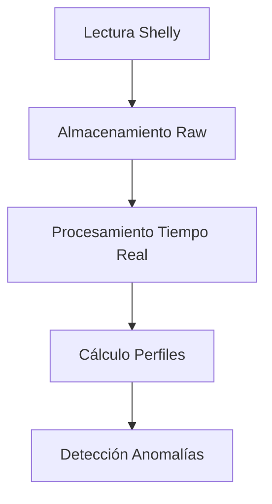
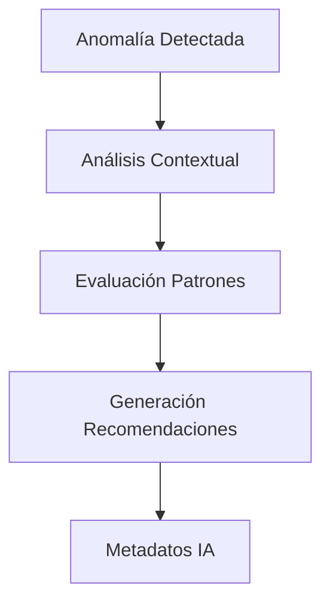
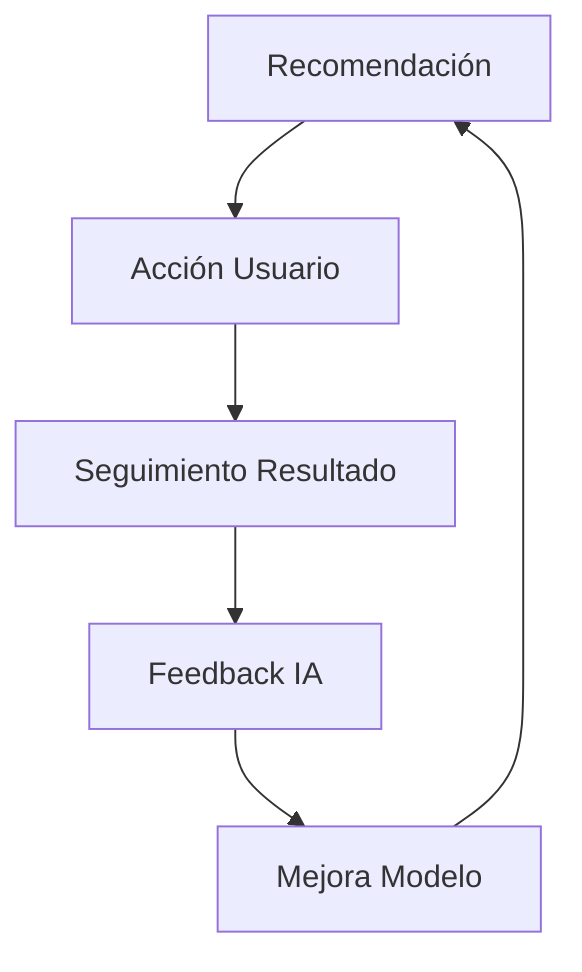

# 🧠 ENERGY INSIGHTS - SISTEMA INTELIGENTE DE ANÁLISIS DE ANOMALÍAS

## 📋 Resumen Ejecutivo

Sistema avanzado de detección y análisis de anomalías energéticas diseñado para optimizar el rendimiento de clínicas de belleza y preparado para integración con agente IA. Implementa múltiples estrategias de análisis, recomendaciones contextuales y metadatos completos para aprendizaje automático.

## 🎯 Objetivos del Sistema

### Objetivos Principales
- **Detección Inteligente**: Identificar anomalías en consumo energético y duración de tratamientos
- **Análisis Contextual**: Evaluar patrones de comportamiento de clientes y empleados
- **Recomendaciones Automatizadas**: Generar acciones específicas basadas en contexto
- **Preparación para IA**: Estructurar datos para futuro aprendizaje automático

### Objetivos Secundarios
- **Optimización Energética**: Reducir costos operativos
- **Detección de Fraude**: Identificar comportamientos sospechosos
- **Mejora de Procesos**: Optimizar técnicas y procedimientos
- **Gestión de Calidad**: Mantener estándares de servicio

## 🔧 Arquitectura del Sistema

### Componentes Principales

#### 1. **Motor de Cálculo Inteligente** (`lib/energy/calculate-expected-energy.ts`)
```typescript
interface ExpectedEnergyResult {
  // Datos básicos
  expectedKwh: number
  stdDevSum: number
  confidence: 'high' | 'medium' | 'low' | 'insufficient_data'
  
  // 🤖 Metadatos para IA
  calculationMethod: 'statistical_profile' | 'fallback_duration' | 'theoretical_estimate'
  fallbackUsed: boolean
  dataQuality: {
    minSamples: number
    avgSamples: number
    profileCoverage: number
    confidenceScore: number // 0-1 score para ML
  }
  contextMetadata: {
    servicesAnalyzed: ServiceAnalysis[]
    equipmentId: string
    timestamp: string
  }
}
```

#### 2. **Analizador de Patrones** (`app/api/internal/energy-insights/route.ts`)
```typescript
interface PatternAnalysis {
  clientPatterns: ClientPattern[]
  employeePatterns: EmployeePattern[]
  servicePatterns: ServicePattern[]
  temporalPatterns: TemporalPattern[]
  
  // 🤖 Metadatos para IA
  aiAnalysisMetadata: {
    dataQuality: DataQualityMetrics
    trendsDetected: TrendAnalysis
    analysisTimestamp: string
  }
}
```

#### 3. **Sistema de Recomendaciones** (Función `generateIntelligentRecommendations`)
```typescript
interface Recommendation {
  type: string
  priority: 'low' | 'medium' | 'high' | 'critical'
  category: string
  message: string
  actionRequired: boolean
  estimatedImpact: 'low' | 'medium' | 'high'
  
  // 🤖 Metadatos para IA
  aiMetadata: {
    confidenceScore: number
    riskLevel: string
    recommendationType: string
    [key: string]: any // Datos contextuales específicos
  }
}
```

## 📊 Estrategias de Cálculo

### 1. **Análisis Estadístico** (Preferido)
- **Fuente**: Perfiles energéticos históricos (`ServiceEnergyProfile`)
- **Algoritmo**: Welford para media y desviación estándar
- **Validación**: Mínimo 5 muestras por perfil
- **Confianza**: Alta (80%+ cobertura de servicios)

### 2. **Fallback Inteligente** (Automático)
- **Trigger**: Servicios sin perfil estadístico válido
- **Lógica**: `treatmentDurationMinutes || durationMinutes`
- **Estimación**: 3.5 kWh/hora para equipos láser
- **Confianza**: Media-Baja según cobertura

### 3. **Estimación Teórica** (Último recurso)
- **Trigger**: Sin datos históricos ni configuración
- **Valores**: Duración 15min, 0.058 kWh/min
- **Confianza**: Baja (solo para continuidad operativa)

## 🎯 Casos de Análisis Detallados

### Tabla de Casos de Detección

| **Caso** | **Histórico Cliente** | **Histórico Empleado** | **Baseline Usado** | **Confianza** | **Acción IA** |
|----------|----------------------|----------------------|-------------------|---------------|---------------|
| **1A** | ❌ Primera vez | ✅ Existe | Promedio servicio | Media | Monitorear patrón inicial |
| **1B** | ✅ Existe | ✅ Existe | Histórico cliente | Alta | Comparar con patrón personal |
| **1C** | ✅ Existe | ❌ Nuevo empleado | Histórico cliente | Media | Entrenar empleado con datos cliente |
| **2A** | ❌ Primera vez | ✅ Existe | Suma promedios | Media | Crear perfil combo |
| **2B** | ✅ Combo exacto | ✅ Existe | Histórico combo | Alta | Optimizar combo específico |
| **2C** | ✅ Servicios individuales | ✅ Existe | Suma históricos | Alta | Evaluar eficiencia combo |
| **3A** | ❌ Primera vez | ❌ Nuevo empleado | Configuración servicio | Baja | Supervisión estrecha |
| **3B** | ❌ Primera vez | ❌ Nuevo empleado | Suma configuraciones | Baja | Entrenamiento intensivo |

## 🧠 Sistema de Recomendaciones

### Categorías de Recomendaciones

#### 1. **Detección de Fraude** (`fraud_detection`)
- **Trigger**: Desviación >200% o patrones sospechosos
- **Acciones**: Investigación inmediata, supervisión
- **IA**: Alta confianza, riesgo crítico

#### 2. **Mantenimiento Técnico** (`technical_issue`)
- **Trigger**: Sub-consumo, fallos de equipo
- **Acciones**: Verificación, calibración, reparación
- **IA**: Alta confianza, impacto operativo

#### 3. **Gestión de Personal** (`human_resources`)
- **Trigger**: Patrones de eficiencia anómalos
- **Acciones**: Entrenamiento, reconocimiento
- **IA**: Media confianza, mejora gradual

#### 4. **Optimización Energética** (`energy_management`)
- **Trigger**: Sobre-consumo consistente
- **Acciones**: Ajuste de configuración, técnica
- **IA**: Media confianza, ahorro operativo

#### 5. **Mejora de Procesos** (`process_improvement`)
- **Trigger**: Duraciones anómalas
- **Acciones**: Revisión de procedimientos
- **IA**: Media confianza, eficiencia operativa

## 🤖 Preparación para Agente IA

### Estructura de Datos para ML

#### 1. **Features Principales**
```typescript
interface MLFeatures {
  // Datos numéricos
  deviationPct: number
  confidenceScore: number
  profileCoverage: number
  
  // Datos categóricos
  calculationMethod: string
  insightType: string
  severity: string
  
  // Contexto temporal
  hourOfDay: number
  dayOfWeek: number
  
  // Contexto de negocio
  clientRiskScore: number
  employeeEfficiency: number
  serviceComplexity: number
}
```

#### 2. **Labels para Entrenamiento**
```typescript
interface MLLabels {
  // Clasificación de anomalías
  anomalyType: string
  severityLevel: string
  
  // Resultados de acciones
  recommendationFollowed: boolean
  issueResolved: boolean
  timeToResolution: number
  
  // Impacto de negocio
  costImpact: number
  customerSatisfaction: number
  operationalEfficiency: number
}
```

#### 3. **Metadatos de Calidad**
```typescript
interface DataQualityMetrics {
  // Completitud de datos
  dataCompleteness: number
  profileAvailability: number
  
  // Calidad estadística
  sampleSize: number
  varianceStability: number
  
  // Contexto temporal
  dataFreshness: number
  seasonalAdjustment: number
}
```

### Estrategias de Aprendizaje

#### 1. **Aprendizaje Supervisado**
- **Objetivo**: Clasificar tipos de anomalías
- **Features**: Desviaciones, patrones, contexto
- **Labels**: Tipos confirmados, resoluciones exitosas

#### 2. **Aprendizaje No Supervisado**
- **Objetivo**: Descubrir patrones ocultos
- **Técnicas**: Clustering, detección de outliers
- **Aplicación**: Nuevos tipos de anomalías

#### 3. **Aprendizaje por Refuerzo**
- **Objetivo**: Optimizar recomendaciones
- **Recompensas**: Resolución exitosa, satisfacción
- **Acciones**: Tipos de recomendaciones, prioridades

## 📈 Métricas de Rendimiento

### KPIs Operativos
- **Tasa de Detección**: % de anomalías detectadas vs reales
- **Precisión**: % de anomalías reales vs falsas alarmas
- **Tiempo de Resolución**: Tiempo promedio hasta resolución
- **Impacto Económico**: Ahorro energético, prevención fraude

### KPIs de Calidad de Datos
- **Cobertura de Perfiles**: % servicios con perfil estadístico
- **Confianza Promedio**: Score promedio de confianza
- **Uso de Fallback**: % casos que requieren fallback
- **Frescura de Datos**: Antigüedad promedio de perfiles

### KPIs para IA
- **Accuracy**: Precisión de clasificación
- **Recall**: Cobertura de detección
- **F1-Score**: Balance precisión-cobertura
- **AUC-ROC**: Capacidad discriminativa

## 🔄 Flujo de Procesamiento

### 1. **Ingesta de Datos**


### 2. **Análisis Inteligente**


### 3. **Ciclo de Mejora**


## 🛠️ Implementación Técnica

### Archivos Principales
- `lib/energy/calculate-expected-energy.ts` - Motor de cálculo
- `app/api/internal/energy-insights/route.ts` - API principal
- `lib/energy/usage-finalizer.ts` - Finalización de perfiles
- `prisma/seed-anomalias.ts` - Datos de prueba

### Configuración
```typescript
const ENERGY_INSIGHT_CONFIG = {
  minSamples: 5,
  deviationThreshold: 0.2,
  sigmaMultiplier: 2,
  confidenceThresholds: {
    high: 0.8,
    medium: 0.5,
    low: 0.2
  }
}
```

### Base de Datos
```sql
-- Perfiles estadísticos
CREATE TABLE smart_plug_service_energy_profiles (
  id TEXT PRIMARY KEY,
  system_id TEXT NOT NULL,
  equipment_id TEXT NOT NULL,
  service_id TEXT NOT NULL,
  avg_kwh_per_min REAL NOT NULL,
  std_dev_kwh_per_min REAL NOT NULL,
  sample_count INTEGER NOT NULL,
  -- Campos para algoritmo de Welford
  m2_kwh_per_min REAL DEFAULT 0,
  created_at TIMESTAMP DEFAULT NOW(),
  updated_at TIMESTAMP DEFAULT NOW()
);

-- Anomalías detectadas
CREATE TABLE smart_plug_device_usage_insights (
  id TEXT PRIMARY KEY,
  system_id TEXT NOT NULL,
  clinic_id TEXT NOT NULL,
  appointment_id TEXT NOT NULL,
  insight_type TEXT NOT NULL,
  actual_kwh REAL NOT NULL,
  expected_kwh REAL NOT NULL,
  deviation_pct REAL NOT NULL,
  detail_json JSONB, -- Metadatos para IA
  resolved BOOLEAN DEFAULT FALSE,
  created_at TIMESTAMP DEFAULT NOW()
);
```

## 🎯 Roadmap de Integración IA

### Fase 1: Preparación (Actual)
- ✅ Estructura de datos para ML
- ✅ Metadatos de calidad
- ✅ Sistema de recomendaciones
- ✅ Documentación completa

### Fase 2: Recolección de Datos (Próxima)
- 📊 Acumulación de datasets
- 📈 Validación de patrones
- 🔍 Refinamiento de features
- 📋 Etiquetado de resultados

### Fase 3: Modelo Base (Futura)
- 🤖 Clasificador de anomalías
- 📊 Predictor de severidad
- 🎯 Recomendador inteligente
- 📈 Evaluación de rendimiento

### Fase 4: Optimización (Avanzada)
- 🧠 Aprendizaje continuo
- 🔄 Feedback loops
- 📊 A/B testing
- 🎯 Personalización

## 📚 Referencias y Recursos

### Documentación Técnica
- [Algoritmo de Welford](https://en.wikipedia.org/wiki/Algorithms_for_calculating_variance#Welford's_online_algorithm)
- [Detección de Anomalías](https://en.wikipedia.org/wiki/Anomaly_detection)
- [Sistemas de Recomendación](https://en.wikipedia.org/wiki/Recommender_system)

### Herramientas ML Sugeridas
- **TensorFlow.js**: Para modelos en el navegador
- **scikit-learn**: Para prototipado rápido
- **PyTorch**: Para modelos avanzados
- **MLflow**: Para gestión de experimentos

### Datasets de Referencia
- Perfiles energéticos por servicio
- Patrones de comportamiento de usuarios
- Resultados de recomendaciones
- Métricas de satisfacción

---

**Última actualización**: 2024-12-28
**Versión**: 1.0.0
**Mantenedor**: Sistema Energy Insights 