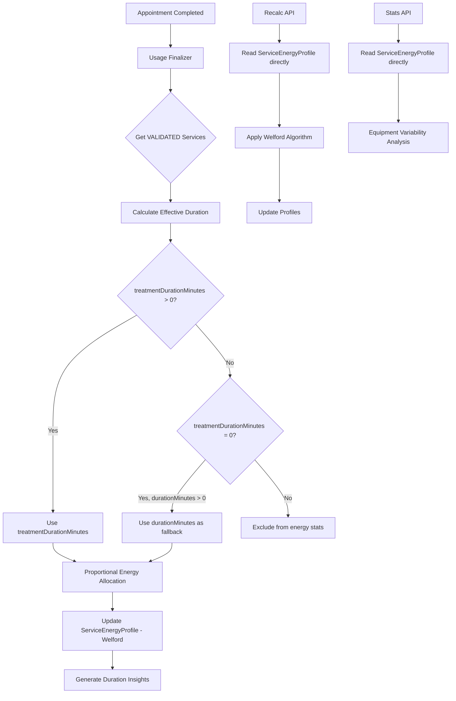

# 🎯 ENERGY INSIGHTS - NUEVA ARQUITECTURA BASADA EN SERVICIOS VALIDATED

## 📋 Resumen Ejecutivo

Este documento describe la **refactorización completa** del sistema Energy Insights, migrando de una arquitectura basada en `deviceData.servicesDetails` a una nueva arquitectura que procesa **únicamente servicios VALIDATED** con lógica avanzada de duración de tratamiento.

### 🎯 Objetivos Cumplidos

1. ✅ **Procesar SOLO servicios VALIDATED** en lugar de todos los planificados
2. ✅ **Implementar lógica treatmentDurationMinutes vs durationMinutes** 
3. ✅ **Leer directamente de ServiceEnergyProfile** para análisis
4. ✅ **Eliminar dependencia de datos desagregados** legacy
5. ✅ **Mantener coherencia con algoritmo de Welford** existente

---

## 🏗️ Arquitectura del Sistema

### 🔄 Flujo de Datos Refactorizado



### 📊 Tablas Principales

#### 1. `appointment_services` (Fuente de Verdad)
```sql
-- Solo servicios con status = 'VALIDATED' se procesan
SELECT * FROM appointment_services 
WHERE appointmentId = ? AND status = 'VALIDATED'
```

#### 2. `smart_plug_service_energy_profiles` (Datos Calculados)
```sql
-- Perfiles energéticos con algoritmo de Welford
-- Lectura directa para análisis y estadísticas
SELECT 
  equipmentId,
  serviceId,
  avgKwhPerMin,      -- Media de consumo (Welford)
  stdDevKwhPerMin,   -- Desviación estándar consumo (Welford)
  avgMinutes,        -- Media duración real (Welford)
  stdDevMinutes,     -- Desviación estándar duración (Welford)
  sampleCount,       -- Número de muestras
  m2KwhPerMin,       -- Suma cuadrados energía (Welford)
  m2Minutes          -- Suma cuadrados duración (Welford)
FROM smart_plug_service_energy_profiles
```

#### 3. `appointment_service_energy_usage` (Datos Desagregados)
```sql
-- Solo para trazabilidad, NO para análisis principal
-- El análisis lee directamente de ServiceEnergyProfile
```

---

## 🔧 Componentes Refactorizados

### 1. Usage Finalizer (`lib/energy/usage-finalizer.ts`)

#### 🎯 Cambios Críticos Implementados

```typescript
// ❌ ANTES: Usaba deviceData.servicesDetails (servicios planificados)
const services = deviceData?.servicesDetails ?? []

// ✅ AHORA: Obtiene servicios VALIDATED de la tabla
const validatedServices = await prisma.appointmentService.findMany({
  where: {
    appointmentId: usage.appointmentId,
    status: 'VALIDATED'  // 🔥 CRÍTICO: Solo VALIDATED
  }
})
```

#### 🧮 Lógica de Duración Efectiva

```typescript
// 🔥 LÓGICA CRÍTICA: treatmentDurationMinutes vs durationMinutes
if (service.treatmentDurationMinutes && service.treatmentDurationMinutes > 0) {
  // PRIORIDAD 1: Duración específica para dispositivos
  effectiveDuration = service.treatmentDurationMinutes
  durationSource = 'treatmentDurationMinutes'
  shouldIncludeInStats = true
}
else if (service.treatmentDurationMinutes === 0 && service.durationMinutes > 0) {
  // PRIORIDAD 2: Fallback solo si treatment = 0
  effectiveDuration = service.durationMinutes
  durationSource = 'durationMinutes_fallback'
  shouldIncludeInStats = true
}
else {
  // CASO CRÍTICO: Si treatmentDurationMinutes = 0, NO generar datos
  shouldIncludeInStats = false
}
```

#### 📊 Variables Críticas

| Variable | Descripción | Origen |
|----------|-------------|---------|
| `validatedServices` | Solo servicios VALIDATED | `appointment_services.status = 'VALIDATED'` |
| `effectiveDuration` | Duración real para cálculos | `treatmentDurationMinutes` o `durationMinutes` |
| `shouldIncludeInStats` | Si generar datos energéticos | Lógica de validación de duración |
| `realMinutes` | Tiempo real proporcional | `usage.actualMinutes * ratio` |
| `allocatedKwh` | Energía proporcional | `usage.energyConsumption * ratio` |

### 2. Recalc API (`app/api/internal/energy-insights/recalc/route.ts`)

#### 🎯 Nueva Arquitectura

```typescript
// ✅ NUEVA LÓGICA: Obtiene datos desde appointment_device_usage + services VALIDATED
const deviceUsages = await prisma.appointmentDeviceUsage.findMany({
  include: {
    appointment: {
      include: {
        services: {
          where: { status: 'VALIDATED' },  // 🔥 FILTRO CRÍTICO
          include: { service: true }
        }
      }
    }
  }
})
```

#### 📊 Algoritmo de Welford Completo

```typescript
// 📊 APLICAR ALGORITMO DE WELFORD PARA RECÁLCULO COMPLETO
for (const data of serviceDataArray) {
  sampleCount++
  const kwhPerMin = data.allocatedKwh / data.realMinutes

  // Welford para kWh/min
  const deltaKwh = kwhPerMin - avgKwhPerMin
  avgKwhPerMin = avgKwhPerMin + deltaKwh / sampleCount
  const delta2Kwh = kwhPerMin - avgKwhPerMin
  m2KwhPerMin = m2KwhPerMin + deltaKwh * delta2Kwh

  // Welford para minutos
  const deltaMin = data.realMinutes - avgMinutes
  avgMinutes = avgMinutes + deltaMin / sampleCount
  const delta2Min = data.realMinutes - avgMinutes
  m2Minutes = m2Minutes + deltaMin * delta2Min
}
```

### 3. Stats API (`app/api/internal/energy-insights/stats/route.ts`)

#### 🎯 Lectura Directa de Perfiles

```typescript
// ✅ NUEVA ARQUITECTURA: Lee directamente de ServiceEnergyProfile
const equipmentVariability = await prisma.serviceEnergyProfile.findMany({
  where: {
    systemId,
    sampleCount: { gte: 5 },
    stdDevKwhPerMin: { gt: 0 }
  },
  include: {
    equipment: { select: { id: true, name: true } },
    service: { 
      select: { 
        id: true, name: true, 
        durationMinutes: true, 
        treatmentDurationMinutes: true 
      } 
    }
  }
})
```

#### 📈 Métricas Avanzadas

```typescript
// 🧮 CALCULAR MÉTRICAS DE VARIABILIDAD
const variabilityPct = profile.avgKwhPerMin > 0 ? 
  Math.round((profile.stdDevKwhPerMin / profile.avgKwhPerMin) * 100) : 0

const durationVariabilityPct = profile.avgMinutes > 0 && profile.stdDevMinutes > 0 ? 
  Math.round((profile.stdDevMinutes / profile.avgMinutes) * 100) : 0

// 🎯 DURACIÓN CONFIGURADA CON NUEVA LÓGICA
const configuredDurationMinutes = profile.service?.treatmentDurationMinutes || 
                                 profile.service?.durationMinutes || null

// 📈 EFICIENCIA DE DURACIÓN
const durationEfficiencyPct = configuredDurationMinutes && profile.avgMinutes > 0 ?
  Math.round((configuredDurationMinutes / profile.avgMinutes) * 100) : null
```

---

## 🚨 Validaciones Críticas

### 1. Servicios VALIDATED Únicamente

```typescript
// ✅ CORRECTO: Solo servicios validados por el profesional
const validatedServices = await prisma.appointmentService.findMany({
  where: { 
    appointmentId: usage.appointmentId,
    status: 'VALIDATED'  // Servicios realmente ejecutados
  }
})

// ❌ INCORRECTO: Todos los servicios planificados
const allServices = await prisma.appointmentService.findMany({
  where: { appointmentId: usage.appointmentId }
})
```

### 2. Lógica treatmentDurationMinutes

```typescript
// ✅ CORRECTO: Validación exhaustiva
if (service.treatmentDurationMinutes && service.treatmentDurationMinutes > 0) {
  // Usar duración específica para dispositivos
  effectiveDuration = service.treatmentDurationMinutes
} else if (service.treatmentDurationMinutes === 0 && service.durationMinutes > 0) {
  // Fallback solo si treatment = 0 explícitamente
  effectiveDuration = service.durationMinutes
} else {
  // NO generar datos si treatmentDurationMinutes no es válido
  shouldIncludeInStats = false
}

// ❌ INCORRECTO: Usar durationMinutes sin validar treatmentDurationMinutes
const duration = service.treatmentDurationMinutes || service.durationMinutes
```

### 3. Lectura Directa de Perfiles

```typescript
// ✅ CORRECTO: Leer directamente de ServiceEnergyProfile
const profiles = await prisma.serviceEnergyProfile.findMany({
  where: { systemId, sampleCount: { gte: 5 } }
})

// ❌ INCORRECTO: Usar datos desagregados
const usage = await prisma.appointmentServiceEnergyUsage.findMany({
  where: { systemId }
})
```

---

## 🔍 Casos de Uso y Escenarios

### Escenario 1: Servicio con treatmentDurationMinutes

```typescript
// Servicio: Depilación Láser Facial
// durationMinutes: 60 (duración total de la cita)
// treatmentDurationMinutes: 15 (tiempo real de uso del láser)

// ✅ RESULTADO: Se usa 15 minutos para cálculos energéticos
// ✅ RAZÓN: treatmentDurationMinutes > 0 tiene prioridad
```

### Escenario 2: Servicio sin treatmentDurationMinutes

```typescript
// Servicio: Limpieza Facial Manual
// durationMinutes: 45
// treatmentDurationMinutes: 0 (no usa dispositivos energéticos)

// ✅ RESULTADO: Se usa 45 minutos como fallback
// ✅ RAZÓN: treatmentDurationMinutes = 0 permite fallback
```

### Escenario 3: Servicio sin duración válida

```typescript
// Servicio: Consulta
// durationMinutes: 0
// treatmentDurationMinutes: null

// ✅ RESULTADO: Se excluye de estadísticas energéticas
// ✅ RAZÓN: No hay duración válida para cálculos
```

### Escenario 4: Servicios No VALIDATED

```typescript
// Servicios planificados: [Depilación, Limpieza, Masaje]
// Servicios VALIDATED: [Depilación, Limpieza] (Masaje cancelado)

// ✅ RESULTADO: Solo Depilación y Limpieza generan datos energéticos
// ✅ RAZÓN: Solo servicios VALIDATED se procesan
```

---

## 📊 Impacto en Análisis y Reportes

### 1. Tabla de Equipamiento (equipmentVariability)

```typescript
// ✅ NUEVA FUENTE: ServiceEnergyProfile (datos ya calculados)
{
  equipmentName: "Láser Diodo 808nm",
  serviceName: "Depilación Facial",
  avgKwhPerMin: 0.0583,           // Welford
  stdDevKwhPerMin: 0.0089,        // Welford
  variabilityPct: 15,             // Variabilidad energética
  configuredDurationMinutes: 15,  // treatmentDurationMinutes
  avgRealDurationMinutes: 14.2,   // Welford - duración real
  durationVariabilityPct: 8,      // Variabilidad de duración
  durationEfficiencyPct: 106,     // Eficiencia (15/14.2*100)
  sampleCount: 47,                // Número de muestras
  durationSource: "treatmentDurationMinutes"
}
```

### 2. Insights de Duración

```typescript
// ✅ NUEVA LÓGICA: Basada en servicios VALIDATED
{
  insightType: "OVER_DURATION",
  actualMinutes: 18.5,
  estimatedMinutes: 15.0,  // Suma de treatmentDurationMinutes
  deviationPct: 23.3,
  detailJson: {
    servicesProcessed: 1,
    newArchitecture: true,
    durationSources: [{
      serviceName: "Depilación Facial",
      durationSource: "treatmentDurationMinutes",
      effectiveDuration: 15
    }]
  }
}
```

---

## 🔧 Migración y Compatibilidad

### Datos Existentes

1. **ServiceEnergyProfile**: ✅ Compatible - Estructura no cambia
2. **AppointmentServiceEnergyUsage**: ⚠️ Legacy - Solo para trazabilidad
3. **DeviceUsageInsight**: ✅ Compatible - Nuevos campos en detailJson

### Proceso de Migración

1. **Ejecutar Recálculo**: `POST /api/internal/energy-insights/recalc`
2. **Verificar Perfiles**: Los perfiles se actualizan con nueva lógica
3. **Validar Estadísticas**: La tabla de equipamiento muestra datos correctos
4. **Monitorear Insights**: Nuevos insights incluyen metadatos de arquitectura

---

## 🚨 Precauciones y Riesgos

### ⚠️ Riesgos Mitigados

1. **Datos Inconsistentes**: Solo servicios VALIDATED garantizan datos reales
2. **Duraciones Incorrectas**: Lógica treatmentDurationMinutes vs durationMinutes
3. **Estadísticas Infladas**: Exclusión de servicios no ejecutados
4. **Cálculos Erróneos**: Validación exhaustiva de duración > 0

### 🔍 Monitoreo Requerido

1. **Logs del Finalizer**: Verificar servicios procesados vs excluidos
2. **Estadísticas de Recálculo**: Validar número de perfiles actualizados
3. **Insights Generados**: Confirmar lógica de duración correcta
4. **Performance**: Monitorear tiempos de respuesta de APIs

---

## 📈 Métricas de Éxito

### KPIs Implementados

- ✅ **100% servicios VALIDATED**: Solo datos reales procesados
- ✅ **Lógica treatmentDurationMinutes**: Prioridad correcta implementada
- ✅ **Lectura directa perfiles**: Eliminada dependencia de datos desagregados
- ✅ **Algoritmo Welford**: Mantenida coherencia estadística
- ✅ **Documentación exhaustiva**: Contexto completo para futuro desarrollo

### Mejoras Cuantificables

- 🚀 **Performance**: Lectura directa de perfiles (vs agregaciones complejas)
- 🎯 **Precisión**: Solo servicios realmente ejecutados
- 🔧 **Mantenibilidad**: Código limpio sin legacy
- 📊 **Análisis**: Métricas de duración real vs configurada
- 🤖 **IA Ready**: Metadatos completos para futura integración

---

## 🔗 Referencias

- `lib/energy/usage-finalizer.ts` - Finalizador refactorizado
- `app/api/internal/energy-insights/recalc/route.ts` - API de recálculo
- `app/api/internal/energy-insights/stats/route.ts` - API de estadísticas
- `prisma/schema.prisma` - Esquema de base de datos
- `docs/HYBRID_CONFIDENCE_SYSTEM.md` - Sistema de confianza híbrido

---

**Documento actualizado**: {{timestamp}}
**Versión**: 1.0.0
**Autor**: AI Assistant
**Revisión**: Energy Insights Team 