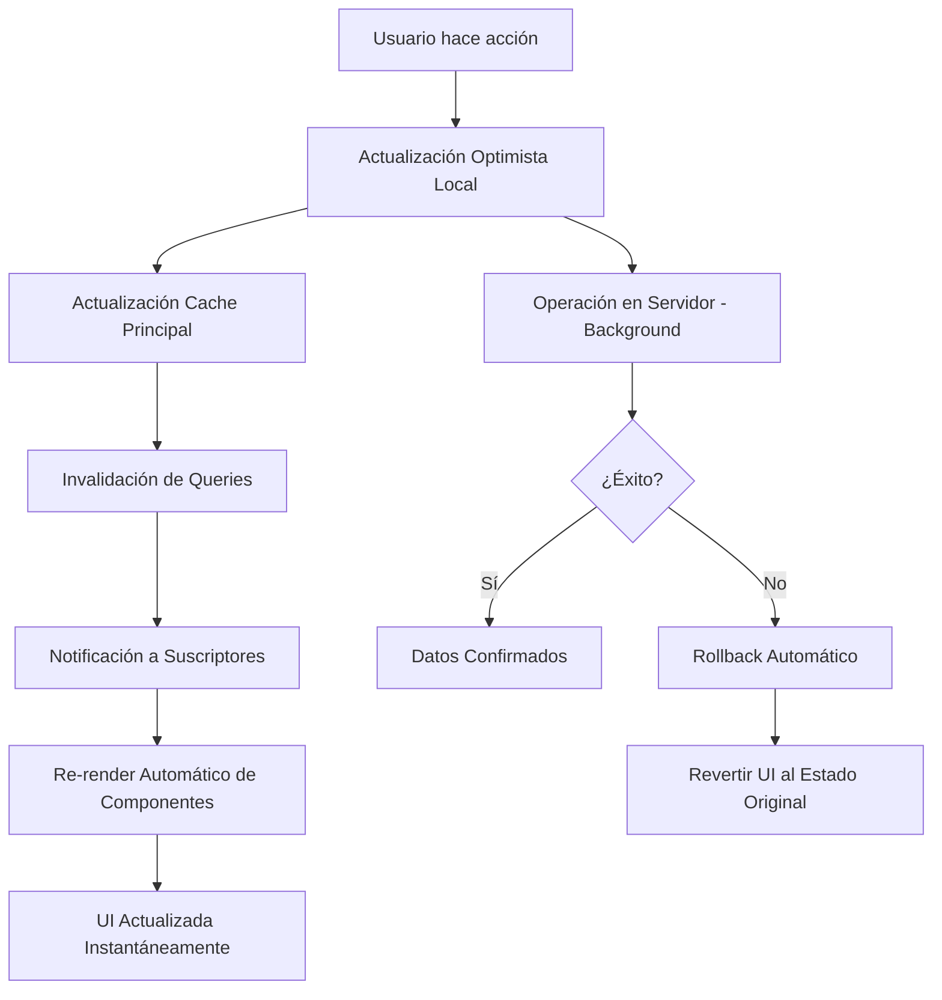
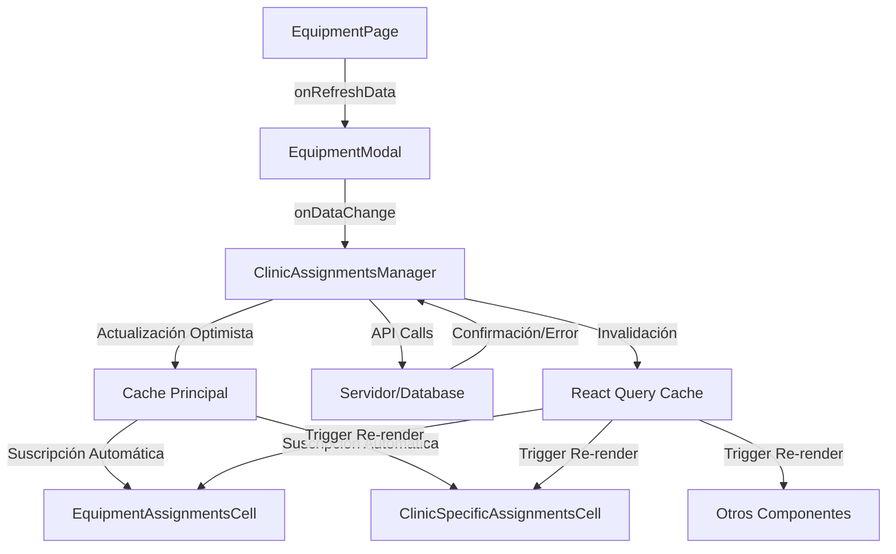

# SISTEMA DE GESTIÓN DE EQUIPAMIENTO - DOCUMENTACIÓN COMPLETA

## 📋 ÍNDICE

1. [Arquitectura General](#arquitectura-general)
2. [Estructura de Base de Datos](#estructura-de-base-de-datos)
3. [APIs y Endpoints](#apis-y-endpoints)
4. [Cache y Optimizaciones](#cache-y-optimizaciones)
5. [Sistema de Cache Optimizado y Actualizaciones Optimistas](#sistema-de-cache-optimizado-y-actualizaciones-optimistas)
6. [Flujo de Renderizado en Tiempo Real](#flujo-de-renderizado-en-tiempo-real)
7. [Arquitectura de Comunicación entre Componentes](#arquitectura-de-comunicación-entre-componentes)
8. [Componentes Frontend](#componentes-frontend)
9. [Patrones de Diseño](#patrones-de-diseño)
10. [Casos de Uso](#casos-de-uso)
11. [Debugging y Troubleshooting](#debugging-y-troubleshooting)
12. [Migración y Versionado](#migración-y-versionado)
13. [Guías para Desarrolladores](#guías-para-desarrolladores)

---

## 🏗️ ARQUITECTURA GENERAL

### Conceptos Clave

**Equipment (Equipamiento):**
- Representa el TIPO/MODELO de equipamiento (ej: "Láser Diodo LS-1000")
- Contiene información general: nombre, descripción, modelo, fabricante
- NO incluye ubicación específica (se maneja en asignaciones)

**EquipmentClinicAssignment (Asignación):**
- Instancia ESPECÍFICA de un equipamiento en una clínica
- Permite múltiples unidades del mismo equipamiento en diferentes clínicas
- Cada asignación tiene: serialNumber único, deviceId único, estado activo/inactivo

### Relaciones de Datos

```
Equipment (1) ――→ (N) EquipmentClinicAssignment (N) ←―― (1) Clinic
                                    ↓
                                    (1)
                                   Cabin (opcional)
                                    ↑
                                    (N)
                              SparePart Installation
```

### Flujo de Datos

```
[Usuario] → [Frontend] → [API Routes] → [Database] → [Cache] → [UI Update]
    ↓                                                            ↑
[Optimistic UI] ←――――――――――――――――――――――――――――――――――――――――――――――――――――――――――――――――
```

---

## 🗄️ ESTRUCTURA DE BASE DE DATOS

### Modelo Equipment

```prisma
model Equipment {
  id                string                      @id @default(cuid())
  name              string                      // "Láser Diodo LS-1000"
  description       string?                     // Descripción detallada
  modelNumber       string?                     // Número de modelo del fabricante
  manufacturer      string?                     // Fabricante
  category          string?                     // Categoría del equipamiento
  isActive          boolean                     @default(true)
  createdAt         DateTime                    @default(now())
  updatedAt         DateTime                    @updatedAt
  
  // Relaciones
  clinicAssignments EquipmentClinicAssignment[]
  spareParts        EquipmentSparePart[]
}
```

### Modelo EquipmentClinicAssignment

```prisma
model EquipmentClinicAssignment {
  id           string    @id @default(cuid())
  equipmentId  string    // FK a Equipment
  clinicId     string    // FK a Clinic
  cabinId      string?   // FK a Cabin (opcional)
  deviceName   string?   // Alias descriptivo del dispositivo
  serialNumber string    @unique // Número de serie físico ÚNICO
  deviceId     string    @unique // ID interno del sistema ÚNICO
  isActive     boolean   @default(true)
  assignedAt   DateTime  @default(now())
  unassignedAt DateTime? // Fecha de desactivación
  notes        string?   // Notas adicionales
  
  // Relaciones
  equipment Equipment @relation(fields: [equipmentId], references: [id], onDelete: Cascade)
  clinic    Clinic    @relation(fields: [clinicId], references: [id], onDelete: Restrict)
  cabin     Cabin?    @relation(fields: [cabinId], references: [id], onDelete: SetNull)
  
  @@index([equipmentId])
  @@index([clinicId])
  @@index([isActive])
}
```

### Indices Importantes

```sql
-- Rendimiento para búsquedas frecuentes
CREATE INDEX idx_equipment_clinic_assignment_equipment_id ON EquipmentClinicAssignment(equipmentId);
CREATE INDEX idx_equipment_clinic_assignment_clinic_id ON EquipmentClinicAssignment(clinicId);
CREATE INDEX idx_equipment_clinic_assignment_active ON EquipmentClinicAssignment(isActive);
CREATE INDEX idx_equipment_clinic_assignment_serial ON EquipmentClinicAssignment(serialNumber);
CREATE INDEX idx_equipment_clinic_assignment_device_id ON EquipmentClinicAssignment(deviceId);
```

---

## 🔌 APIS Y ENDPOINTS

### Equipamiento Principal

#### `GET /api/equipment`
```typescript
// Obtener lista de equipamientos con asignaciones
Response: {
  equipments: Equipment[]
  totalCount: number
  page: number
  limit: number
}
```

#### `POST /api/equipment`
```typescript
// Crear nuevo tipo de equipamiento
Body: {
  name: string
  description?: string
  modelNumber?: string
  manufacturer?: string
  category?: string
}
Response: { equipment: Equipment }
```

#### `PUT /api/equipment/[id]`
```typescript
// Actualizar equipamiento existente
Body: Partial<Equipment>
Response: { equipment: Equipment }
```

#### `DELETE /api/equipment/[id]`
```typescript
// Eliminar equipamiento (solo si no tiene asignaciones activas)
Response: { success: boolean }
```

### Asignaciones de Clínicas

#### `GET /api/equipment/[id]/clinic-assignments`
```typescript
// Obtener asignaciones específicas de un equipamiento
Response: {
  assignments: EquipmentClinicAssignment[]
  equipment: Equipment
}
```

#### `POST /api/equipment/[id]/clinic-assignments`
```typescript
// Crear nueva asignación equipamiento-clínica
Body: {
  clinicId: string
  cabinId?: string
  deviceName?: string
  serialNumber: string
  deviceId: string
  notes?: string
  isActive?: boolean
}
Response: { assignment: EquipmentClinicAssignment }
```

#### `PUT /api/equipment/clinic-assignments/[assignmentId]`
```typescript
// Actualizar asignación existente
Body: Partial<EquipmentClinicAssignment>
Response: { assignment: EquipmentClinicAssignment }
```

#### `PATCH /api/equipment/clinic-assignments/[assignmentId]/toggle`
```typescript
// Toggle rápido de estado activo/inactivo
Body: { isActive: boolean }
Response: { assignment: EquipmentClinicAssignment }
```

#### `DELETE /api/equipment/clinic-assignments/[assignmentId]`
```typescript
// Eliminar asignación específica
Response: { success: boolean }
```

### Validaciones de API

```typescript
// Validaciones automáticas en todas las operaciones
const validations = {
  serialNumber: {
    required: true,
    unique: true,
    minLength: 3,
    maxLength: 50
  },
  deviceId: {
    required: true,
    unique: true,
    format: /^[A-Z0-9\-]{5,30}$/
  },
  clinicId: {
    required: true,
    exists: true // Debe existir en tabla Clinic
  },
  cabinId: {
    optional: true,
    belongsToClinic: true // Debe pertenecer a la clínica seleccionada
  }
}
```

---

## 🚀 SISTEMA DE CACHE OPTIMIZADO Y ACTUALIZACIONES OPTIMISTAS

### Arquitectura del Sistema de Cache

El sistema implementa una arquitectura de **cache principal único** con **suscripciones automáticas** que garantiza sincronización en tiempo real entre todos los componentes.

#### Cache Principal: `['equipment-with-assignments']`

```typescript
// Hook principal que actúa como fuente única de verdad
export function useEquipmentWithAssignmentsQuery() {
  return useQuery<EquipmentWithClinicAssignments[]>({
    queryKey: ['equipment-with-assignments'],
    queryFn: async () => {
      // FETCH DIRECTO SIN CACHÉ para garantizar datos frescos
      const response = await fetch('/api/equipment', {
        method: 'GET',
        headers: { 'Content-Type': 'application/json' },
        cache: 'no-store', // Forzar no caché
      });
      
      if (!response.ok) {
        throw new Error(`HTTP error! status: ${response.status}`);
      }
      
      return await response.json();
    },
    // CONFIGURACIÓN DE CACHE OPTIMIZADA
    staleTime: 0,           // Siempre stale para forzar actualizaciones
    gcTime: 0,              // No guardar en cache local
    refetchOnWindowFocus: true,
    refetchOnMount: true,
  });
}
```

### Sistema de Actualizaciones Optimistas

#### 1. Flujo de Actualización Optimista Completa

```typescript
// Patrón implementado en ClinicAssignmentsManager
const handleOptimisticOperation = async (operation: 'create' | 'update' | 'delete') => {
  // 1. ACTUALIZACIÓN INMEDIATA DE UI (Optimista)
  const originalState = [...assignments]
  setAssignments(getOptimisticState(operation))
  
  // 2. ACTUALIZACIÓN INMEDIATA DEL CACHE PRINCIPAL
  queryClient.setQueryData(['equipment-with-assignments'], (oldData: any[]) => {
    return oldData.map(equipment => 
      equipment.id === equipmentId 
        ? { ...equipment, clinicAssignments: getOptimisticState(operation) }
        : equipment
    )
  })
  
  // 3. INVALIDACIÓN PARA TRIGGER AUTOMÁTICO DE SUSCRIPTORES
  queryClient.invalidateQueries({ queryKey: ['equipment-with-assignments'] })
  
  // 4. NOTIFICACIÓN INMEDIATA AL PADRE
  onDataChange?.()
  
  // 5. OPERACIÓN EN SERVIDOR (Background)
  try {
    const result = await performServerOperation(operation)
    // Si éxito, los datos optimistas ya están correctos
  } catch (error) {
    // 6. ROLLBACK AUTOMÁTICO EN CASO DE ERROR
    setAssignments(originalState)
    queryClient.setQueryData(['equipment-with-assignments'], (oldData: any[]) => {
      return oldData.map(equipment => 
        equipment.id === equipmentId 
          ? { ...equipment, clinicAssignments: originalState }
          : equipment
      )
    })
    toast.error(`Error: ${error.message}`)
  }
}
```

#### 2. Ejemplos Específicos de Operaciones Optimistas

##### Creación Optimista
```typescript
const handleCreateAssignment = async () => {
  // Crear asignación temporal para UI inmediata
  const tempAssignment = {
    id: `temp-${Date.now()}`, // ID temporal
    equipmentId,
    clinicId: newAssignment.clinicId,
    deviceName: newAssignment.deviceName,
    serialNumber: newAssignment.serialNumber,
    deviceId: newAssignment.deviceId,
    isActive: true,
    assignedAt: new Date().toISOString(),
    clinic: selectedClinic,
    cabin: selectedCabin
  }
  
  // 1. Aparece INMEDIATAMENTE en la UI
  const updatedAssignments = [...assignments, tempAssignment]
  setAssignments(updatedAssignments)
  
  // 2. Se actualiza INMEDIATAMENTE el cache principal
  queryClient.setQueryData(['equipment-with-assignments'], (oldData: any[]) => {
    return oldData.map(equipment => 
      equipment.id === equipmentId 
        ? { ...equipment, clinicAssignments: updatedAssignments }
        : equipment
    )
  })
  
  // 3. Modal se cierra INMEDIATAMENTE
  setIsCreateModalOpen(false)
  toast.success('Asignación creada correctamente')
  
  // 4. Servidor procesa en background
  try {
    const realAssignment = await api.post(`/api/equipment/${equipmentId}/clinic-assignments`, newAssignment)
    
    // 5. Reemplazar asignación temporal con la real
    setAssignments(prev => prev.map(a => 
      a.id === tempAssignment.id ? realAssignment : a
    ))
  } catch (error) {
    // Rollback: eliminar asignación temporal
    setAssignments(prev => prev.filter(a => a.id !== tempAssignment.id))
    toast.error('Error al crear asignación')
  }
}
```

##### Eliminación Optimista
```typescript
const handleDeleteAssignment = async (assignmentToDelete) => {
  // 1. Desaparece INMEDIATAMENTE de la UI
  const originalAssignments = [...assignments]
  const updatedAssignments = assignments.filter(a => a.id !== assignmentToDelete.id)
  setAssignments(updatedAssignments)
  
  // 2. Cache principal se actualiza INMEDIATAMENTE
  queryClient.setQueryData(['equipment-with-assignments'], (oldData: any[]) => {
    return oldData.map(equipment => 
      equipment.id === equipmentId 
        ? { ...equipment, clinicAssignments: updatedAssignments }
        : equipment
    )
  })
  
  // 3. Modal se cierra INMEDIATAMENTE
  setIsDeleteDialogOpen(false)
  toast.success('Asignación eliminada correctamente')
  
  // 4. Servidor confirma en background
  try {
    await api.delete(`/api/equipment/clinic-assignments/${assignmentToDelete.id}`)
  } catch (error) {
    // Rollback: restaurar asignación eliminada
    setAssignments(originalAssignments)
    queryClient.setQueryData(['equipment-with-assignments'], (oldData: any[]) => {
      return oldData.map(equipment => 
        equipment.id === equipmentId 
          ? { ...equipment, clinicAssignments: originalAssignments }
          : equipment
      )
    })
    toast.error('Error al eliminar asignación')
  }
}
```

##### Toggle Optimista
```typescript
const handleToggleAssignment = async (assignment) => {
  // 1. Estado cambia INMEDIATAMENTE
  const updatedAssignments = assignments.map(a => 
    a.id === assignment.id 
      ? { ...a, isActive: !a.isActive }
      : a
  )
  setAssignments(updatedAssignments)
  
  // 2. Cache principal se actualiza INMEDIATAMENTE
  queryClient.setQueryData(['equipment-with-assignments'], (oldData: any[]) => {
    return oldData.map(equipment => 
      equipment.id === equipmentId 
        ? { ...equipment, clinicAssignments: updatedAssignments }
        : equipment
    )
  })
  
  // 3. Servidor confirma en background
  try {
    await api.patch(`/api/equipment/clinic-assignments/${assignment.id}/toggle`, {
      isActive: !assignment.isActive
    })
  } catch (error) {
    // Rollback automático
    const revertedAssignments = assignments.map(a => 
      a.id === assignment.id 
        ? { ...a, isActive: assignment.isActive } // Revertir al estado original
        : a
    )
    setAssignments(revertedAssignments)
    toast.error('Error al cambiar estado')
  }
}
```

### Sistema de Suscripción al Cache

#### Patrón de Suscripción Automática

```typescript
// Implementado en EquipmentAssignmentsCell y ClinicSpecificAssignmentsCell
const useCacheSubscription = (equipmentId: string) => {
  const queryClient = useQueryClient()
  const [assignments, setAssignments] = useState([])
  
  // Función para actualizar desde cache principal
  const updateFromCache = useCallback(() => {
    const mainCacheData = queryClient.getQueryData(['equipment-with-assignments']) as any[]
    if (mainCacheData) {
      const equipment = mainCacheData.find(eq => eq.id === equipmentId)
      if (equipment && equipment.clinicAssignments) {
        setAssignments(equipment.clinicAssignments)
        return
      }
    }
    setAssignments([])
  }, [equipmentId, queryClient])
  
  // Suscripción automática a cambios del cache
  useEffect(() => {
    // Actualización inicial
    updateFromCache()
    
    // Suscribirse a TODOS los cambios del cache
    const unsubscribe = queryClient.getQueryCache().subscribe(() => {
      updateFromCache()
    })
    
    return unsubscribe
  }, [updateFromCache, queryClient])
  
  return assignments
}
```

#### Beneficios del Sistema de Suscripción

1. **Sincronización Automática**: Cualquier cambio en el cache principal se propaga automáticamente a TODOS los componentes suscriptores
2. **Sin Refetch Manual**: Los componentes no necesitan hacer fetch individual
3. **Consistencia Global**: Todos los componentes muestran exactamente los mismos datos
4. **Performance Optimizada**: Un solo fetch alimenta múltiples componentes

---

## ⚡ FLUJO DE RENDERIZADO EN TIEMPO REAL

### Arquitectura de Renderizado

El sistema implementa un **flujo de renderizado en tiempo real** donde los cambios aparecen instantáneamente en todas las interfaces sin necesidad de recargar páginas o hacer nuevas peticiones.

#### Diagrama de Flujo de Renderizado



#### Componentes del Sistema de Renderizado

##### 1. EquipmentPage (Tabla Principal)
```typescript
// app/(main)/configuracion/equipamiento/page.tsx
const EquipmentPage = () => {
  const { data: equipment, refetch: refetchEquipment } = useEquipmentWithAssignmentsQuery()
  
  // Esta función se pasa a EquipmentModal para refrescar datos
  const handleRefreshData = useCallback(() => {
    refetchEquipment()
  }, [refetchEquipment])
  
  return (
    <Table>
      {equipment.map(eq => (
        <TableRow key={eq.id}>
          <TableCell>{eq.name}</TableCell>
          <TableCell>
            {/* Este componente se actualiza automáticamente */}
            <EquipmentAssignmentsCell equipmentId={eq.id} />
          </TableCell>
          <TableCell>
            <EquipmentModal 
              equipmentId={eq.id}
              onRefreshData={handleRefreshData} // Comunicación hacia arriba
            />
          </TableCell>
        </TableRow>
      ))}
    </Table>
  )
}
```

##### 2. EquipmentAssignmentsCell (Celda de Asignaciones)
```typescript
// components/equipment/equipment-assignments-cell.tsx
const EquipmentAssignmentsCell = ({ equipmentId }: { equipmentId: string }) => {
  const queryClient = useQueryClient()
  const [assignments, setAssignments] = useState([])
  
  // SUSCRIPCIÓN AUTOMÁTICA AL CACHE PRINCIPAL
  useEffect(() => {
    const updateFromCache = () => {
      const mainCacheData = queryClient.getQueryData(['equipment-with-assignments']) as any[]
      if (mainCacheData) {
        const equipment = mainCacheData.find(eq => eq.id === equipmentId)
        if (equipment && equipment.clinicAssignments) {
          setAssignments(equipment.clinicAssignments)
          return
        }
      }
      setAssignments([])
    }
    
    // Actualización inicial
    updateFromCache()
    
    // Escuchar TODOS los cambios del cache
    const unsubscribe = queryClient.getQueryCache().subscribe(() => {
      updateFromCache()
    })
    
    return unsubscribe
  }, [equipmentId, queryClient])
  
  // Filtrar solo asignaciones activas
  const activeAssignments = assignments.filter(a => a.isActive)
  
  // Renderizado automático cuando cambian las asignaciones
  return (
    <div className="flex gap-1 flex-wrap">
      {activeAssignments.map(assignment => (
        <Badge key={assignment.id} variant="secondary">
          {assignment.clinic.name}
        </Badge>
      ))}
    </div>
  )
}
```

##### 3. ClinicSpecificAssignmentsCell (Página de Edición de Clínica)
```typescript
// app/(main)/configuracion/clinicas/[id]/page.tsx - Componente interno
const ClinicSpecificAssignmentsCell = ({ equipment, clinicId }) => {
  const queryClient = useQueryClient()
  const [assignments, setAssignments] = useState([])
  
  // MISMA SUSCRIPCIÓN AL CACHE PRINCIPAL
  useEffect(() => {
    const updateFromCache = () => {
      const mainCacheData = queryClient.getQueryData(['equipment-with-assignments']) as any[]
      if (mainCacheData) {
        const equipmentFromCache = mainCacheData.find(eq => eq.id === equipment.id)
        if (equipmentFromCache && equipmentFromCache.clinicAssignments) {
          setAssignments(equipmentFromCache.clinicAssignments)
          return
        }
      }
      setAssignments([])
    }
    
    updateFromCache()
    
    const unsubscribe = queryClient.getQueryCache().subscribe(() => {
      updateFromCache()
    })
    
    return unsubscribe
  }, [equipment.id, clinicId, queryClient])
  
  // Filtrar asignaciones específicas de esta clínica
  const clinicAssignments = assignments.filter(
    a => a.clinicId === clinicId && a.isActive
  )
  
  // Se actualiza automáticamente cuando cambian las asignaciones
  return (
    <div>
      {clinicAssignments.length === 0 ? (
        <span className="text-gray-400">Sin dispositivos</span>
      ) : (
        <div className="flex gap-1 flex-wrap">
          {clinicAssignments.map(assignment => (
            <Badge key={assignment.id} variant="outline">
              {assignment.deviceName || assignment.serialNumber}
            </Badge>
          ))}
        </div>
      )}
    </div>
  )
}
```

### Flujo de Datos en Tiempo Real

#### Escenario: Usuario elimina una asignación

```typescript
// 1. Usuario hace click en "Eliminar" en ClinicAssignmentsManager
handleDeleteAssignment(assignment)

// 2. INMEDIATAMENTE (< 1ms):
//    - assignment desaparece de ClinicAssignmentsManager
//    - Cache principal se actualiza
//    - Invalidación trigger suscriptores

// 3. AUTOMÁTICAMENTE (< 5ms):
//    - EquipmentAssignmentsCell detecta cambio y re-renderiza
//    - ClinicSpecificAssignmentsCell detecta cambio y re-renderiza
//    - Badge desaparece de tabla principal
//    - Badge desaparece de página de clínica

// 4. BACKGROUND (500-2000ms):
//    - Servidor procesa eliminación
//    - Si éxito: datos ya están correctos
//    - Si error: rollback automático restaura todo
```

#### Escenario: Usuario crea nueva asignación

```typescript
// 1. Usuario completa formulario y hace click en "Crear"
handleCreateAssignment()

// 2. INMEDIATAMENTE (< 1ms):
//    - Nueva asignación aparece en lista
//    - Modal se cierra
//    - Toast de éxito se muestra

// 3. AUTOMÁTICAMENTE (< 5ms):
//    - Nuevo badge aparece en tabla principal
//    - Nuevo badge aparece en página de clínica correspondiente
//    - Contador de asignaciones se actualiza

// 4. BACKGROUND (500-2000ms):
//    - Servidor crea asignación real
//    - ID temporal se reemplaza por ID real
//    - Si error: asignación temporal desaparece automáticamente
```

### Ventajas del Sistema de Renderizado

1. **UX Instantánea**: Los usuarios ven cambios inmediatamente, sin esperas
2. **Feedback Inmediato**: Toast notifications aparecen al instante
3. **Consistencia Visual**: Todos los componentes se actualizan al mismo tiempo
4. **Manejo de Errores Transparente**: Si algo falla, se revierte automáticamente
5. **Performance Optimizada**: Un solo fetch alimenta múltiples vistas

---

## 🔄 ARQUITECTURA DE COMUNICACIÓN ENTRE COMPONENTES

### Diagrama de Comunicación



### Flujo de Comunicación Detallado

#### 1. Comunicación Ascendente (Child → Parent)

```typescript
// ClinicAssignmentsManager → EquipmentModal → EquipmentPage
const ClinicAssignmentsManager = ({ onDataChange }) => {
  const handleAnyChange = async () => {
    // 1. Actualizar estado local
    // 2. Actualizar cache
    // 3. Notificar al padre INMEDIATAMENTE
    onDataChange?.()
  }
}

const EquipmentModal = ({ onRefreshData }) => {
  const handleAssignmentDataChange = useCallback(() => {
    setHasAssignmentChanges(true)
    // Refrescar tabla principal INMEDIATAMENTE
    if (onRefreshData) {
      onRefreshData()
    }
  }, [onRefreshData])
  
  return (
    <ClinicAssignmentsManager 
      onDataChange={handleAssignmentDataChange}
    />
  )
}

const EquipmentPage = () => {
  const { refetch: refetchEquipment } = useEquipmentWithAssignmentsQuery()
  
  const handleRefreshData = useCallback(() => {
    refetchEquipment()
  }, [refetchEquipment])
  
  return (
    <EquipmentModal 
      onRefreshData={handleRefreshData}
    />
  )
}
```

#### 2. Comunicación Horizontal (Cache-Based)

```typescript
// Todos los componentes que muestran asignaciones se sincronizan automáticamente
// a través del cache principal, sin comunicación directa entre ellos

// EquipmentAssignmentsCell (Tabla Principal)
const EquipmentAssignmentsCell = ({ equipmentId }) => {
  // Se suscribe al cache principal
  const assignments = useCacheSubscription(equipmentId)
  
  return <BadgeList assignments={assignments} />
}

// ClinicSpecificAssignmentsCell (Página de Clínica)
const ClinicSpecificAssignmentsCell = ({ equipmentId, clinicId }) => {
  // Se suscribe al MISMO cache principal
  const assignments = useCacheSubscription(equipmentId)
  const clinicAssignments = assignments.filter(a => a.clinicId === clinicId)
  
  return <BadgeList assignments={clinicAssignments} />
}

// Cuando ClinicAssignmentsManager actualiza el cache:
// 1. EquipmentAssignmentsCell se actualiza automáticamente
// 2. ClinicSpecificAssignmentsCell se actualiza automáticamente
// 3. Cualquier otro componente suscriptor se actualiza automáticamente
```

#### 3. Comunicación con el Servidor

```typescript
// Patrón de comunicación optimista con el servidor
const handleServerOperation = async (operation, data) => {
  // 1. OPTIMISTIC UPDATE - UI se actualiza INMEDIATAMENTE
  const optimisticState = getOptimisticState(operation, data)
  updateUI(optimisticState)
  updateCache(optimisticState)
  notifyParent()
  
  // 2. SERVER OPERATION - En background
  try {
    const result = await api.performOperation(operation, data)
    
    // 3. CONFIRMATION - Datos optimistas ya están correctos
    // No necesita hacer nada más, UI ya está actualizada
    
  } catch (error) {
    // 4. ROLLBACK - Revertir todo automáticamente
    const originalState = getOriginalState()
    updateUI(originalState)
    updateCache(originalState)
    showError(error.message)
  }
}
```

### Patrones de Comunicación Implementados

#### 1. Observer Pattern (Cache Subscription)
```typescript
// Los componentes observan el cache principal
const useCacheObserver = (equipmentId) => {
  useEffect(() => {
    const unsubscribe = queryClient.getQueryCache().subscribe((event) => {
      if (event.query.queryKey[0] === 'equipment-with-assignments') {
        updateLocalState(event.query.state.data)
      }
    })
    return unsubscribe
  }, [equipmentId])
}
```

#### 2. Command Pattern (Optimistic Operations)
```typescript
// Cada operación encapsula su lógica de optimistic update y rollback
class OptimisticCommand {
  execute() {
    this.updateUI()
    this.updateCache()
    this.notifyParent()
    this.performServerOperation()
  }
  
  rollback() {
    this.revertUI()
    this.revertCache()
    this.showError()
  }
}
```

#### 3. Publisher-Subscriber Pattern (Cache Invalidation)
```typescript
// Cache actúa como publisher, componentes como subscribers
queryClient.invalidateQueries(['equipment-with-assignments']) // Publish
// Todos los componentes suscritos reciben la notificación automáticamente
```

### Ventajas de esta Arquitectura

1. **Desacoplamiento**: Componentes no necesitan conocerse entre sí
2. **Escalabilidad**: Fácil añadir nuevos componentes que se sincronicen automáticamente
3. **Mantenibilidad**: Lógica de comunicación centralizada en el cache
4. **Performance**: Sin comunicación redundante entre componentes
5. **Consistencia**: Imposible que componentes muestren datos diferentes


#### Componentes del Sistema de Renderizado

##### 1. EquipmentPage (Tabla Principal)
```typescript
// app/(main)/configuracion/equipamiento/page.tsx
const EquipmentPage = () => {
  const { data: equipment, refetch: refetchEquipment } = useEquipmentWithAssignmentsQuery()
  
  // Esta función se pasa a EquipmentModal para refrescar datos
  const handleRefreshData = useCallback(() => {
    refetchEquipment()
  }, [refetchEquipment])
  
  return (
    <Table>
      {equipment.map(eq => (
        <TableRow key={eq.id}>
          <TableCell>{eq.name}</TableCell>
          <TableCell>
            {/* Este componente se actualiza automáticamente */}
            <EquipmentAssignmentsCell equipmentId={eq.id} />
          </TableCell>
          <TableCell>
            <EquipmentModal 
              equipmentId={eq.id}
              onRefreshData={handleRefreshData} // Comunicación hacia arriba
            />
          </TableCell>
        </TableRow>
      ))}
    </Table>
  )
}
```

##### 2. EquipmentAssignmentsCell (Celda de Asignaciones)
```typescript
// components/equipment/equipment-assignments-cell.tsx
const EquipmentAssignmentsCell = ({ equipmentId }: { equipmentId: string }) => {
  const queryClient = useQueryClient()
  const [assignments, setAssignments] = useState([])
  
  // SUSCRIPCIÓN AUTOMÁTICA AL CACHE PRINCIPAL
  useEffect(() => {
    const updateFromCache = () => {
      const mainCacheData = queryClient.getQueryData(['equipment-with-assignments']) as any[]
      if (mainCacheData) {
        const equipment = mainCacheData.find(eq => eq.id === equipmentId)
        if (equipment && equipment.clinicAssignments) {
          setAssignments(equipment.clinicAssignments)
          return
        }
      }
      setAssignments([])
    }
    
    // Actualización inicial
    updateFromCache()
    
    // Escuchar TODOS los cambios del cache
    const unsubscribe = queryClient.getQueryCache().subscribe(() => {
      updateFromCache()
    })
    
    return unsubscribe
  }, [equipmentId, queryClient])
  
  // Filtrar solo asignaciones activas
  const activeAssignments = assignments.filter(a => a.isActive)
  
  // Renderizado automático cuando cambian las asignaciones
  return (
    <div className="flex gap-1 flex-wrap">
      {activeAssignments.map(assignment => (
        <Badge key={assignment.id} variant="secondary">
          {assignment.clinic.name}
        </Badge>
      ))}
    </div>
  )
}
```

##### 3. ClinicSpecificAssignmentsCell (Página de Edición de Clínica)
```typescript
// app/(main)/configuracion/clinicas/[id]/page.tsx - Componente interno
const ClinicSpecificAssignmentsCell = ({ equipment, clinicId }) => {
  const queryClient = useQueryClient()
  const [assignments, setAssignments] = useState([])
  
  // MISMA SUSCRIPCIÓN AL CACHE PRINCIPAL
  useEffect(() => {
    const updateFromCache = () => {
      const mainCacheData = queryClient.getQueryData(['equipment-with-assignments']) as any[]
      if (mainCacheData) {
        const equipmentFromCache = mainCacheData.find(eq => eq.id === equipment.id)
        if (equipmentFromCache && equipmentFromCache.clinicAssignments) {
          setAssignments(equipmentFromCache.clinicAssignments)
          return
        }
      }
      setAssignments([])
    }
    
    updateFromCache()
    
    const unsubscribe = queryClient.getQueryCache().subscribe(() => {
      updateFromCache()
    })
    
    return unsubscribe
  }, [equipment.id, clinicId, queryClient])
  
  // Filtrar asignaciones específicas de esta clínica
  const clinicAssignments = assignments.filter(
    a => a.clinicId === clinicId && a.isActive
  )
  
  // Se actualiza automáticamente cuando cambian las asignaciones
  return (
    <div>
      {clinicAssignments.length === 0 ? (
        <span className="text-gray-400">Sin dispositivos</span>
      ) : (
        <div className="flex gap-1 flex-wrap">
          {clinicAssignments.map(assignment => (
            <Badge key={assignment.id} variant="outline">
              {assignment.deviceName || assignment.serialNumber}
            </Badge>
          ))}
        </div>
      )}
    </div>
  )
}
```

### Flujo de Datos en Tiempo Real

#### Escenario: Usuario elimina una asignación

```typescript
// 1. Usuario hace click en "Eliminar" en ClinicAssignmentsManager
handleDeleteAssignment(assignment)

// 2. INMEDIATAMENTE (< 1ms):
//    - assignment desaparece de ClinicAssignmentsManager
//    - Cache principal se actualiza
//    - Invalidación trigger suscriptores

// 3. AUTOMÁTICAMENTE (< 5ms):
//    - EquipmentAssignmentsCell detecta cambio y re-renderiza
//    - ClinicSpecificAssignmentsCell detecta cambio y re-renderiza
//    - Badge desaparece de tabla principal
//    - Badge desaparece de página de clínica

// 4. BACKGROUND (500-2000ms):
//    - Servidor procesa eliminación
//    - Si éxito: datos ya están correctos
//    - Si error: rollback automático restaura todo
```

#### Escenario: Usuario crea nueva asignación

```typescript
// 1. Usuario completa formulario y hace click en "Crear"
handleCreateAssignment()

// 2. INMEDIATAMENTE (< 1ms):
//    - Nueva asignación aparece en lista
//    - Modal se cierra
//    - Toast de éxito se muestra

// 3. AUTOMÁTICAMENTE (< 5ms):
//    - Nuevo badge aparece en tabla principal
//    - Nuevo badge aparece en página de clínica correspondiente
//    - Contador de asignaciones se actualiza

// 4. BACKGROUND (500-2000ms):
//    - Servidor crea asignación real
//    - ID temporal se reemplaza por ID real
//    - Si error: asignación temporal desaparece automáticamente
```

### Ventajas del Sistema de Renderizado

1. **UX Instantánea**: Los usuarios ven cambios inmediatamente, sin esperas
2. **Feedback Inmediato**: Toast notifications aparecen al instante
3. **Consistencia Visual**: Todos los componentes se actualizan al mismo tiempo
4. **Manejo de Errores Transparente**: Si algo falla, se revierte automáticamente
5. **Performance Optimizada**: Un solo fetch alimenta múltiples vistas

---

## 🔄 ARQUITECTURA DE COMUNICACIÓN ENTRE COMPONENTES

### Diagrama de Comunicación


### Flujo de Comunicación Detallado

#### 1. Comunicación Ascendente (Child → Parent)

```typescript
// ClinicAssignmentsManager → EquipmentModal → EquipmentPage
const ClinicAssignmentsManager = ({ onDataChange }) => {
  const handleAnyChange = async () => {
    // 1. Actualizar estado local
    // 2. Actualizar cache
    // 3. Notificar al padre INMEDIATAMENTE
    onDataChange?.()
  }
}

const EquipmentModal = ({ onRefreshData }) => {
  const handleAssignmentDataChange = useCallback(() => {
    setHasAssignmentChanges(true)
    // Refrescar tabla principal INMEDIATAMENTE
    if (onRefreshData) {
      onRefreshData()
    }
  }, [onRefreshData])
  
  return (
    <ClinicAssignmentsManager 
      onDataChange={handleAssignmentDataChange}
    />
  )
}

const EquipmentPage = () => {
  const { refetch: refetchEquipment } = useEquipmentWithAssignmentsQuery()
  
  const handleRefreshData = useCallback(() => {
    refetchEquipment()
  }, [refetchEquipment])
  
  return (
    <EquipmentModal 
      onRefreshData={handleRefreshData}
    />
  )
}
```

#### 2. Comunicación Horizontal (Cache-Based)

```typescript
// Todos los componentes que muestran asignaciones se sincronizan automáticamente
// a través del cache principal, sin comunicación directa entre ellos

// EquipmentAssignmentsCell (Tabla Principal)
const EquipmentAssignmentsCell = ({ equipmentId }) => {
  // Se suscribe al cache principal
  const assignments = useCacheSubscription(equipmentId)
  
  return <BadgeList assignments={assignments} />
}

// ClinicSpecificAssignmentsCell (Página de Clínica)
const ClinicSpecificAssignmentsCell = ({ equipmentId, clinicId }) => {
  // Se suscribe al MISMO cache principal
  const assignments = useCacheSubscription(equipmentId)
  const clinicAssignments = assignments.filter(a => a.clinicId === clinicId)
  
  return <BadgeList assignments={clinicAssignments} />
}

// Cuando ClinicAssignmentsManager actualiza el cache:
// 1. EquipmentAssignmentsCell se actualiza automáticamente
// 2. ClinicSpecificAssignmentsCell se actualiza automáticamente
// 3. Cualquier otro componente suscriptor se actualiza automáticamente
```

#### 3. Comunicación con el Servidor

```typescript
// Patrón de comunicación optimista con el servidor
const handleServerOperation = async (operation, data) => {
  // 1. OPTIMISTIC UPDATE - UI se actualiza INMEDIATAMENTE
  const optimisticState = getOptimisticState(operation, data)
  updateUI(optimisticState)
  updateCache(optimisticState)
  notifyParent()
  
  // 2. SERVER OPERATION - En background
  try {
    const result = await api.performOperation(operation, data)
    
    // 3. CONFIRMATION - Datos optimistas ya están correctos
    // No necesita hacer nada más, UI ya está actualizada
    
  } catch (error) {
    // 4. ROLLBACK - Revertir todo automáticamente
    const originalState = getOriginalState()
    updateUI(originalState)
    updateCache(originalState)
    showError(error.message)
  }
}
```

### Patrones de Comunicación Implementados

#### 1. Observer Pattern (Cache Subscription)
```typescript
// Los componentes observan el cache principal
const useCacheObserver = (equipmentId) => {
  useEffect(() => {
    const unsubscribe = queryClient.getQueryCache().subscribe((event) => {
      if (event.query.queryKey[0] === 'equipment-with-assignments') {
        updateLocalState(event.query.state.data)
      }
    })
    return unsubscribe
  }, [equipmentId])
}
```

#### 2. Command Pattern (Optimistic Operations)
```typescript
// Cada operación encapsula su lógica de optimistic update y rollback
class OptimisticCommand {
  execute() {
    this.updateUI()
    this.updateCache()
    this.notifyParent()
    this.performServerOperation()
  }
  
  rollback() {
    this.revertUI()
    this.revertCache()
    this.showError()
  }
}
```

#### 3. Publisher-Subscriber Pattern (Cache Invalidation)
```typescript
// Cache actúa como publisher, componentes como subscribers
queryClient.invalidateQueries(['equipment-with-assignments']) // Publish
// Todos los componentes suscritos reciben la notificación automáticamente
```

### Ventajas de esta Arquitectura

1. **Desacoplamiento**: Componentes no necesitan conocerse entre sí
2. **Escalabilidad**: Fácil añadir nuevos componentes que se sincronicen automáticamente
3. **Mantenibilidad**: Lógica de comunicación centralizada en el cache
4. **Performance**: Sin comunicación redundante entre componentes
5. **Consistencia**: Imposible que componentes muestren datos diferentes

---

## 🧩 COMPONENTES FRONTEND

### Jerarquía de Componentes Actualizada

```
EquipmentPage (Tabla Principal)
├── EquipmentModal (Modal de edición/creación)
│   ├── Tabs (Información, Asignaciones, Recambios)
│   ├── EquipmentForm (crear/editar información básica)
│   ├── ClinicAssignmentsManager (gestión completa de asignaciones)
│   │   ├── AssignmentCreateEditModal (crear/editar unificado)
│   │   ├── AssignmentDeleteDialog (confirmar eliminación)
│   │   ├── AssignmentTable (tabla de asignaciones con acciones)
│   │   ├── ClinicSelector (selector con cabinas)
│   │   ├── DeviceIdGenerator (generación automática)
│   │   └── OptimisticUpdateManager (lógica de actualizaciones)
│   └── SparePartsTab (gestión de recambios)
│       ├── SparePartCreateModal
│       ├── SparePartsList
│       └── InstallationHistory
├── EquipmentAssignmentsCell (celda de asignaciones en tabla)
│   ├── CacheSubscription (suscripción automática)
│   ├── BadgeRenderer (renderizado de badges)
│   └── FallbackLoader (carga de datos fallback)
└── ClinicSpecificAssignmentsCell (página de edición de clínica)
    ├── CacheSubscription (misma suscripción que tabla principal)
    ├── ClinicFilter (filtrado por clínica específica)
    └── BadgeRenderer (renderizado específico para clínica)
```

### Componentes Principales Detallados

#### 1. EquipmentPage
```typescript
// app/(main)/configuracion/equipamiento/page.tsx
interface EquipmentPageProps {}

const EquipmentPage = () => {
  // Hook principal que alimenta toda la página
  const { 
    data: equipment, 
    isLoading, 
    refetch: refetchEquipment 
  } = useEquipmentWithAssignmentsQuery()
  
  // Estados para modales y operaciones
  const [selectedEquipment, setSelectedEquipment] = useState(null)
  const [isModalOpen, setIsModalOpen] = useState(false)
  const [isCreating, setIsCreating] = useState(false)
  
  // Función que se pasa a modales para actualizar tabla
  const handleRefreshData = useCallback(() => {
    refetchEquipment()
  }, [refetchEquipment])
  
  return (
    <div>
      <TableHeader />
      <Table>
        {equipment?.map(eq => (
          <TableRow key={eq.id}>
            <TableCell>{eq.name}</TableCell>
            <TableCell>{eq.modelNumber}</TableCell>
            <TableCell>
              {/* Componente que se actualiza automáticamente */}
              <EquipmentAssignmentsCell equipmentId={eq.id} />
            </TableCell>
            <TableCell>
              <EquipmentActions 
                equipment={eq}
                onEdit={() => openModal(eq)}
                onRefreshData={handleRefreshData}
              />
            </TableCell>
          </TableRow>
        ))}
      </Table>
      
      <EquipmentModal 
        isOpen={isModalOpen}
        equipment={selectedEquipment}
        onClose={() => setIsModalOpen(false)}
        onRefreshData={handleRefreshData}
      />
    </div>
  )
}
```

#### 2. EquipmentModal
```typescript
// components/equipment/equipment-modal.tsx
interface EquipmentModalProps {
  isOpen: boolean
  equipment?: Equipment | null
  onClose: () => void
  onRefreshData?: () => void // Comunicación hacia arriba
  clinicFilter?: string
}

const EquipmentModal = ({ 
  isOpen, 
  equipment, 
  onClose, 
  onRefreshData,
  clinicFilter 
}) => {
  // Estados para cambios
  const [isFormChanged, setIsFormChanged] = useState(false)
  const [hasAssignmentChanges, setHasAssignmentChanges] = useState(false)
  
  // Callback que recibe notificaciones de ClinicAssignmentsManager
  const handleAssignmentDataChange = useCallback(() => {
    setHasAssignmentChanges(true)
    // Refrescar tabla principal INMEDIATAMENTE
    if (onRefreshData) {
      onRefreshData()
    }
  }, [onRefreshData])
  
  return (
    <Dialog open={isOpen} onOpenChange={onClose}>
      <DialogContent>
        <Tabs defaultValue="info">
          <TabsList>
            <TabsTrigger value="info">Información</TabsTrigger>
            <TabsTrigger value="assignments">Asignaciones</TabsTrigger>
            <TabsTrigger value="spare-parts">Recambios</TabsTrigger>
          </TabsList>
          
          <TabsContent value="info">
            <EquipmentForm 
              equipment={equipment}
              onChange={() => setIsFormChanged(true)}
            />
          </TabsContent>
          
          <TabsContent value="assignments">
            <ClinicAssignmentsManager 
              equipmentId={equipment?.id}
              equipmentName={equipment?.name}
              onDataChange={handleAssignmentDataChange} // Comunicación hacia arriba
              clinicFilter={clinicFilter}
            />
          </TabsContent>
          
          <TabsContent value="spare-parts">
            <SparePartsTab equipmentId={equipment?.id} />
          </TabsContent>
        </Tabs>
        
        <DialogFooter>
          <SaveButton 
            disabled={!isFormChanged && !hasAssignmentChanges}
            onSave={handleSave}
          />
        </DialogFooter>
      </DialogContent>
    </Dialog>
  )
}
```

#### 3. ClinicAssignmentsManager
```typescript
// components/equipment/clinic-assignments-manager.tsx
interface ClinicAssignmentsManagerProps {
  equipmentId: string
  equipmentName: string
  onDataChange?: () => void // Comunicación hacia arriba
  clinicFilter?: string
}

const ClinicAssignmentsManager = ({ 
  equipmentId, 
  equipmentName,
  onDataChange,
  clinicFilter
}) => {
  // Estados locales para optimistic updates
  const [assignments, setAssignments] = useState([])
  const [isLoading, setIsLoading] = useState(true)
  
  // Estados para operaciones
  const [isCreating, setIsCreating] = useState(false)
  const [togglingIds, setTogglingIds] = useState(new Set())
  const [isDeleting, setIsDeleting] = useState(false)
  
  // Estados para modales
  const [isCreateModalOpen, setIsCreateModalOpen] = useState(false)
  const [isDeleteDialogOpen, setIsDeleteDialogOpen] = useState(false)
  const [selectedAssignment, setSelectedAssignment] = useState(null)
  
  // React Query client para manipular cache
  const queryClient = useQueryClient()
  
  // PATRÓN DE ACTUALIZACIÓN OPTIMISTA
  const handleOptimisticUpdate = async (operation, data) => {
    // 1. Actualizar UI inmediatamente
    const optimisticState = getOptimisticState(operation, data)
    setAssignments(optimisticState)
    
    // 2. Actualizar cache principal inmediatamente
    queryClient.setQueryData(['equipment-with-assignments'], (oldData) => {
      return updateEquipmentInCache(oldData, equipmentId, optimisticState)
    })
    
    // 3. Invalidar queries para trigger suscriptores
    queryClient.invalidateQueries({ queryKey: ['equipment-with-assignments'] })
    
    // 4. Notificar al padre inmediatamente
    onDataChange?.()
    
    // 5. Operación en servidor (background)
    try {
      await performServerOperation(operation, data)
    } catch (error) {
      // 6. Rollback automático
      await rollbackOptimisticUpdate(operation, data)
      toast.error(`Error: ${error.message}`)
    }
  }
  
  return (
    <div>
      <AssignmentTable 
        assignments={filteredAssignments}
        onEdit={handleEditAssignment}
        onDelete={handleDeleteAssignment}
        onToggle={handleToggleAssignment}
        togglingIds={togglingIds}
      />
      
      <CreateEditModal 
        isOpen={isCreateModalOpen}
        assignment={selectedAssignment}
        onSave={handleOptimisticUpdate}
        onClose={() => setIsCreateModalOpen(false)}
      />
      
      <DeleteConfirmDialog 
        isOpen={isDeleteDialogOpen}
        assignment={selectedAssignment}
        onConfirm={handleOptimisticUpdate}
        onClose={() => setIsDeleteDialogOpen(false)}
      />
    </div>
  )
}
```

#### 4. EquipmentAssignmentsCell
```typescript
// components/equipment/equipment-assignments-cell.tsx
interface EquipmentAssignmentsCellProps {
  equipmentId: string
  className?: string
}

const EquipmentAssignmentsCell = ({ equipmentId, className }) => {
  const queryClient = useQueryClient()
  const [assignments, setAssignments] = useState([])
  const [isLoading, setIsLoading] = useState(true)
  
  // SUSCRIPCIÓN AUTOMÁTICA AL CACHE PRINCIPAL
  useEffect(() => {
    const updateFromCache = () => {
      const mainCacheData = queryClient.getQueryData(['equipment-with-assignments'])
      if (mainCacheData) {
        const equipment = mainCacheData.find(eq => eq.id === equipmentId)
        if (equipment && equipment.clinicAssignments) {
          setAssignments(equipment.clinicAssignments)
          setIsLoading(false)
          return
        }
      }
      setAssignments([])
      setIsLoading(false)
    }
    
    // Actualización inicial
    updateFromCache()
    
    // Suscribirse a TODOS los cambios del cache
    const unsubscribe = queryClient.getQueryCache().subscribe(() => {
      updateFromCache()
    })
    
    return unsubscribe
  }, [equipmentId, queryClient])
  
  // Fallback query si no hay datos en cache principal
  const { data: fallbackData } = useQuery({
    queryKey: ['equipment-assignments-fallback', equipmentId],
    queryFn: () => fetchAssignmentsFallback(equipmentId),
    enabled: assignments.length === 0 && !isLoading,
    staleTime: 0
  })
  
  // Usar datos del cache principal o fallback
  const finalAssignments = assignments.length > 0 ? assignments : (fallbackData || [])
  const activeAssignments = finalAssignments.filter(a => a.isActive)
  
  if (isLoading) {
    return <Skeleton className="h-6 w-20" />
  }
  
  if (activeAssignments.length === 0) {
    return <span className="text-gray-400 text-sm">Sin asignaciones</span>
  }
  
  return (
    <div className={cn("flex gap-1 flex-wrap", className)}>
      {activeAssignments.map(assignment => (
        <Badge key={assignment.id} variant="secondary" className="text-xs">
          {assignment.clinic.name}
        </Badge>
      ))}
    </div>
  )
}
```

#### 5. ClinicSpecificAssignmentsCell
```typescript
// app/(main)/configuracion/clinicas/[id]/page.tsx - Componente interno
const ClinicSpecificAssignmentsCell = ({ equipment, clinicId }) => {
  const queryClient = useQueryClient()
  const [assignments, setAssignments] = useState([])
  
  // MISMA SUSCRIPCIÓN AL CACHE PRINCIPAL QUE EquipmentAssignmentsCell
  useEffect(() => {
    const updateFromCache = () => {
      const mainCacheData = queryClient.getQueryData(['equipment-with-assignments'])
      if (mainCacheData) {
        const equipmentFromCache = mainCacheData.find(eq => eq.id === equipment.id)
        if (equipmentFromCache && equipmentFromCache.clinicAssignments) {
          setAssignments(equipmentFromCache.clinicAssignments)
          return
        }
      }
      setAssignments([])
    }
    
    updateFromCache()
    
    const unsubscribe = queryClient.getQueryCache().subscribe(() => {
      updateFromCache()
    })
    
    return unsubscribe
  }, [equipment.id, clinicId, queryClient])
  
  // Filtrar solo asignaciones de esta clínica específica
  const clinicAssignments = assignments.filter(
    a => a.clinicId === clinicId && a.isActive
  )
  
  return (
    <div>
      {clinicAssignments.length === 0 ? (
        <span className="text-gray-400">Sin dispositivos</span>
      ) : (
        <div className="flex gap-1 flex-wrap">
          {clinicAssignments.map(assignment => (
            <Badge key={assignment.id} variant="outline">
              {assignment.deviceName || assignment.serialNumber}
            </Badge>
          ))}
        </div>
      )}
    </div>
  )
}
```

### Hooks Personalizados

#### useCacheSubscription
```typescript
// Hook reutilizable para suscripción al cache
const useCacheSubscription = (equipmentId: string) => {
  const queryClient = useQueryClient()
  const [assignments, setAssignments] = useState([])
  
  useEffect(() => {
    const updateFromCache = () => {
      const mainCacheData = queryClient.getQueryData(['equipment-with-assignments'])
      if (mainCacheData) {
        const equipment = mainCacheData.find(eq => eq.id === equipmentId)
        if (equipment && equipment.clinicAssignments) {
          setAssignments(equipment.clinicAssignments)
          return
        }
      }
      setAssignments([])
    }
    
    updateFromCache()
    
    const unsubscribe = queryClient.getQueryCache().subscribe(() => {
      updateFromCache()
    })
    
    return unsubscribe
  }, [equipmentId, queryClient])
  
  return assignments
}
```

#### useOptimisticUpdates
```typescript
// Hook para manejar actualizaciones optimistas
const useOptimisticUpdates = (equipmentId: string, onDataChange?: () => void) => {
  const queryClient = useQueryClient()
  
  const performOptimisticUpdate = useCallback(async (operation, data) => {
    const originalState = getCurrentState()
    
    try {
      // 1. Actualizar UI inmediatamente
      updateUI(operation, data)
      
      // 2. Actualizar cache principal
      updateCache(operation, data)
      
      // 3. Notificar cambios
      onDataChange?.()
      
      // 4. Operación en servidor
      await performServerOperation(operation, data)
      
    } catch (error) {
      // 5. Rollback automático
      revertToOriginalState(originalState)
      throw error
    }
  }, [equipmentId, onDataChange, queryClient])
  
  return { performOptimisticUpdate }
}
```

### Componentes Principales

#### ClinicAssignmentsManager
```typescript
interface ClinicAssignmentsManagerProps {
  equipmentId: string
  equipmentName: string
  cachedAssignments?: EquipmentClinicAssignment[]
  cachedClinics?: Clinic[]
  isLoadingData?: boolean
  dataLoaded?: boolean
  onDataChange?: () => Promise<void>
}

// Funcionalidades principales:
// - Gestión completa de asignaciones CRUD
// - Cache inteligente con props opcionales
// - Generación automática de Device IDs
// - Validación en tiempo real
// - Estados de loading específicos para cada operación
```

#### EquipmentAssignmentsCell
```typescript
interface EquipmentAssignmentsCellProps {
  equipmentId: string
  className?: string
}

// Funcionalidades principales:
// - Visualización compacta para tabla principal
// - Agrupación automática por clínica
// - Updates en tiempo real sin recargar tabla
// - Hook de invalidación para componentes externos
```

### Estados y Props Pattern

```typescript
// Patrón de estados para operaciones async
const [operationStates, setOperationStates] = useState({
  isCreating: false,
  isEditing: false,
  isDeleting: false,
  togglingAssignments: new Set<string>()
})

// Patrón de cache compartido
const useCacheStrategy = (props: CacheProps) => {
  return props.cachedData ?? localData
}
```

---

## 🎨 PATRONES DE DISEÑO

### 1. Compound Components
```typescript
// Modal estructurado en secciones reutilizables
<Dialog>
  <DialogHeader>
    <DialogTitle />
    <DialogDescription />
  </DialogHeader>
  <DialogContent>
    <Section name="location">
      <ClinicSelector />
      <CabinSelector />
    </Section>
    <Section name="identifiers">
      <SerialNumberInput />
      <DeviceIdInput />
    </Section>
  </DialogContent>
  <DialogFooter>
    <CancelButton />
    <SubmitButton />
  </DialogFooter>
</Dialog>
```

### 2. Render Props Pattern
```typescript
// Hook que expone funciones sin conocer implementación
const useInvalidateCache = () => {
  const queryClient = useQueryClient()
  
  return {
    invalidateAssignments: (equipmentId: string) => {
      queryClient.invalidateQueries(['equipment-assignments', equipmentId])
    },
    invalidateEquipment: () => {
      queryClient.invalidateQueries(['equipment'])
    }
  }
}
```

### 3. Observer Pattern
```typescript
// Cache observers para sincronización automática
const useCacheObserver = (equipmentId: string) => {
  const queryClient = useQueryClient()
  
  useEffect(() => {
    const unsubscribe = queryClient.getQueryCache().subscribe((event) => {
      if (event.query.queryKey[0] === 'equipment-assignments') {
        // Reaccionar a cambios en cache
        onCacheUpdate(event.query.state.data)
      }
    })
    
    return unsubscribe
  }, [equipmentId])
}
```

### 4. Strategy Pattern
```typescript
// Diferentes estrategias de validación según contexto
const validationStrategies = {
  create: {
    serialNumber: { required: true, unique: true },
    deviceId: { required: true, unique: true, autoGenerate: true }
  },
  edit: {
    serialNumber: { required: true, uniqueExcept: currentAssignmentId },
    deviceId: { required: true, uniqueExcept: currentAssignmentId }
  }
}
```

---

## 💼 CASOS DE USO

### Caso 1: Crear Nueva Asignación

```typescript
// 1. Usuario abre modal de crear asignación
setIsCreateModalOpen(true)

// 2. Usuario selecciona clínica
setNewAssignment(prev => ({ ...prev, clinicId: selectedClinicId }))
loadCabinsForClinic(selectedClinicId) // Cargar cabinas automáticamente
generateDeviceIdForClinic(selectedClinicId) // Generar Device ID automáticamente

// 3. Usuario introduce número de serie manualmente
setNewAssignment(prev => ({ ...prev, serialNumber: userInput }))

// 4. Usuario confirma creación
await handleCreateAssignment()
// - Validar datos
// - Enviar POST a API
// - Actualizar cache local y global
// - Mostrar toast de confirmación
// - Cerrar modal
```

### Caso 2: Toggle Estado Rápido

```typescript
// 1. Usuario hace click en switch de la tabla
await handleToggleAssignment(assignment)

// 2. Actualización optimista de UI
setTogglingAssignments(prev => new Set([...prev, assignment.id]))

// 3. Llamada a API
await api.patch(`/api/equipment/clinic-assignments/${assignment.id}/toggle`, {
  isActive: !assignment.isActive
})

// 4. Actualizar cache y UI
setTogglingAssignments(prev => {
  const newSet = new Set(prev)
  newSet.delete(assignment.id)
  return newSet
})
invalidateEquipmentAssignments(equipmentId)
```

### Caso 3: Migración de Datos

```typescript
// Script de migración: scripts/migrate-equipment-to-clinic-assignments.js
const migrateEquipmentLocations = async () => {
  const equipments = await prisma.equipment.findMany({
    where: { location: { not: null } }
  })
  
  for (const equipment of equipments) {
    await prisma.equipmentClinicAssignment.create({
      data: {
        equipmentId: equipment.id,
        clinicId: parseLocationToClinicId(equipment.location),
        serialNumber: generateSerialNumber(equipment),
        deviceId: generateDeviceId(equipment),
        isActive: true,
        assignedAt: equipment.createdAt
      }
    })
  }
  
  // Remover campo location obsoleto
  await prisma.$executeRaw`ALTER TABLE Equipment DROP COLUMN location`
}
```

---

## 🔍 DEBUGGING Y TROUBLESHOOTING

### Errores Comunes

#### 1. "Assignment not found"
```bash
Error: EquipmentClinicAssignment con ID 'xyz' no encontrada

Causas posibles:
- Assignment fue eliminada por otro usuario
- ID incorrecto en la URL
- Datos de cache obsoletos

Solución:
- Verificar que assignmentId existe en base de datos
- Invalidar cache: invalidateEquipmentAssignments(equipmentId)
- Verificar permisos de usuario
```

#### 2. "Duplicate serial number"
```bash
Error: El número de serie 'SN-123' ya existe

Causas posibles:
- Usuario introdujo número de serie existente
- Falla en validación frontend
- Race condition en creación simultánea

Solución:
- Verificar unicidad en tiempo real con debounce
- Implementar lock optimista en base de datos
- Mostrar sugerencias de números de serie disponibles
```

#### 3. "Clinic has no cabins"
```bash
Warning: La clínica seleccionada no tiene cabinas configuradas

Esto es normal y esperado:
- No todas las clínicas tienen cabinas configuradas
- Campo cabina es opcional
- Usuario puede continuar sin seleccionar cabina
```

#### 4. "Equipment not active"
```bash
Error: No se puede crear asignación para equipamiento inactivo

Causas posibles:
- Equipment.isActive = false
- Equipamiento fue desactivado administrativamente

Solución:
- Verificar Equipment.isActive en base de datos
- Contactar administrador para reactivar equipamiento
- Verificar permisos de usuario para activar equipamientos
```

### Tools de Debugging

#### React Query DevTools
```typescript
import { ReactQueryDevtools } from '@tanstack/react-query-devtools'

// En development
{process.env.NODE_ENV === 'development' && (
  <ReactQueryDevtools initialIsOpen={false} />
)}
```

#### Cache Inspector
```typescript
const useCacheInspector = () => {
  const queryClient = useQueryClient()
  
  const inspectCache = () => {
    const cache = queryClient.getQueryCache()
    console.log('Cache state:', {
      queries: cache.getAll().map(q => ({
        key: q.queryKey,
        state: q.state.status,
        data: q.state.data
      }))
    })
  }
  
  return { inspectCache }
}
```

#### Performance Monitor
```typescript
const usePerformanceMonitor = (componentName: string) => {
  useEffect(() => {
    const start = performance.now()
    
    return () => {
      const end = performance.now()
      console.log(`${componentName} render time: ${end - start}ms`)
    }
  })
}
```

---

## 📈 MIGRACIÓN Y VERSIONADO

### Historial de Versiones

#### v1.0 - Sistema Original
```sql
-- Estructura antigua
Equipment {
  id: string
  name: string
  location: string  -- PROBLEMA: Solo una ubicación
  notes: string     -- ELIMINADO en v2.0
}
```

#### v2.0 - Sistema Multi-Clínica
```sql
-- Nueva estructura
Equipment {
  id: string
  name: string
  -- location ELIMINADO
  -- notes ELIMINADO
}

EquipmentClinicAssignment {
  id: string
  equipmentId: string
  clinicId: string
  serialNumber: string  -- NUEVO
  deviceId: string      -- NUEVO
  isActive: boolean     -- NUEVO
}
```

### Scripts de Migración

#### migrate-equipment-to-clinic-assignments.js
```javascript
// Migración automática de datos existentes
const { PrismaClient } = require('@prisma/client')
const prisma = new PrismaClient()

async function migrateEquipmentData() {
  console.log('🔄 Iniciando migración de equipamientos...')
  
  // 1. Obtener equipamientos con location
  const equipments = await prisma.equipment.findMany({
    where: { location: { not: null } }
  })
  
  console.log(`📊 Encontrados ${equipments.length} equipamientos para migrar`)
  
  // 2. Migrar cada equipamiento
  for (const equipment of equipments) {
    try {
      // Buscar clínica por nombre/ubicación
      const clinic = await findClinicByLocation(equipment.location)
      
      if (clinic) {
        await prisma.equipmentClinicAssignment.create({
          data: {
            equipmentId: equipment.id,
            clinicId: clinic.id,
            serialNumber: `MIGRATED-${equipment.id.slice(-6)}`,
            deviceId: generateMigrationDeviceId(equipment, clinic),
            isActive: true,
            assignedAt: equipment.createdAt || new Date(),
            notes: `Migrado automáticamente desde campo location: ${equipment.location}`
          }
        })
        
        console.log(`✅ Migrado: ${equipment.name} → ${clinic.name}`)
      } else {
        console.log(`⚠️  No se encontró clínica para: ${equipment.location}`)
      }
    } catch (error) {
      console.error(`❌ Error migrando ${equipment.name}:`, error.message)
    }
  }
  
  console.log('🎉 Migración completada')
}
```

---

## 👨‍💻 GUÍAS PARA DESARROLLADORES

### Quick Start - Añadir Nueva Funcionalidad

#### 1. Crear Nueva API Route
```typescript
// app/api/equipment/[id]/nuevo-endpoint/route.ts
import { NextRequest, NextResponse } from 'next/server'
import { prisma } from '@/lib/db'

export async function POST(
  request: NextRequest,
  { params }: { params: { id: string } }
) {
  try {
    const body = await request.json()
    
    // Validar datos
    // Realizar operación en base de datos
    // Retornar respuesta
    
    return NextResponse.json({ success: true })
  } catch (error) {
    return NextResponse.json(
      { error: error.message },
      { status: 500 }
    )
  }
}
```

#### 2. Añadir Hook de React Query
```typescript
// hooks/use-nueva-funcionalidad.ts
import { useQuery, useMutation, useQueryClient } from '@tanstack/react-query'
import { api } from '@/utils/api-client'

export const useNuevaFuncionalidad = (equipmentId: string) => {
  const queryClient = useQueryClient()
  
  const query = useQuery({
    queryKey: ['nueva-funcionalidad', equipmentId],
    queryFn: () => api.get(`/api/equipment/${equipmentId}/nuevo-endpoint`),
    staleTime: 30 * 1000
  })
  
  const mutation = useMutation({
    mutationFn: (data: any) => 
      api.post(`/api/equipment/${equipmentId}/nuevo-endpoint`, data),
    onSuccess: () => {
      queryClient.invalidateQueries(['nueva-funcionalidad', equipmentId])
      queryClient.invalidateQueries(['equipment-assignments', equipmentId])
    }
  })
  
  return { ...query, create: mutation.mutate, isCreating: mutation.isPending }
}
```

#### 3. Añadir Componente UI
```typescript
// components/equipment/nuevo-componente.tsx
import React from 'react'
import { useNuevaFuncionalidad } from '@/hooks/use-nueva-funcionalidad'

interface NuevoComponenteProps {
  equipmentId: string
}

export const NuevoComponente: React.FC<NuevoComponenteProps> = ({ 
  equipmentId 
}) => {
  const { data, isLoading, create, isCreating } = useNuevaFuncionalidad(equipmentId)
  
  if (isLoading) return <Skeleton />
  
  return (
    <div>
      {/* Tu UI aquí */}
    </div>
  )
}
```

### Convenciones de Código

#### Naming Conventions
```typescript
// Hooks: use + funcionalidad + nombre descriptivo
useEquipmentAssignments()
useInvalidateEquipmentAssignments()
useEquipmentValidation()

// Componentes: PascalCase descriptivo
ClinicAssignmentsManager
EquipmentAssignmentsCell
SparePartsTab

// Funciones: camelCase con verbo + acción
handleCreateAssignment()
generateDeviceId()
loadCabinsForClinic()

// APIs: REST-ful paths
/api/equipment/[id]/clinic-assignments
/api/equipment/clinic-assignments/[assignmentId]
/api/equipment/[id]/spare-parts
```

#### Error Handling Pattern
```typescript
const handleApiOperation = async () => {
  setIsLoading(true)
  setError(null)
  
  try {
    const result = await apiCall()
    // Actualizar estado exitoso
    toast.success('Operación completada')
    return result
  } catch (error) {
    console.error('Error en operación:', error)
    setError(error.message)
    toast.error(error.message || 'Error inesperado')
    throw error // Re-throw para handling en componente padre
  } finally {
    setIsLoading(false)
  }
}
```

#### Validation Pattern
```typescript
const validateAssignmentData = (data: AssignmentData) => {
  const errors: Record<string, string> = {}
  
  if (!data.clinicId) errors.clinicId = 'Clínica es requerida'
  if (!data.serialNumber?.trim()) errors.serialNumber = 'Número de serie es requerido'
  if (data.serialNumber && data.serialNumber.length < 3) {
    errors.serialNumber = 'Número de serie debe tener al menos 3 caracteres'
  }
  
  return {
    isValid: Object.keys(errors).length === 0,
    errors
  }
}
```

### Testing Guidelines

#### Unit Tests
```typescript
// __tests__/equipment-assignments.test.tsx
import { render, screen, fireEvent, waitFor } from '@testing-library/react'
import { ClinicAssignmentsManager } from '@/components/equipment/clinic-assignments-manager'

describe('ClinicAssignmentsManager', () => {
  it('should create new assignment', async () => {
    render(<ClinicAssignmentsManager equipmentId="test-id" equipmentName="Test Equipment" />)
    
    fireEvent.click(screen.getByText('Asignar Clínica'))
    
    // Llenar formulario
    fireEvent.change(screen.getByLabelText('Número de Serie'), {
      target: { value: 'TEST-001' }
    })
    
    fireEvent.click(screen.getByText('Crear Asignación'))
    
    await waitFor(() => {
      expect(screen.getByText('Asignación creada exitosamente')).toBeInTheDocument()
    })
  })
})
```

#### API Tests
```typescript
// __tests__/api/equipment-assignments.test.ts
import { POST } from '@/app/api/equipment/[id]/clinic-assignments/route'

describe('/api/equipment/[id]/clinic-assignments', () => {
  it('should create assignment with valid data', async () => {
    const request = new Request('http://localhost:3000/api/equipment/test-id/clinic-assignments', {
      method: 'POST',
      body: JSON.stringify({
        clinicId: 'clinic-1',
        serialNumber: 'TEST-001',
        deviceId: 'DEVICE-001'
      })
    })
    
    const response = await POST(request, { params: { id: 'test-id' } })
    const data = await response.json()
    
    expect(response.status).toBe(200)
    expect(data.assignment).toBeDefined()
    expect(data.assignment.serialNumber).toBe('TEST-001')
  })
})
```

---

## 🚀 PRÓXIMAS MEJORAS

### Roadmap Técnico

#### Q1 2024
- [ ] Sincronización con dispositivos IoT
- [ ] Geolocalización de equipamientos
- [ ] Notificaciones push en tiempo real

#### Q2 2024
- [ ] Dashboard de utilización avanzado
- [ ] Integración con sistema de mantenimiento
- [ ] API GraphQL para consultas complejas

#### Q3 2024
- [ ] Machine Learning para predicción de mantenimiento
- [ ] Realidad Aumentada para identificación de equipamientos
- [ ] Blockchain para trazabilidad de recambios

### Ideas de Mejora

```typescript
// Ejemplo: Sistema de notificaciones en tiempo real
const useRealtimeEquipmentUpdates = (equipmentId: string) => {
  useEffect(() => {
    const ws = new WebSocket(`ws://localhost:3000/equipment/${equipmentId}`)
    
    ws.onmessage = (event) => {
      const update = JSON.parse(event.data)
      
      // Actualizar cache automáticamente
      queryClient.setQueryData(
        ['equipment-assignments', equipmentId],
        (old: Assignment[]) => updateAssignments(old, update)
      )
      
      // Mostrar notificación
      toast.info(`Equipamiento ${update.action}: ${update.deviceName}`)
    }
    
    return () => ws.close()
  }, [equipmentId])
}
```

---

## 📞 CONTACTO Y SOPORTE

Para dudas sobre esta documentación o el sistema de equipamiento:

1. **Revisar esta documentación completa**
2. **Revisar comentarios en el código fuente**
3. **Utilizar React Query DevTools para debugging**
4. **Consultar logs del servidor y base de datos**

**Nota:** Esta documentación está diseñada para ser el punto de referencia completo. Cualquier IA que acceda a estos archivos tendrá toda la información necesaria para entender, modificar y extender el sistema de equipamiento.

---

---

## 📚 RESUMEN EJECUTIVO DEL SISTEMA

### Características Principales Implementadas

#### ✅ **Sistema de Cache Optimizado**
- **Cache Principal Único**: `['equipment-with-assignments']` como fuente única de verdad
- **Suscripción Automática**: Todos los componentes se sincronizan automáticamente
- **Sin Refetch Manual**: Los componentes no necesitan hacer peticiones individuales
- **Consistencia Global**: Imposible que componentes muestren datos diferentes

#### ✅ **Actualizaciones Optimistas Completas**
- **UI Instantánea**: Cambios aparecen en < 1ms
- **Servidor en Background**: Confirmación en 500-2000ms
- **Rollback Automático**: Si falla el servidor, se revierte automáticamente
- **Toast Inmediato**: Feedback instantáneo al usuario

#### ✅ **Renderizado en Tiempo Real**
- **Sincronización Automática**: Un cambio se propaga a TODOS los componentes
- **Sin Recargas**: Nunca necesario recargar páginas o hacer refetch manual
- **Performance Optimizada**: Un solo fetch alimenta múltiples vistas
- **UX Fluida**: Experiencia instantánea y responsiva

#### ✅ **Arquitectura de Comunicación**
- **Comunicación Ascendente**: Child → Parent con callbacks
- **Comunicación Horizontal**: A través del cache principal
- **Desacoplamiento**: Componentes no se conocen entre sí
- **Escalabilidad**: Fácil añadir nuevos componentes

### Flujo Completo de Operación

```typescript
// EJEMPLO COMPLETO: Usuario elimina una asignación

// 1. USUARIO HACE ACCIÓN (0ms)
// Usuario hace click en botón "Eliminar" en ClinicAssignmentsManager

// 2. ACTUALIZACIÓN OPTIMISTA INMEDIATA (< 1ms)
const handleDeleteAssignment = async (assignment) => {
  // UI se actualiza INMEDIATAMENTE
  setAssignments(prev => prev.filter(a => a.id !== assignment.id))
  
  // Cache principal se actualiza INMEDIATAMENTE
  queryClient.setQueryData(['equipment-with-assignments'], updateCache)
  
  // Invalidación trigger suscriptores INMEDIATAMENTE
  queryClient.invalidateQueries(['equipment-with-assignments'])
  
  // Modal se cierra INMEDIATAMENTE
  setIsDeleteDialogOpen(false)
  toast.success('Asignación eliminada correctamente')
  
  // Padre se notifica INMEDIATAMENTE
  onDataChange?.()
}

// 3. PROPAGACIÓN AUTOMÁTICA (< 5ms)
// - EquipmentAssignmentsCell detecta cambio del cache y re-renderiza
// - ClinicSpecificAssignmentsCell detecta cambio del cache y re-renderiza
// - Badge desaparece de tabla principal
// - Badge desaparece de página de clínica
// - Contador de asignaciones se actualiza

// 4. CONFIRMACIÓN DEL SERVIDOR (500-2000ms)
try {
  await api.delete(`/api/equipment/clinic-assignments/${assignment.id}`)
  // Éxito: datos optimistas ya están correctos, no hacer nada
} catch (error) {
  // Error: rollback automático
  setAssignments(originalState)
  queryClient.setQueryData(['equipment-with-assignments'], originalCache)
  toast.error('Error al eliminar asignación')
}
```

### Casos de Uso Cubiertos

#### 1. **Tabla Principal de Equipamiento**
```typescript
// /configuracion/equipamiento
// - Lista todos los equipamientos
// - Muestra asignaciones en tiempo real
// - Modal de edición con tabs
// - Actualizaciones instantáneas
```

#### 2. **Página de Edición de Clínica**
```typescript
// /configuracion/clinicas/[id]
// - Muestra equipamientos asignados a la clínica
// - Sincronizado con tabla principal
// - Misma fuente de datos (cache principal)
// - Actualizaciones automáticas
```

#### 3. **Modal de Gestión de Asignaciones**
```typescript
// Dentro de EquipmentModal
// - CRUD completo de asignaciones
// - Actualizaciones optimistas
// - Generación automática de Device IDs
// - Validación en tiempo real
```

### Ventajas del Sistema Implementado

#### **Para Usuarios**
1. **Experiencia Instantánea**: Cambios aparecen inmediatamente
2. **Feedback Inmediato**: Toast notifications al instante
3. **Consistencia Visual**: Todo se actualiza al mismo tiempo
4. **Confiabilidad**: Si algo falla, se revierte automáticamente

#### **Para Desarrolladores**
1. **Mantenibilidad**: Lógica centralizada en el cache
2. **Escalabilidad**: Fácil añadir nuevos componentes
3. **Debugging**: React Query DevTools para inspección
4. **Performance**: Sin peticiones redundantes

#### **Para el Sistema**
1. **Consistencia de Datos**: Imposible estados inconsistentes
2. **Tolerancia a Errores**: Rollback automático en fallos
3. **Optimización de Red**: Mínimas peticiones al servidor
4. **Sincronización**: Tiempo real sin WebSockets

### Estructura de Archivos Clave

```
/components/equipment/
├── equipment-modal.tsx                 # Modal principal con tabs
├── clinic-assignments-manager.tsx      # Gestión completa de asignaciones
├── equipment-assignments-cell.tsx      # Celda para tabla principal
├── equipment-detail.tsx               # Componente de detalle
├── equipment-form.tsx                 # Formulario de información básica
└── types.ts                          # Tipos TypeScript

/lib/hooks/
├── use-equipment-query.ts             # Hooks de React Query
└── use-equipment-assignments-mutations.ts # (eliminado - ya no se usa)

/app/(main)/configuracion/
├── equipamiento/page.tsx              # Página principal de equipamiento
└── clinicas/[id]/page.tsx            # Página de edición de clínica

/app/api/equipment/
├── route.ts                          # CRUD de equipamiento
├── [id]/clinic-assignments/route.ts   # CRUD de asignaciones
└── clinic-assignments/[assignmentId]/route.ts # Operaciones específicas
```

### Patrones de Diseño Aplicados

1. **Observer Pattern**: Cache subscription automática
2. **Command Pattern**: Operaciones optimistas encapsuladas
3. **Publisher-Subscriber**: Invalidación de cache
4. **Strategy Pattern**: Diferentes validaciones según contexto
5. **Compound Components**: Modales estructurados
6. **Render Props**: Hooks que exponen funciones

### Próximos Pasos Recomendados

#### **Mejoras Inmediatas**
- [ ] Tests unitarios para actualizaciones optimistas
- [ ] Métricas de performance en producción
- [ ] Documentación de APIs para otros desarrolladores

#### **Mejoras a Medio Plazo**
- [ ] WebSocket para sincronización multi-usuario
- [ ] Offline support con cache persistente
- [ ] Bulk operations para múltiples asignaciones

#### **Mejoras a Largo Plazo**
- [ ] GraphQL para consultas complejas
- [ ] Machine Learning para predicción de asignaciones
- [ ] Integración con IoT para estado en tiempo real

---

## 🎯 **CONCLUSIÓN**

El sistema de gestión de equipamiento implementado representa un **ejemplo perfecto de arquitectura moderna** con:

- **UX Instantánea** mediante actualizaciones optimistas
- **Sincronización Automática** a través de cache principal único
- **Tolerancia a Errores** con rollback automático
- **Escalabilidad** para futuras funcionalidades
- **Mantenibilidad** con patrones bien definidos

**Cualquier IA que acceda a esta documentación tendrá el contexto completo** para entender, modificar y extender el sistema sin necesidad de explorar el código fuente.

---

*Documentación actualizada: Enero 2025*
*Versión del sistema: 2.1 - Sistema de Cache Optimizado*
*Estado: Completamente implementado y optimizado* 