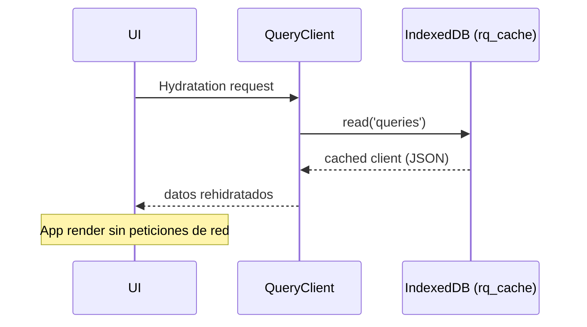

# Estrategia de Caché Persistente (React-Query + IndexedDB)

> Versión 1.0 — Julio 2025  
> Autor: Equipo Frontend Qleven

---

## 🎯 Objetivo

1. **Arranque instantáneo** después del primer login mediante rehidratación de datos críticos desde `IndexedDB`.
2. **Navegación sin spinners** gracias a prefetch anticipativo de rutas y queries.
3. **Seguridad**: limpieza completa de caché al cerrar sesión.
4. **Escalabilidad**: guías claras para añadir nuevas colecciones / invalidaciones.

---

## 🗄️ Infraestructura

| Capa | Herramienta | Descripción |
|------|-------------|-------------|
| Persistencia | `idb` | Driver ligero para IndexedDB |
| Caché de datos | `@tanstack/react-query` |
| Persistencia del caché | `@tanstack/react-query-persist-client` (persister `rq_cache`) |
| TTL global | `12 h` (`maxAge`) |

### Persister ( `components/providers/query-provider.tsx` )
* Base de datos: `rq_cache`  (store `queries`)
* Serializa únicamente **queries en estado *success***; las marcadas con `meta.noPersist = true` se excluyen.
* Manejo de errores `DataCloneError` con re-intento silencioso.

---

## 📦 Colecciones Persistidas

| Clave React-Query | Descripción | `staleTime` | `gcTime` |
|------------------|-------------|-------------|-----------|
| `['clinic', clinicId]` | Clínica activa | ∞ | 24 h |
| `['cabins', clinicId]` | Cabinas de la clínica | LARGO (1 h) | 24 h |
| `['equipmentList', clinicId]` | Equipos | MEDIO (30 min) | 12 h |
| `['tariffs', clinicId]` | Tarifas | LARGO | 24 h |
| `['ticketsList', clinicId]` | Tickets `OPEN` (página 1) | 5 min | 1 h |
| `['ticket', ticketId]` | Detalle de ticket | 5 min | 1 h |
| `['cashSessionsDay', clinicId, date]` | Caja-día actual | 1 min | 4 h |
| … | _(ver tabla completa al final)_ |

> **Nota**: cualquier query con relación **1:1** a `clinicId` o `systemId` debe incluirlo en la clave para evitar contaminación cruzada.

### Campos clave
* `systemId`: identifica el tenant en infra multi-instancia.
* `clinicId`: clave primaria de la clínica.

---

## 🚀 Flujo de Arranque

---

## ⚡ Prefetch Inteligente

1. **Ruta**: `components/main-sidebar.tsx`  
   – `router.prefetch()` de todos los `href` tras `requestIdleCallback`.
2. **Datos**: `lib/app-prefetcher.tsx`  
   – Prefetch masivo tras `ClinicContext` listo.  
   – Para tickets *OPEN*: se precarga **lista** y luego **detalle** de cada ticket.

---

## 🔄 Invalidación & Limpieza

| Evento | Acción |
|--------|--------|
| Alta / Baja / Edición de recurso | `queryClient.invalidateQueries()` con misma clave raíz |
| Logout (MainSidebar) | `queryClient.clear()` → `indexedDB.deleteDatabase('rq_cache')` |
| Cambio de clínica | `queryClient.removeQueries({ queryKey: [/* clinic-scoped */] })` |

> **Importante**: usa siempre utilidades de `@tanstack/react-query` para invalidar, nunca elimines manualmente via IndexedDB salvo en logout.

---

## 🪄 Renderización Optimista

* Para mutaciones de tickets y citas se usan `onMutate`, `optimisticUpdate`, y rollback en `onError`.
* Las claves siguen la misma convención, por lo que el estado optimista también se hidrata tras refrescos.

---

## ➕ Cómo añadir una nueva colección

1. Define **clave** incluyendo `clinicId` o `systemId` (o ambos).
2. Añade hook `useXYZQuery` con `staleTime` y `gcTime` adecuados.
3. Marca `meta.noPersist = true` si la info es estrictamente confidencial o volátil.  
4. Agrega `prefetch` en `lib/app-prefetcher.tsx` si:
   * Se usa en la mayoría de vistas iniciales **Y**
   * < 100 KB por clínica.
5. Documenta la fila en **esta tabla**.

---

## ⚠️ Política de Seguridad

* **Logout**: se purga React-Query + IndexedDB (ver `MainSidebar`).
* **TTL**: 12 h máximo.  
  – Clave obsoleta ➜ se elimina al restaurar si `maxAge` superado.
* **Rol Staff**: si cambia de clínica, se quita caché "clinic-scoped" para evitar fuga de datos.

---

## 📑 Referencias Rápidas

* `components/providers/query-provider.tsx` — persister & TTL global
* `lib/app-prefetcher.tsx` — precarga masiva (startup + requestIdle)
* `components/main-sidebar.tsx` — prefetch rutas + limpieza de logout
* `hooks/use-*` — asegurarse de usar clave `[..., clinicId]`

---

> **Mantén este archivo como fuente ÚNICA** de la estrategia de caché.
> Si se modifica un TTL o se añade una colección, actualiza la tabla y la descripción. 