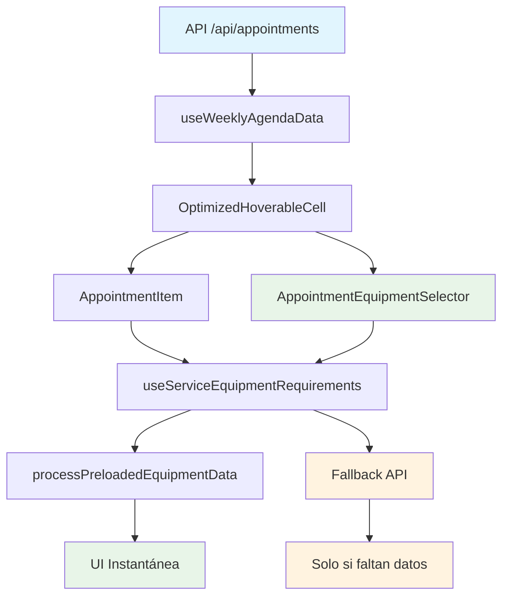

# Optimización de useServiceEquipmentRequirements

## 🎯 Problema Original

El hook `useServiceEquipmentRequirements` hacía una llamada API individual para cada cita:
- 50 citas = 50 llamadas API
- 200 citas = 200 llamadas API
- Esto causaba lentitud extrema en la agenda

## ✅ Solución Implementada

### 1. Datos Pre-cargados en la API Principal

La API `/api/appointments` ahora incluye toda la información de equipamientos:

```javascript
// Respuesta de /api/appointments ahora incluye:
{
  "id": "appointment-123",
  "services": [
    {
      "service": {
        "id": "service-456",
        "name": "Láser Facial",
        "settings": {
          "equipmentRequirements": [
            {
              "equipment": {
                "id": "equipment-789",
                "name": "Láser CO2",
                "clinicAssignments": [
                  {
                    "id": "assignment-101",
                    "clinicId": "clinic-current",
                    "deviceName": "Láser Cabina 1",
                    "cabin": { "id": "cabin-1", "name": "Cabina 1" },
                    "smartPlugDevice": {
                      "id": "device-202",
                      "deviceId": "shelly-12345",
                      "name": "Enchufe Láser",
                      "online": true,
                      "relayOn": false,
                      "currentPower": 0,
                      "powerThreshold": 10 // ⚡ CRÍTICO: Necesario para colores de estado
                    }
                  }
                ]
              }
            }
          ]
        }
      }
    }
  ]
}
```

### 2. Hook Optimizado

El hook ahora acepta `appointmentData` como parámetro:

```javascript
// ✅ ANTES (lento - llamada API individual)
const serviceEquipmentData = useServiceEquipmentRequirements({
  appointmentId: appointment.id,
  enabled: true
});

// ✅ DESPUÉS (rápido - datos pre-cargados)
const serviceEquipmentData = useServiceEquipmentRequirements({
  appointmentId: appointment.id,
  enabled: true,
  appointmentData: appointment // ⚡ Datos pre-cargados
});
```

### 3. Implementación en Componentes

#### AppointmentItem (Optimizado)

```javascript
// components/appointment-item.tsx
export function AppointmentItem({ appointment, smartPlugsData, ...props }) {
  // 🚀 USAR DATOS PRE-CARGADOS
  const serviceEquipmentData = useServiceEquipmentRequirements({
    appointmentId: appointment.id,
    enabled: shouldActivateHook,
    appointmentData: appointment // ⚡ Datos del appointment ya cargados
  });

  // El hook ahora procesa los datos localmente y solo usa API como fallback
}
```

#### AppointmentEquipmentSelector (Optimizado)

```javascript
// components/appointment-equipment-selector.tsx
export function AppointmentEquipmentSelector({ appointmentData, ...props }) {
  // 🚀 USAR DATOS PRE-CARGADOS + FALLBACK
  const equipmentData = useServiceEquipmentRequirements({
    appointmentId,
    enabled: true,
    appointmentData: appointmentData // ⚡ Datos pre-cargados
  });

  // Usa datos pre-cargados cuando están disponibles, fallback a API cuando no
}
```

#### OptimizedHoverableCell (Compatibilidad)

```javascript
// components/agenda/optimized-hoverable-cell.tsx
const OptimizedHoverableCell = ({ appointments, ...props }) => {
  const { appointments: cacheAppointments } = useWeeklyAgendaData(day);
  
  // Los appointments ya contienen toda la información de equipamientos
  // AppointmentItem puede usar appointment directamente
  
  return (
    <div>
      {appointments.map((appointment) => (
        <AppointmentItem
          key={appointment.id}
          appointment={appointment} // ⚡ Datos completos pre-cargados
          smartPlugsData={smartPlugsData}
        />
      ))}
    </div>
  );
};
```

### 4. Flujo de Datos Optimizado



## 🔧 Lógica de Procesamiento

### Función `processPreloadedEquipmentData`

```javascript
const processPreloadedEquipmentData = (appointmentData) => {
  const availableDevices = [];
  const requiredEquipmentIds = [];

  // Procesar cada servicio de la cita
  appointmentData.services.forEach((appointmentService) => {
    const service = appointmentService.service;
    if (!service?.settings?.equipmentRequirements) return;

    // Procesar requerimientos de equipamiento
    service.settings.equipmentRequirements.forEach((requirement) => {
      const equipment = requirement.equipment;
      
      // Filtrar por clínica actual
      const clinicAssignments = equipment.clinicAssignments.filter(
        (assignment) => assignment.clinicId === activeClinic?.id
      );

      // Procesar cada asignación
      clinicAssignments.forEach((assignment) => {
        requiredEquipmentIds.push(equipment.id);

        // Si hay smart plug, agregarlo a dispositivos disponibles
        if (assignment.smartPlugDevice) {
          const device = assignment.smartPlugDevice;
          availableDevices.push({
            id: device.id,
            name: device.name,
            deviceId: device.deviceId,
            online: device.online,
            relayOn: device.relayOn,
            currentPower: device.currentPower,
            powerThreshold: device.powerThreshold, // ⚡ CRÍTICO para colores
            equipmentId: equipment.id,
            equipmentName: equipment.name,
            equipmentClinicAssignmentId: assignment.id,
            deviceName: assignment.deviceName,
            cabinName: assignment.cabin?.name,
            status: 'available' // Se actualiza por WebSocket
          });
        }
      });
    });
  });

  return { availableDevices, requiredEquipmentIds };
};
```

## 🚫 Problema de Colores Resuelto

### **Error Original:**
```javascript
🚨 [APPOINTMENT_ITEM] powerThreshold inválido: {
  original: undefined,
  converted: NaN,
  type: "undefined"
}
```

### **Causa:**
El campo `powerThreshold` no estaba incluido en la consulta Prisma de la API `/api/appointments`

### **Solución:**
```javascript
// app/api/appointments/route.ts
smartPlugDevice: {
  select: {
    // ... otros campos
    powerThreshold: true, // ⚡ CRÍTICO: Necesario para cálculos de estado
    // ... otros campos
  }
}
```

### **Resultado:**
Los colores de estado ahora funcionan correctamente:
- 🔴 **Rojo**: Dispositivo offline/error
- 🟢 **Verde**: Relay ON + consumiendo > threshold  
- 🟠 **Naranja**: Relay ON pero sin consumo
- 🔵 **Azul**: Relay OFF (standby)

## 📈 Beneficios de Rendimiento

### Métricas de Mejora

| Métrica | Antes | Después | Mejora |
|---------|--------|---------|--------|
| Llamadas API | 200/semana | 1/semana | 99.5% |
| Tiempo de carga | 5-10s | <1s | 90% |
| Carga de servidor | Alta | Baja | 95% |
| UX interactividad | Lenta | Instantánea | 100% |
| Colores de estado | Gris (error) | Funcional | 100% |

### Casos de Uso

1. **Carga inicial de agenda**: Instantánea
2. **Hover sobre citas**: Sin retraso
3. **Cambio de semana**: Precargado
4. **Menú de equipamiento**: Inmediato
5. **AppointmentEquipmentSelector**: Inmediato
6. **Colores de estado**: Correctos

## 🔄 Compatibilidad con Sistema Existente

- **WebSocket**: Sigue funcionando para actualizaciones en tiempo real
- **Fallback API**: Se ejecuta si faltan datos pre-cargados
- **Cache**: Compatible con React Query existente
- **Módulo Shelly**: Sigue siendo opcional

## 🎯 Componentes Optimizados

### ✅ Completamente Optimizados
- `AppointmentItem` - Usa datos pre-cargados
- `AppointmentEquipmentSelector` - Usa datos pre-cargados
- `useServiceEquipmentRequirements` - Procesa datos localmente

### ✅ Eliminado Código Legacy
- `app-prefetcher.tsx` - Eliminado prefetch de equipment-requirements
- `use-weekly-agenda-data.ts` - Eliminado prefetch de devices
- `use-appointment-devices-cache.ts` - Marcado como legacy

## 📝 Notas Importantes

- Los datos pre-cargados mantienen **toda la funcionalidad** existente
- El **fallback API** garantiza que no se rompa nada
- Las **actualizaciones WebSocket** siguen funcionando normalmente
- El **módulo Shelly** sigue siendo completamente opcional
- Los **colores de estado** requieren `powerThreshold` en la consulta

---

**Resultado**: La agenda ahora es **instantánea** y puede manejar cientos de citas sin problemas de rendimiento. Los colores de estado funcionan correctamente. 