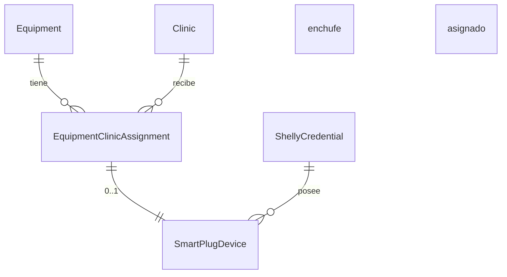

# 🔌 Flujo de Asignación — Equipamiento ⇆ Clínica ⇆ Enchufe Shelly

> Última actualización: 2025-07-09

## 1. Entidades principales

| Tabla | Descripción |
|-------|-------------|
| `Equipment` | Tipo genérico de equipamiento (láser, ballancer, etc.). |
| `EquipmentClinicAssignment` | Instancia de un `Equipment` en una clínica concreta. Contiene `serialNumber`, `deviceId`, `isActive`, etc. |
| `SmartPlugDevice` | Enchufe inteligente Shelly sincronizado desde la Cloud. Campo clave **`equipmentClinicAssignmentId`** enlaza de forma opcional el enchufe con la asignación. |
| `ShellyCredential` | Cuenta Shelly Cloud del sistema. Cada enchufe pertenece a una credencial. |

Relación simplificada:

## 2. Flujo de creación / edición en UI

1. **Modal `ClinicAssignmentsManager`**
   1. Usuario selecciona clínica, opcionalmente cabina.
   2. Si el módulo Shelly está activo (`useIntegrationModules`):
      * Se muestran dos selects adicionales.
      * Select 1 → Credenciales activas.
      * Select 2 → Enchufes libres de esa credencial
        (`GET /api/internal/smart-plug-devices?credentialId=...` y filtro
        `!equipmentClinicAssignmentId`).
   3. Al pulsar "Crear" (o "Actualizar") se realiza **optimistic update**:
      * Se añade un registro *temp-xxx* a `assignments` y al cache
        `['equipment-with-assignments']`.
      * La UI se refresca instantáneamente.
2. **Petición al servidor** (`POST /api/equipment/{id}/clinic-assignments`).
3. Al recibir `serverAssignment`:
   * Se reemplaza el temp-ID en estado y cache.
   * **Si el usuario eligió enchufe** → `PATCH /api/internal/smart-plug-devices/{plugId}` con
     `{ equipmentClinicAssignmentId: serverAssignment.id }`.
   * Invalida `['smart-plug-devices']` y `['equipment-with-assignments']`.
4. Otros componentes (celda de asignaciones, menú flotante, etc.) se
   actualizan por subscripción al cache.

## 3. Renderizado rápido (estrategia cache-first)

* Al abrir la pestaña de asignaciones:
  1. `ClinicAssignmentsManager.loadData()` intenta primero leer
     `['equipment-with-assignments']` → render en &lt;30 ms.
  2. Paralelamente hace refetch a API para refrescar.
* Para la columna "Enchufe" se usa `assignmentPlugMap`:
  1. Se busca lista de enchufes en cache global
     `['smart-plug-devices-all']`.
  2. Si existe, el mapa se construye inmediatamente.
  3. En paralelo, fetch a la API para repoblar el cache y detectar
     cambios.

## 4. Invalidaciones clave

| Acción | Queries invalidadas |
|--------|---------------------|
| Crear / editar asignación | `['equipment-assignments', equipmentId]`, `['equipment-with-assignments']` |
| Vincular enchufe Shelly | `['smart-plug-devices']`, `['equipment-with-assignments']` |
| Cambiar estado activo | mismas que creación |

## 5. Optimistic UI

* Todos los cambios en la lista (crear, activar, eliminar) se reflejan
  primero en estado local y cache, **antes** de hacer la petición
  HTTP.
* En caso de error del servidor se hace rollback basado en una copia del
  array original.

## 6. Puntos de extensión futuros

* Sincronizar automáticamente la columna "Enchufe" vía WebSocket cuando
  un plug se asigne/desasigne en otra pestaña.
* Mostrar potencia consumida directamente en la tabla.
* Tooltip con datos del plug (modelo, voltaje…). 